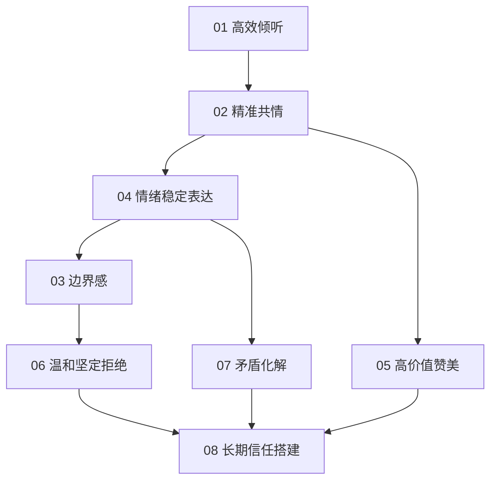

# 通用核心能力 · 模块导读

> 这个文件夹是 v2 体系的"内功"。场景话术是招式，这里是心法。
> 招式学一百套，不如内功练到家。

---

## 这个文件夹为什么重要

所有场景话术都是这 9 大通用能力的"外显"：

- 父母催婚你怎么接，用的是**温和坚定拒绝** + **边界感**；
- 伴侣吵架你怎么降级，用的是**情绪稳定表达** + **精准共情**；
- 领导批评你怎么扛，用的是**高效倾听** + **矛盾化解**；
- 暗恋对象怎么夸，用的是**高价值赞美**；
- 客户长期合作怎么保，用的是**长期信任搭建**。

换句话说：**把这 9 个能力练到 60 分，8 大场景都能从 0 分直接跳到 70 分。**

### 与「辩证式策略沟通」怎么叠读（扩展）

v2 通用能力管「内功」；《辩证式策略沟通》管「**同一立场下，入口、披露度、节奏、选项怎么设计**」。根目录 **[`00-辩证策略与增量资源-融合层.md`](../00-辩证策略与增量资源-融合层.md)** 里有一张 **套路 → 本文件夹能力 / 各人群模块** 的对照表。快速对应：**先承后转** 多依赖 `02 共情` + `04 情绪稳定`；**边界铺垫—温和拒绝** 多依赖 `03 边界` + `06 拒绝`；**第三方锚定** 多依赖 `07 矛盾化解`。

---

## 9 大能力清单


| #                     | 能力     | 一句话本质       | 主要受益场景             |
| --------------------- | ------ | ----------- | ------------------ |
| [01](01-高效倾听.md)      | 高效倾听   | 听到对方的"话外音"  | 所有场景，尤其冲突、亲密、向上    |
| [02](02-精准共情.md)      | 精准共情   | 先接情绪，再谈事实   | 亲密、朋友、家人、下属        |
| [03](03-边界感建立与维护.md)  | 边界感    | 知道什么该答、什么该拒 | 家人催、同事甩锅、陌生人骚扰、暧昧期 |
| [04](04-情绪稳定表达.md)    | 情绪稳定表达 | 有情绪不代表情绪化   | 吵架、被批评、被冒犯         |
| [05](05-高价值赞美.md)     | 高价值赞美  | 夸得对方想和你长期相处 | 所有关系建立与维护          |
| [06](06-温和坚定拒绝.md)    | 温和坚定拒绝 | 说"不"还不伤关系   | 家人、同事、领导、陌生人       |
| [07](07-矛盾化解与情绪疏导.md) | 矛盾化解   | 吵架的目的不是赢    | 伴侣、朋友、同事、家人        |
| [08](08-长期信任搭建.md)    | 长期信任搭建 | 信任是复利、是皮肤感  | 所有长期关系             |


（本文档为第 00 号导读，所以自己不算在 9 大能力里。）

---

## 每个能力文件的统一结构（8 段式）

方便你记忆、复用、检索：

```
1. 底层逻辑         — 为什么这个能力这么重要
2. 核心模型 / 公式   — 1-3 个可落地框架，带理论来源
3. 分步执行流程     — Step by step，可照做
4. 通用话术模板     — 20+ 句跨场景可用的"内功外化"
5. 典型高频场景举例 — 3-5 个常见用法示范
6. 避坑清单         — 常见错误 + 为什么错
7. 长期修炼方法     — 怎么练，多久见效
8. 关键来源参考     — 具体书、课、仓库
```

每份约 10-15KB，是深度体系而非碎片笔记。

---

## 推荐学习顺序

### 顺序 A · 按依赖顺序（推荐新手）




听懂 → 共情 → 稳得住 → 立得住 → 拒得下 → 夸得好 → 和得了 → 守得住。

### 顺序 B · 按痛点倒推

- **你最常 emo / 一被说就炸** → 先看 `04 情绪稳定表达` + `02 精准共情`
- **你最容易答应不想答应的事** → 先看 `03 边界感` + `06 温和坚定拒绝`
- **你一跟人吵就冷战** → 先看 `07 矛盾化解`
- **你感觉关系总是"浅"，难深入** → 先看 `05 高价值赞美` + `08 长期信任`

### 顺序 C · 按场景驱动

1. 先读 5 条底层准则（根目录那份）
2. 直接进你的目标场景文件夹
3. 场景内某个模块读不懂，回头查这里对应的能力文件

---

## 一个忠告

**通用能力和场景话术是螺旋上升的关系。**
第一遍读能力文件你会觉得"道理都懂，要看话术"；
读完一轮场景回头再读，你会突然发现"原来话术背后就是这个逻辑"。

这两份东西来回读 3 遍，你的社交能力会有质变。一次读完没什么用。