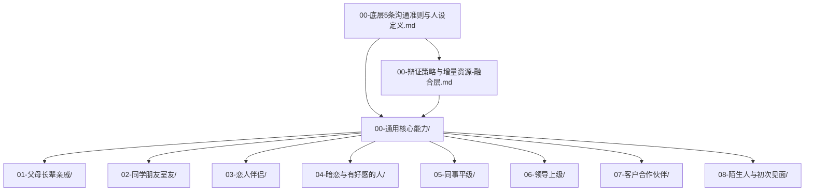

# high-emotional-intelligence-social-skill · 高情商社交沟通 v2

[](LICENSE)
[](SKILL.md)
[](https://skills.sh)

**主入口**：全场景高情商沟通 —— 多文件夹 SOP、通用核心能力、8 类人群 × 5 模块、辩证与增量融合层；统一人设见下文。

```bash
npx skills add abwoo/high-emotional-intelligence-social-skill
```

---

> **v2**：多文件夹、全生命周期 SOP、通用核心能力 + 8 类人群 × 5 模块，可直接落地。
> **v1**：速查单文件版，已归档至 `_v1速查版/`，适合随手搜一句。

---

## Skill 封装与调用

**Skill 名称（YAML `name`，规范）**：`high-emotional-intelligence-social-skill`

本仓库已提供 [`SKILL.md`](SKILL.md)：YAML `name` / `description`（含**触发词**）+ **Agent 工作流** + **意图路由表**，便于 Cursor / Claude Code 等按 Skill 规范加载。

| 你要做的事                 | 说明                                                                                                                                                                                       |
| -------------------------- | ------------------------------------------------------------------------------------------------------------------------------------------------------------------------------------------ |
| **看协议全文**       | 打开 `[SKILL.md](SKILL.md)`                                                                                                                                                              |
| **本地用**           | 推荐：使用上表「本机已配置」的联接路径；或手动将本仓库加入**Agent Skills**（须含根目录 `SKILL.md`）。                                                                              |
| **远程安装（可选）** | 若你已把本仓库推到 GitHub，可执行 `npx skills add abwoo/high-emotional-intelligence-social-skill`                                                                                        |
| **用户怎么触发**     | 见下方 **「触发词一览」**；权威全文以 [`SKILL.md`](SKILL.md) 顶部 YAML `description` 为准。 |
| **Agent 该怎么读**   | 先按 `SKILL.md` 第三节 **路由表** `Read` 对应文件，再作答；急用话术优先 `01-全情景话术库.md`。                                                                                 |

### 触发词一览（与 `SKILL.md` 的 `description` 同步）

客户端（Cursor 等）通常根据 Skill 元数据里的 **`description`** 文本做匹配；下列即从该字段拆出的关键词，便于检索与复制。**若与仓库内 `SKILL.md` 不一致，以 `SKILL.md` 为准。**

<!-- darwin-trigger-sync:start -->
#### 自动同步触发词清单

- 主场景触发词（20）：`高情商`、`社交话术`、`催婚`、`父母沟通`、`朋友借钱`、`同事甩锅`、`领导汇报`、`加薪`、`客户谈判`、`催款`、`陌生人`、`暗恋`、`吵架`、`拒绝`、`边界`、`倾听`、`共情`、`策略`、`T0`、`信息博弈`
- 达尔文维护关键词（6）：`优化 skill`、`skill 评分`、`达尔文`、`darwin`、`自动优化`、`skill 质量`

> 此块由 `scripts/darwin-ci.mjs` 从 `SKILL.md` 顶部 YAML `description` 自动同步。
<!-- darwin-trigger-sync:end -->

（维护流程见 [`references/DARWIN-EVOLUTION.md`](references/DARWIN-EVOLUTION.md)，并需环境中已安装上游 [darwin-skill](https://github.com/alchaincyf/darwin-skill)。）

### 默认达尔文进化模式（本仓库维护时自动启用）

本仓库已额外约定：**只要任务是在维护本仓库本身**，就默认进入**达尔文进化模式**，**不要求你手动说出任何触发词**。典型情况包括：

- 修改 `SKILL.md` 的 `description`、路由表、SOP
- 修改 `README.md` 的安装说明、触发词、致谢、许可、发布文案
- 修改 `references/` 下的方法说明
- 修改 `test-prompts.json`

默认流程为：先读 [`references/DARWIN-EVOLUTION.md`](references/DARWIN-EVOLUTION.md)，再按 **评估 → 改进 → 实测 → 人类确认 → 棘轮保留** 执行；若同时扩展正文结构，则再对齐 [`references/NUWA-GUIDANCE.md`](references/NUWA-GUIDANCE.md)。

**能力边界**：这表示“该 skill 一旦被调用来维护本仓库，就默认按达尔文方式工作”；但**不等于后台持续自动运行**。若要真正做到定时、无人值守地持续进化，还需要额外的自动化载体，例如本地计划任务、脚本或 GitHub Actions / CI。

### GitHub Actions 自动进化（推到 GitHub 后可用）

本仓库已提供一套 GitHub Actions 方案：推到 GitHub 后，可在 `push`、定时 `schedule` 或手动 `workflow_dispatch` 时运行 **Darwin CI**，自动完成：

- 读取 `SKILL.md`、`README.md`、`references/`、`test-prompts.json`
- 自动同步 README 中的**触发词清单**与 Darwin CI 摘要块
- 输出一份 Darwin 结构评估报告
- 在已配置 OpenAI 密钥时输出一份**语义级 AI 评估报告**
- 将报告同步到 GitHub Issue，便于你长期追踪
- 对**可自动修复**的 README 同步内容生成 PR

工作流文件：`.github/workflows/darwin-evolution.yml`  
本地脚本：`scripts/darwin-ci.mjs`、`scripts/darwin-ai-review.mjs`

默认不需要额外密钥；使用仓库自带 `GITHUB_TOKEN` 即可创建 issue / PR。  
若要启用**真正语义级 AI 评估**，请在 GitHub 仓库中配置：

- Repository Secret：`OPENAI_API_KEY`
- 可选 Repository Variable：`OPENAI_MODEL`（默认 `gpt-5.4`）

<!-- darwin-ci:start -->
#### Darwin CI 同步摘要

- 主场景触发词数量：20
- 达尔文维护关键词数量：6
- `test-prompts.json` 当前用例数：3
- 默认维护模式：修改本仓库时自动进入达尔文流程
- 自动修复范围：README 中的 Darwin CI 摘要块与触发词清单同步

> 此块由 `scripts/darwin-ci.mjs` 自动维护；最近评估得分：100/100。
<!-- darwin-ci:end -->

### 3）女娲方法论（扩展正文结构时）

`SKILL.md` 中写为：扩展内容时遵循 [`references/NUWA-GUIDANCE.md`](references/NUWA-GUIDANCE.md) 与 nuwa 五层结构——**偏维护者写库指引**，一般不设成用户闲聊触发词；对齐说明见 [nuwa-skill](https://github.com/alchaincyf/nuwa-skill)。

---

## 双入口说明

| 入口                            | 路径                                                                                                                           | 适合谁                                                      |
| ------------------------------- | ------------------------------------------------------------------------------------------------------------------------------ | ----------------------------------------------------------- |
| **v2 深度版（推荐）**     | 本 README 下方索引                                                                                                             | 要系统学、要案例、要正反对比与雷区                          |
| **辩证 + 增量资源整合层** | `[00-辩证策略与增量资源-融合层.md](00-辩证策略与增量资源-融合层.md)`                                                         | 要「立场为锚、策略为翼」、套路映射、书/视频/GitHub 候选总表 |
| **增量融合大全（长文）**  | `[高情商社交话术_增量融合版_2026-04-23.md](高情商社交话术_增量融合版_2026-04-23.md)`                                         | 与 v1 同结构的合并版 + 8 领域引用汇总                       |
| **辩证式原文**            | `[辩证式策略沟通体系_立场为锚_策略为翼_辩证为核_2026-04-23.md](辩证式策略沟通体系_立场为锚_策略为翼_辩证为核_2026-04-23.md)` | T0—T5、I1—I3、12+ 套路与分领域正反案例                    |
| **v1 速查版**             | `[_v1速查版/](_v1速查版/)`                                                                                                   | 只要单文件、旧习惯路径                                      |

---

## v2 贯穿：5 条底层沟通准则

全文以 `[00-底层5条沟通准则与人设定义.md](00-底层5条沟通准则与人设定义.md)` 为准，此处只列标题：

1. **责任前置、结果导向**（向上）
2. **共识引领、格局优先**（平级）
3. **亲和有界、原则清晰**（向下 / 陌生）
4. **真诚自信、边界有度**（亲密 / 异性）
5. **长期主义的一致性人设**（全局）

---

## 统一人设（全体系一致）

**成熟稳重、有担当、有边界、情绪稳定；不讨好、不卑微、不油腻、不阴阳怪气**——让长期相处的人「越处越信任」。各场景在对应文件夹 `00-原则SOP与人设.md` 中有定向细化。

---

## v2 导航（Mermaid）



**建议阅读顺序**：先读 `00-底层…` → 浏览 `00-通用核心能力/00-模块导读.md` → 按你当前最痛的人群文件夹读 `00`→`01`→`02`→`03`→`04`。

---

## 通用核心能力（9 文件）

| 文件                                                                                     | 内容               |
| ---------------------------------------------------------------------------------------- | ------------------ |
| `[00-通用核心能力/00-模块导读.md](00-通用核心能力/00-模块导读.md)`                     | 能力地图与学习路线 |
| `[00-通用核心能力/01-高效倾听.md](00-通用核心能力/01-高效倾听.md)`                     | 倾听               |
| `[00-通用核心能力/02-精准共情.md](00-通用核心能力/02-精准共情.md)`                     | 共情               |
| `[00-通用核心能力/03-边界感建立与维护.md](00-通用核心能力/03-边界感建立与维护.md)`     | 边界               |
| `[00-通用核心能力/04-情绪稳定表达.md](00-通用核心能力/04-情绪稳定表达.md)`             | 情绪表达           |
| `[00-通用核心能力/05-高价值赞美.md](00-通用核心能力/05-高价值赞美.md)`                 | 赞美               |
| `[00-通用核心能力/06-温和坚定拒绝.md](00-通用核心能力/06-温和坚定拒绝.md)`             | 拒绝               |
| `[00-通用核心能力/07-矛盾化解与情绪疏导.md](00-通用核心能力/07-矛盾化解与情绪疏导.md)` | 冲突               |
| `[00-通用核心能力/08-长期信任搭建.md](00-通用核心能力/08-长期信任搭建.md)`             | 信任               |

---

## 8 类人群 · 各 5 模块（固定结构）

每个人群文件夹内文件名为：

- `00-原则SOP与人设.md` — 原则、人设、分阶段 SOP
- `01-全情景话术库.md` — 分场景话术 + 来源标注
- `02-核心沟通技巧.md` — 5～8 个技巧（流程、示例、阶段、注意、来源）
- `03-完整对话闭环案例.md` — ≥3 组完整对话 + 点评
- `04-正反对比与雷区.md` — 正反表 + 应急预案 + 绝对雷区

### 索引表

| 人群             | 原则与 SOP                                   | 话术库                                      | 技巧                                        | 案例                                            | 正反与雷区                                    |
| ---------------- | -------------------------------------------- | ------------------------------------------- | ------------------------------------------- | ----------------------------------------------- | --------------------------------------------- |
| 父母长辈亲戚     | [打开](01-父母长辈亲戚/00-原则SOP与人设.md)     | [打开](01-父母长辈亲戚/01-全情景话术库.md)     | [打开](01-父母长辈亲戚/02-核心沟通技巧.md)     | [打开](01-父母长辈亲戚/03-完整对话闭环案例.md)     | [打开](01-父母长辈亲戚/04-正反对比与雷区.md)     |
| 同学朋友室友     | [打开](02-同学朋友室友/00-原则SOP与人设.md)     | [打开](02-同学朋友室友/01-全情景话术库.md)     | [打开](02-同学朋友室友/02-核心沟通技巧.md)     | [打开](02-同学朋友室友/03-完整对话闭环案例.md)     | [打开](02-同学朋友室友/04-正反对比与雷区.md)     |
| 恋人伴侣         | [打开](03-恋人伴侣/00-原则SOP与人设.md)         | [打开](03-恋人伴侣/01-全情景话术库.md)         | [打开](03-恋人伴侣/02-核心沟通技巧.md)         | [打开](03-恋人伴侣/03-完整对话闭环案例.md)         | [打开](03-恋人伴侣/04-正反对比与雷区.md)         |
| 暗恋与有好感的人 | [打开](04-暗恋与有好感的人/00-原则SOP与人设.md) | [打开](04-暗恋与有好感的人/01-全情景话术库.md) | [打开](04-暗恋与有好感的人/02-核心沟通技巧.md) | [打开](04-暗恋与有好感的人/03-完整对话闭环案例.md) | [打开](04-暗恋与有好感的人/04-正反对比与雷区.md) |
| 同事平级         | [打开](05-同事平级/00-原则SOP与人设.md)         | [打开](05-同事平级/01-全情景话术库.md)         | [打开](05-同事平级/02-核心沟通技巧.md)         | [打开](05-同事平级/03-完整对话闭环案例.md)         | [打开](05-同事平级/04-正反对比与雷区.md)         |
| 领导上级         | [打开](06-领导上级/00-原则SOP与人设.md)         | [打开](06-领导上级/01-全情景话术库.md)         | [打开](06-领导上级/02-核心沟通技巧.md)         | [打开](06-领导上级/03-完整对话闭环案例.md)         | [打开](06-领导上级/04-正反对比与雷区.md)         |
| 客户合作伙伴     | [打开](07-客户合作伙伴/00-原则SOP与人设.md)     | [打开](07-客户合作伙伴/01-全情景话术库.md)     | [打开](07-客户合作伙伴/02-核心沟通技巧.md)     | [打开](07-客户合作伙伴/03-完整对话闭环案例.md)     | [打开](07-客户合作伙伴/04-正反对比与雷区.md)     |
| 陌生人与初次见面 | [打开](08-陌生人与初次见面/00-原则SOP与人设.md) | [打开](08-陌生人与初次见面/01-全情景话术库.md) | [打开](08-陌生人与初次见面/02-核心沟通技巧.md) | [打开](08-陌生人与初次见面/03-完整对话闭环案例.md) | [打开](08-陌生人与初次见面/04-正反对比与雷区.md) |

---

## v1 速查版（归档）

以下文件在 `[_v1速查版/](_v1速查版/)` 目录中，文件名与早期单文件版一致，例如：

- `00-底层原则与通用技巧.md`
- `01-父母长辈亲戚.md` … `08-陌生人与初次见面.md`
- `README.md`（若存在）

**说明**：v1 与 v2 **不互斥**——v1 适合手机随手搜一句；v2 适合建立操作系统与复盘。

---

## 使用方式（4 种）

1. **急用**：打开对应人群 `01-全情景话术库.md`，复制改写。
2. **系统学**：按 `00-模块导读` 推荐顺序啃通用能力，再按人群读 `00→04`。
3. **复盘**：事后对照 `04-正反对比与雷区.md` 看踩线与否。
4. **策略叠读**：在「要守底线又要迂回、要真诚又要梯度披露」时，先翻 `[00-辩证策略与增量资源-融合层.md](00-辩证策略与增量资源-融合层.md)` 的套路映射，再回具体场景模块；需要书 / UP 主 / 仓库线索时，用该文件第三节总表跳转。

---

## 来源与诚信说明

v2 正文对权威模型、书目与已核实的开源项目使用 `[来源：…]` 标注；无把握处不硬标。详见 `[00-底层5条沟通准则与人设定义.md](00-底层5条沟通准则与人设定义.md)` 中的「来源标注规范」。

---

## 致谢与方法论溯源（女娲 · 达尔文）

本仓库在**维护与进化**上与花叔（Huashu / [alchaincyf](https://github.com/alchaincyf)）开源生态的方法论对齐，并在本节致谢其**思路与工具链启发**（**不构成官方背书或隶属关系**；许可与版本以各上游仓库为准）。

### 与两个上游仓库的关系（配置说明）

| 项目                             | 远程地址（HTTPS）                                                                                                                                     | 在本仓库中的接入方式                                                                                                                                                                                                                                                                                                                                                         |
| -------------------------------- | ----------------------------------------------------------------------------------------------------------------------------------------------------- | ---------------------------------------------------------------------------------------------------------------------------------------------------------------------------------------------------------------------------------------------------------------------------------------------------------------------------------------------------------------------------- |
| **达尔文.skill（Darwin）** | [https://github.com/alchaincyf/darwin-skill](https://github.com/alchaincyf/darwin-skill) · `git clone https://github.com/alchaincyf/darwin-skill.git` | **不**以 git 子模块内嵌；通过根目录 [`SKILL.md`](SKILL.md) 的触发词与路由、[`references/DARWIN-EVOLUTION.md`](references/DARWIN-EVOLUTION.md) 工作流说明，以及 [`test-prompts.json`](test-prompts.json) 与 Darwin 的实测思路对齐。要在 Agent 中执行「自动进化 / 评分 / 棘轮式优化」，请在环境中**另行安装**上游 skill：`npx skills add alchaincyf/darwin-skill`。 |
| **女娲.skill（Nuwa）**     | [https://github.com/alchaincyf/nuwa-skill](https://github.com/alchaincyf/nuwa-skill) · `git clone https://github.com/alchaincyf/nuwa-skill.git`       | 以[`references/NUWA-GUIDANCE.md`](references/NUWA-GUIDANCE.md) 将本仓库 v2 的 **00→04** 模块结构与「来源 / 诚实边界」纪律，与 Nuwa 五层蒸馏方法论对齐；扩展正文时对照该指引，而非复制上游资产。                                                                                                                                                                        |

### 女娲.skill（Nuwa）

- **仓库**：[alchaincyf/nuwa-skill](https://github.com/alchaincyf/nuwa-skill)
- **许可证**：上游以 [**MIT License**](https://github.com/alchaincyf/nuwa-skill/blob/main/LICENSE) 发布；本 README 对其方法论表述的引用，在合理范围内遵循 MIT 常见的署名与许可保留义务。
- **思路**：从公开材料蒸馏「怎么说话、怎么想、怎么判断、什么不做、诚实边界」；强调可验证与诚实边界。
- **在本仓库中的用法**：新增或改写模块时，请对照 [`references/NUWA-GUIDANCE.md`](references/NUWA-GUIDANCE.md)，保持 v2 **00→04** 结构与来源纪律。

### 达尔文.skill（Darwin）

- **仓库**：[alchaincyf/darwin-skill](https://github.com/alchaincyf/darwin-skill)
- **许可证**：上游以 [**MIT License**](https://github.com/alchaincyf/darwin-skill/blob/master/LICENSE) 发布；同上，引用其公开方法论时遵守 MIT 要求。
- **思路**：受 Karpathy [autoresearch](https://github.com/karpathy/autoresearch) 启发，对 `SKILL.md` 做 **结构 + 实测** 双重评估、**棘轮式**只保留真改进。
- **在本仓库中的用法**：见 [`references/DARWIN-EVOLUTION.md`](references/DARWIN-EVOLUTION.md)；根目录 [`test-prompts.json`](test-prompts.json) 供典型场景实测。安装上游 Darwin：`npx skills add alchaincyf/darwin-skill`。

### 许可证（本仓库）

本仓库原创内容（含 `SKILL.md`、各 Markdown 模块及 `references/` 下说明文件）由维护者 **[abwoo](https://github.com/abwoo)** 以 **[MIT License](LICENSE)** 发布，除非个别文件另有声明。
若你分发或修改本仓库，请保留根目录 `LICENSE` 中的版权与许可全文。使用上游 **女娲 / 达尔文** 的代码、模板与品牌素材时，请同时遵守其各自仓库的 **LICENSE** 与署名要求。

---

## 最后一句

话术是术，**真诚与稳定**是道。v2 的目标是：让你在说对话的同时，**人设十年如一日地可信**。
