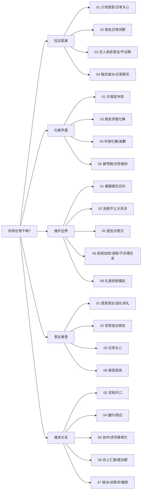

# 高情商社交话术 · 全场景落地体系

> **一套可以直接抄、直接发、直接说的高情商话术库。**
> 覆盖 8 大人群、47 个子场景、600+ 句话术，强调自然、接地气、不讨好、不卑微、不阴阳怪气。

---

## 这套话术能解决什么

你会遇到的社交场景，大概就这 5 类目的：

- **拉近距离** —— 跟家人 / 朋友 / 恋人 / 暧昧对象
- **化解矛盾** —— 跟爱人吵架、跟朋友误会、跟同事冲突
- **维护边界** —— 催婚、加班、甩锅、推销、骚扰
- **表达善意** —— 感恩、道歉、赞美、安慰
- **推进关系** —— 求助、邀约、汇报、谈加薪、催款、表白

这 5 件事，不管你跟谁打交道，都绕不过。这套体系就是把 8 类人 × 这 5 件事的典型场合都给你写好了。

---

## 一页速查路由图（遇到 X 去哪）




---

## 文件索引（按人群）


| 文件                                   | 覆盖人群      | 子场景数                  |
| ------------------------------------ | --------- | --------------------- |
| `[00-底层原则与通用技巧.md](00-底层原则与通用技巧.md)` | 所有场景的操作系统 | 10 心法 + 6 公式 + 8 通用动作 |
| `[01-父母长辈亲戚.md](01-父母长辈亲戚.md)`       | 父母、长辈、亲戚  | 6                     |
| `[02-同学朋友室友.md](02-同学朋友室友.md)`       | 同学、朋友、室友  | 6                     |
| `[03-恋人伴侣.md](03-恋人伴侣.md)`           | 恋人、已婚伴侣   | 6                     |
| `[04-暗恋与有好感的人.md](04-暗恋与有好感的人.md)`   | 暧昧阶段的对象   | 6                     |
| `[05-同事平级.md](05-同事平级.md)`           | 同事、合作的平级  | 7                     |
| `[06-领导上级.md](06-领导上级.md)`           | 上级、老板     | 6                     |
| `[07-客户合作伙伴.md](07-客户合作伙伴.md)`       | 客户、B 端伙伴  | 5                     |
| `[08-陌生人与初次见面.md](08-陌生人与初次见面.md)`   | 陌生人、一过性场合 | 5                     |


---

## 推荐使用方式（3 种用法任选）

### 用法 1：急用查表（遇事翻书）

你现在就要去开会 / 见家长 / 吵架 / 表白——直接跳到对应章节，照着抄，临走前读 3 遍。

### 用法 2：系统学习（30 天养成）

每天啃一个子场景：看原则、背 3-5 句最对你胃口的话术、观察雷区。一个月下来覆盖全套。
建议顺序：先读 `00-底层原则`，再按你生活中最常遇到的顺序读（比如程序员优先 05-06-07，学生优先 01-02-04）。

### 用法 3：长期复盘（当成镜子）

每次沟通完翻出对应章节，对照看自己说得对不对、雷区踩没踩。两个月，情商是真能养出来的。

---

## 每个子场景的内部结构（统一格式）

```
### 核心原则（3-5 条）     ← 先理解心法
### 高情商话术库           ← 10-15 句，直接抄
### 聊天技巧              ← 倾听/赞美/共情/化解/拒绝的手法
### 绝对雷区              ← "千万别说/别做"红线
```

话术后面的 `→` 符号是"心法注解"——告诉你这句话为什么好、什么时候用。

---

## 全书通用的 6 个万能公式（详见 `00-底层原则.md`）


| 公式          | 用途         | 一句话记法             |
| ----------- | ---------- | ----------------- |
| **NVC 四步**  | 提意见 / 表达不满 | 观察 → 感受 → 需要 → 请求 |
| **共同目的法**   | 对立破冰       | "我们其实都想 × ×"      |
| **结构化倾听**   | 听懂话外音      | 事实 + 情绪 + 期待      |
| **PREP 表达** | 清晰讲观点      | 观点 → 原因 → 例子 → 观点 |
| **SBI 反馈**  | 夸人 / 提意见   | 情境 + 行为 + 影响      |
| **课题分离**    | 拒绝 / 守边界   | 他的事我不背，我的事他别管     |


---

## 核心底层原则（如果只记 10 条）

1. 人不是被说服的，是被听到的。
2. 情绪在，道理进不去。
3. 对事不对人。
4. "我" 开头，不是 "你" 开头。
5. 多问一句"你怎么想"比多说十句想法管用。
6. 留白比话多更显高级。
7. 说真话，但不说全部真话。
8. 先给台阶，再谈问题。
9. 能问的别断言。
10. 关系 > 对错。

---

## 全书写作风格（也是可以直接套用的说话风格）

- 每句话术 **不超过 25 字**。
- 不用 "您"（除非对领导 / 长辈 / 客户）、不用 "甚是"、不用 "十分"。
- **不讨好、不卑微、不阴阳怪气、不说教**。
- 能用口语的不用成语，能用动词的不用名词。
- 真诚是最高级的技巧。

---

## 方法论来源致谢

本体系融合了以下经典方法论，去粗取精后落地为话术：

**书籍**：《非暴力沟通》（马歇尔·卢森堡）/《关键对话》/《高难度谈话》/《沟通的方法》（脱不花）/《蔡康永的说话之道》/《所谓情商高就是会说话》/《人性的弱点》（卡耐基）/《亲密关系》/《被讨厌的勇气》/《爱的五种语言》/《如何与任何人都能聊得来》/《可复制的沟通力》/《沟通的艺术》/《情商》（戈尔曼）

**课程**：脱不花《沟通训练营》、薇安《高情商人士沟通秘籍》、陈钰《即学即会的高情商沟通》、张国银《高情商沟通 36 技》、富兰克林柯维《驾驭艰难对话》

**GitHub 参考项目**（场景拆解思路）：

- `[nicepkg/boss-skill](https://github.com/nicepkg/boss-skill)` — 职场 PUA / 加薪 / 汇报三档话术分级
- `[Pronting/chat-skills](https://github.com/Pronting/chat-skills)`、`[863401402/she-love-me](https://github.com/863401402/she-love-me)` — 两性沟通与关系诊断
- `[MrGeDiao/shuorenhua](https://github.com/MrGeDiao/shuorenhua)` — 去 AI 腔、去书面化的表达风格约束
- `[marklolo/EveryTalk](https://github.com/marklolo/EveryTalk)` — 商务沟通与催款

**影视**：《触不可及》《心灵奇旅》《国王的演讲》《爱在黎明破晓前》《穿普拉达的女王》——对话节奏与人物共情参考。

---

## 最后一句

话术是术，真诚是道。**所有技巧用对了人才有用。**

你记得对方的事、你在乎对方的感受、你不把对方当工具——做到这三件，即使你说的话结构再不标准，也是高情商。

反过来，所有技巧堆在一个不走心的人身上，只会让人更反感。

愿你用这套东西，把该说的话说出口、把不该说的话咽回去、把重要的人越处越近。