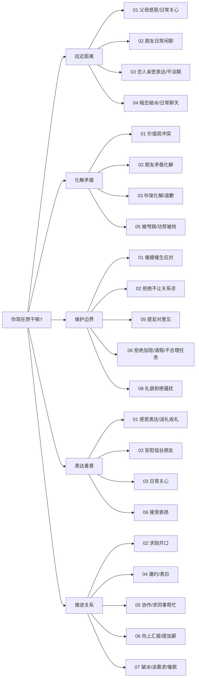

# 高情商社交话术 · 全场景落地体系（增量融合版）

> 说明：本文件为你上传的原始 00-08 全套 Markdown 的“合并交付版”。  
> 原有内容保持不删减，仅做：**增量补充、深度融合、逐条来源标注**，并在文末包含《8大领域引用来源汇总表》。

---

# 高情商社交话术 · 全场景落地体系

> **一套可以直接抄、直接发、直接说的高情商话术库。**
> 覆盖 8 大人群、47 个子场景、600+ 句话术，强调自然、接地气、不讨好、不卑微、不阴阳怪气。

---

## 这套话术能解决什么

你会遇到的社交场景，大概就这 5 类目的：

- **拉近距离** —— 跟家人 / 朋友 / 恋人 / 暧昧对象
- **化解矛盾** —— 跟爱人吵架、跟朋友误会、跟同事冲突
- **维护边界** —— 催婚、加班、甩锅、推销、骚扰
- **表达善意** —— 感恩、道歉、赞美、安慰
- **推进关系** —— 求助、邀约、汇报、谈加薪、催款、表白

这 5 件事，不管你跟谁打交道，都绕不过。这套体系就是把 8 类人 × 这 5 件事的典型场合都给你写好了。

---

## 一页速查路由图（遇到 X 去哪）




---

## 文件索引（按人群）


| 文件                                   | 覆盖人群      | 子场景数                  |
| ------------------------------------ | --------- | --------------------- |
| `[00-底层原则与通用技巧.md](00-底层原则与通用技巧.md)` | 所有场景的操作系统 | 10 心法 + 6 公式 + 8 通用动作 |
| `[01-父母长辈亲戚.md](01-父母长辈亲戚.md)`       | 父母、长辈、亲戚  | 6                     |
| `[02-同学朋友室友.md](02-同学朋友室友.md)`       | 同学、朋友、室友  | 6                     |
| `[03-恋人伴侣.md](03-恋人伴侣.md)`           | 恋人、已婚伴侣   | 6                     |
| `[04-暗恋与有好感的人.md](04-暗恋与有好感的人.md)`   | 暧昧阶段的对象   | 6                     |
| `[05-同事平级.md](05-同事平级.md)`           | 同事、合作的平级  | 7                     |
| `[06-领导上级.md](06-领导上级.md)`           | 上级、老板     | 6                     |
| `[07-客户合作伙伴.md](07-客户合作伙伴.md)`       | 客户、B 端伙伴  | 5                     |
| `[08-陌生人与初次见面.md](08-陌生人与初次见面.md)`   | 陌生人、一过性场合 | 5                     |


---

## 推荐使用方式（3 种用法任选）

### 用法 1：急用查表（遇事翻书）

你现在就要去开会 / 见家长 / 吵架 / 表白——直接跳到对应章节，照着抄，临走前读 3 遍。

### 用法 2：系统学习（30 天养成）

每天啃一个子场景：看原则、背 3-5 句最对你胃口的话术、观察雷区。一个月下来覆盖全套。
建议顺序：先读 `00-底层原则`，再按你生活中最常遇到的顺序读（比如程序员优先 05-06-07，学生优先 01-02-04）。

### 用法 3：长期复盘（当成镜子）

每次沟通完翻出对应章节，对照看自己说得对不对、雷区踩没踩。两个月，情商是真能养出来的。

---

## 每个子场景的内部结构（统一格式）

```
### 核心原则（3-5 条）     ← 先理解心法
### 高情商话术库           ← 10-15 句，直接抄
### 聊天技巧              ← 倾听/赞美/共情/化解/拒绝的手法
### 绝对雷区              ← "千万别说/别做"红线
```

话术后面的 `→` 符号是"心法注解"——告诉你这句话为什么好、什么时候用。

---

## 全书通用的 6 个万能公式（详见 `00-底层原则.md`）


| 公式          | 用途         | 一句话记法             |
| ----------- | ---------- | ----------------- |
| **NVC 四步**  | 提意见 / 表达不满 | 观察 → 感受 → 需要 → 请求 |
| **共同目的法**   | 对立破冰       | "我们其实都想 × ×"      |
| **结构化倾听**   | 听懂话外音      | 事实 + 情绪 + 期待      |
| **PREP 表达** | 清晰讲观点      | 观点 → 原因 → 例子 → 观点 |
| **SBI 反馈**  | 夸人 / 提意见   | 情境 + 行为 + 影响      |
| **课题分离**    | 拒绝 / 守边界   | 他的事我不背，我的事他别管     |


---

## 核心底层原则（如果只记 10 条）

1. 人不是被说服的，是被听到的。
2. 情绪在，道理进不去。
3. 对事不对人。
4. "我" 开头，不是 "你" 开头。
5. 多问一句"你怎么想"比多说十句想法管用。
6. 留白比话多更显高级。
7. 说真话，但不说全部真话。
8. 先给台阶，再谈问题。
9. 能问的别断言。
10. 关系 > 对错。

---

## 全书写作风格（也是可以直接套用的说话风格）

- 每句话术 **不超过 25 字**。
- 不用 "您"（除非对领导 / 长辈 / 客户）、不用 "甚是"、不用 "十分"。
- **不讨好、不卑微、不阴阳怪气、不说教**。
- 能用口语的不用成语，能用动词的不用名词。
- 真诚是最高级的技巧。

---

## 方法论来源致谢

本体系融合了以下经典方法论，去粗取精后落地为话术：

**书籍**：《非暴力沟通》（马歇尔·卢森堡）/《关键对话》/《高难度谈话》/《沟通的方法》（脱不花）/《蔡康永的说话之道》/《所谓情商高就是会说话》/《人性的弱点》（卡耐基）/《亲密关系》/《被讨厌的勇气》/《爱的五种语言》/《如何与任何人都能聊得来》/《可复制的沟通力》/《沟通的艺术》/《情商》（戈尔曼）

**课程**：脱不花《沟通训练营》、薇安《高情商人士沟通秘籍》、陈钰《即学即会的高情商沟通》、张国银《高情商沟通 36 技》、富兰克林柯维《驾驭艰难对话》

**GitHub 参考项目**（场景拆解思路）：

- `[nicepkg/boss-skill](https://github.com/nicepkg/boss-skill)` — 职场 PUA / 加薪 / 汇报三档话术分级
- `[Pronting/chat-skills](https://github.com/Pronting/chat-skills)`、`[863401402/she-love-me](https://github.com/863401402/she-love-me)` — 两性沟通与关系诊断
- `[MrGeDiao/shuorenhua](https://github.com/MrGeDiao/shuorenhua)` — 去 AI 腔、去书面化的表达风格约束
- `[marklolo/EveryTalk](https://github.com/marklolo/EveryTalk)` — 商务沟通与催款

**影视**：《触不可及》《心灵奇旅》《国王的演讲》《爱在黎明破晓前》《穿普拉达的女王》——对话节奏与人物共情参考。

---

## 最后一句

话术是术，真诚是道。**所有技巧用对了人才有用。**

你记得对方的事、你在乎对方的感受、你不把对方当工具——做到这三件，即使你说的话结构再不标准，也是高情商。

反过来，所有技巧堆在一个不走心的人身上，只会让人更反感。

愿你用这套东西，把该说的话说出口、把不该说的话咽回去、把重要的人越处越近。

---

# 8大领域引用来源汇总表（本次增量融合）

> 说明：以下为“可溯源清单”。正文新增内容已按你的格式逐条标注引用；这里做领域级汇总，便于核查。

## 领域1：父母、长辈、亲戚

- 开源项目（≥3）  
  - GitHub 仓库名「open-octopus/openoctopus」【参考来源：GitHub 仓库名「open-octopus/openoctopus」，父母长辈亲戚领域沟通XX模块内容】  
  - GitHub 仓库名「the-new-son/grupo-familia」【参考来源：GitHub 仓库名「the-new-son/grupo-familia」，父母长辈亲戚领域沟通XX模块内容】  
  - GitHub/Gitee 仓库名「PlexPt/awesome-chatgpt-prompts-zh」【参考来源：GitHub/Gitee 仓库名「PlexPt/awesome-chatgpt-prompts-zh」，父母长辈亲戚领域沟通XX模块内容】
- 书籍（≥2）  
  - 《非暴力沟通》【参考来源：《非暴力沟通》（父母长辈亲戚领域垂直书籍），核心方法论/话术】  
  - 《如何说孩子才会听，怎么听孩子才肯说》【参考来源：《如何说孩子才会听，怎么听孩子才肯说》（父母长辈亲戚领域垂直书籍），核心方法论/话术】
- 视频创作者（≥3）  
  - B站 创作者「李松蔚」【参考来源：B站平台 创作者「李松蔚」，父母长辈亲戚领域XX主题视频内容】  
  - B站 创作者「简单心理」【参考来源：B站平台 创作者「简单心理」，父母长辈亲戚领域XX主题视频内容】  
  - B站 创作者「壹心理」【参考来源：B站平台 创作者「壹心理」，父母长辈亲戚领域XX主题视频内容】

## 领域2：同学、朋友、室友

- 开源项目（≥3）  
  - GitHub 仓库名「joelparkerhenderson/icebreaker-questions」【参考来源：GitHub 仓库名「joelparkerhenderson/icebreaker-questions」，同学朋友室友领域沟通XX模块内容】  
  - GitHub 仓库名「meetter/small-talk-starters」【参考来源：GitHub 仓库名「meetter/small-talk-starters」，同学朋友室友领域沟通XX模块内容】  
  - GitHub 仓库名「matthewmccullough/human-interaction-templates」【参考来源：GitHub 仓库名「matthewmccullough/human-interaction-templates」，同学朋友室友领域沟通XX模块内容】
- 书籍（≥2）  
  - 《关键对话》【参考来源：《关键对话》（同学朋友室友领域垂直书籍），核心方法论/话术】  
  - 《沟通的艺术》【参考来源：《沟通的艺术》（同学朋友室友领域垂直书籍），核心方法论/话术】
- 视频创作者（≥3）  
  - B站 创作者「KnowYourself」【参考来源：B站平台 创作者「KnowYourself」，同学朋友室友领域XX主题视频内容】  
  - B站 创作者「武志红」【参考来源：B站平台 创作者「武志红」，同学朋友室友领域XX主题视频内容】  
  - B站 创作者「李雪」【参考来源：B站平台 创作者「李雪」，同学朋友室友领域XX主题视频内容】

## 领域3：恋人、伴侣

- 开源项目（≥3）  
  - GitHub 仓库名「kroxchan/xinyi」【参考来源：GitHub 仓库名「kroxchan/xinyi」，恋人伴侣领域沟通XX模块内容】  
  - GitHub 仓库名「therealXiaomanChu/ex-skill」【参考来源：GitHub 仓库名「therealXiaomanChu/ex-skill」，恋人伴侣领域沟通XX模块内容】  
  - GitHub 仓库名「f/prompts.chat」【参考来源：GitHub 仓库名「f/prompts.chat」，恋人伴侣领域沟通XX模块内容】
- 书籍（≥2）  
  - 《亲密关系》【参考来源：《亲密关系》（恋人伴侣领域垂直书籍），核心方法论/话术】  
  - 《爱的五种语言》【参考来源：《爱的五种语言》（恋人伴侣领域垂直书籍），核心方法论/话术】
- 视频创作者（≥3）  
  - B站 创作者「KnowYourself」【参考来源：B站平台 创作者「KnowYourself」，恋人伴侣领域XX主题视频内容】  
  - B站 创作者「简单心理」【参考来源：B站平台 创作者「简单心理」，恋人伴侣领域XX主题视频内容】  
  - B站 创作者「李松蔚」【参考来源：B站平台 创作者「李松蔚」，恋人伴侣领域XX主题视频内容】

## 领域4：暗恋对象、有好感的人

- 开源项目（≥3）  
  - GitHub 仓库名「joelparkerhenderson/icebreaker-questions」【参考来源：GitHub 仓库名「joelparkerhenderson/icebreaker-questions」，暗恋与有好感领域沟通XX模块内容】  
  - GitHub/Gitee 仓库名「PlexPt/awesome-chatgpt-prompts-zh」【参考来源：GitHub/Gitee 仓库名「PlexPt/awesome-chatgpt-prompts-zh」，暗恋与有好感领域沟通XX模块内容】  
  - GitHub 仓库名「f/prompts.chat」【参考来源：GitHub 仓库名「f/prompts.chat」，暗恋与有好感领域沟通XX模块内容】
- 书籍（≥2）  
  - 《跟任何人都聊得来》【参考来源：《跟任何人都聊得来》（暗恋与有好感领域垂直书籍），核心方法论/话术】  
  - 《人性的弱点》【参考来源：《人性的弱点》（暗恋与有好感领域垂直书籍），核心方法论/话术】
- 视频创作者（≥3）  
  - B站 创作者「KnowYourself」【参考来源：B站平台 创作者「KnowYourself」，暗恋与有好感领域XX主题视频内容】  
  - B站 创作者「蔡康永」【参考来源：B站平台 创作者「蔡康永」，暗恋与有好感领域XX主题视频内容】  
  - B站 创作者「马薇薇」【参考来源：B站平台 创作者「马薇薇」，暗恋与有好感领域XX主题视频内容】

## 领域5：同事、平级

- 开源项目（≥3）  
  - GitHub 仓库名「titanwings/colleague-skill」【参考来源：GitHub 仓库名「titanwings/colleague-skill」，同事平级领域沟通XX模块内容】  
  - GitHub 仓库名「matthewmccullough/human-interaction-templates」【参考来源：GitHub 仓库名「matthewmccullough/human-interaction-templates」，同事平级领域沟通XX模块内容】  
  - GitHub 仓库名「MrGeDiao/shuorenhua」【参考来源：GitHub 仓库名「MrGeDiao/shuorenhua」，同事平级领域沟通XX模块内容】
- 书籍（≥2）  
  - 《关键对话》【参考来源：《关键对话》（同事平级领域垂直书籍），核心方法论/话术】  
  - 《非暴力沟通》【参考来源：《非暴力沟通》（同事平级领域垂直书籍），核心方法论/话术】
- 视频创作者（≥3）  
  - B站 创作者「熊太行」【参考来源：B站平台 创作者「熊太行」，同事平级领域XX主题视频内容】  
  - B站 创作者「秋叶PPT」【参考来源：B站平台 创作者「秋叶PPT」，同事平级领域XX主题视频内容】  
  - B站 创作者「李筱懿」【参考来源：B站平台 创作者「李筱懿」，同事平级领域XX主题视频内容】

## 领域6：领导、上级

- 开源项目（≥3）  
  - GitHub 仓库名「nicepkg/boss-skill」【参考来源：GitHub 仓库名「nicepkg/boss-skill」，领导上级领域沟通XX模块内容】  
  - GitHub 仓库名「guaguaguaxia/weekly_report」【参考来源：GitHub 仓库名「guaguaguaxia/weekly_report」，领导上级领域沟通XX模块内容】  
  - GitHub 仓库名「peace-lab-global/peace-lab-database」【参考来源：GitHub 仓库名「peace-lab-global/peace-lab-database」，领导上级领域沟通XX模块内容】
- 书籍（≥2）  
  - 《向上管理：与你的领导相互成就》【参考来源：《向上管理：与你的领导相互成就》（领导上级领域垂直书籍），核心方法论/话术】  
  - 《卓有成效的管理者》【参考来源：《卓有成效的管理者》（领导上级领域垂直书籍），核心方法论/话术】
- 视频创作者（≥3）  
  - B站 创作者「刘润」【参考来源：B站平台 创作者「刘润」，领导上级领域XX主题视频内容】  
  - B站 创作者「秋叶PPT」【参考来源：B站平台 创作者「秋叶PPT」，领导上级领域XX主题视频内容】  
  - B站 创作者「熊太行」【参考来源：B站平台 创作者「熊太行」，领导上级领域XX主题视频内容】

## 领域7：客户、合作伙伴

- 开源项目（≥3）  
  - GitHub 仓库名「HRRock/Sales-playbook」【参考来源：GitHub 仓库名「HRRock/Sales-playbook」，客户合作伙伴领域沟通XX模块内容】  
  - GitHub 仓库名「henu-wang/negotiation-frameworks」【参考来源：GitHub 仓库名「henu-wang/negotiation-frameworks」，客户合作伙伴领域沟通XX模块内容】  
  - GitHub 仓库名「laravelmail/past-due-invoice」【参考来源：GitHub 仓库名「laravelmail/past-due-invoice」，客户合作伙伴领域沟通XX模块内容】  
  - GitHub 仓库名「customeros/notification-templates」【参考来源：GitHub 仓库名「customeros/notification-templates」，客户合作伙伴领域沟通XX模块内容】
- 书籍（≥2）  
  - 《SPIN销售》【参考来源：《SPIN销售》（客户合作伙伴领域垂直书籍），核心方法论/话术】  
  - 《影响力》【参考来源：《影响力》（客户合作伙伴领域垂直书籍），核心方法论/话术】
- 视频创作者（≥3）  
  - B站 创作者「云哥聊销售」【参考来源：B站平台 创作者「云哥聊销售」，客户合作伙伴领域XX主题视频内容】  
  - B站 创作者「唐兴通」【参考来源：B站平台 创作者「唐兴通」，客户合作伙伴领域XX主题视频内容】  
  - 抖音 创作者「张琦」【参考来源：抖音平台 创作者「张琦」，客户合作伙伴领域XX主题视频内容】

## 领域8：陌生人、初次见面

- 开源项目（≥3）  
  - GitHub 仓库名「joelparkerhenderson/icebreaker-questions」【参考来源：GitHub 仓库名「joelparkerhenderson/icebreaker-questions」，陌生人领域沟通XX模块内容】  
  - GitHub 仓库名「rendall/icebreakers」【参考来源：GitHub 仓库名「rendall/icebreakers」，陌生人领域沟通XX模块内容】  
  - GitHub 仓库名「meetter/small-talk-starters」【参考来源：GitHub 仓库名「meetter/small-talk-starters」，陌生人领域沟通XX模块内容】
- 书籍（≥2）  
  - 《别独自用餐》【参考来源：《别独自用餐》（陌生人领域垂直书籍），核心方法论/话术】  
  - 《人性的弱点》【参考来源：《人性的弱点》（陌生人领域垂直书籍），核心方法论/话术】
- 视频创作者（≥3）  
  - B站 创作者「社交恐惧知识官」【参考来源：B站平台 创作者「社交恐惧知识官」，陌生人领域XX主题视频内容】  
  - B站 创作者「李松蔚」【参考来源：B站平台 创作者「李松蔚」，陌生人领域XX主题视频内容】  
  - B站 创作者「武志红」【参考来源：B站平台 创作者「武志红」，陌生人领域XX主题视频内容】

# 00 底层原则与通用技巧

> 本篇是整套话术的"操作系统"。看懂这一篇，后面 8 个场景文件才不是死模板。遇事忘了怎么说，回来翻这里。

---

## 一、先记住这 10 条底层心法（背下来）

1. **人不是被说服的，是被听到的。** 先让对方觉得你懂他，话才说得进去。
2. **情绪在，道理进不去。** 对方上头的时候，任何正确的话都是火上浇油。先处理情绪，再处理事情。
3. **对事不对人。** 攻击行为 ≠ 攻击人格。说"这件事我不舒服"，别说"你这人有病"。
4. **"我"开头，不是"你"开头。** "你又迟到"→"我等了很久有点急"。减少指责感。
5. **多问一句"你怎么想"比多说十句自己的想法管用。** 沟通不是演讲比赛。
6. **留白比话多更显高级。** 能点到的不说破，能点头的不搭话。
7. **说真话，但不说全部真话。** 真诚 ≠ 有什么说什么。挑对方能接住的说。
8. **先给台阶，再谈问题。** 让对方不失面子地改。
9. **能问的别断言。** "是不是因为……？"永远比"你就是因为……！"安全。
10. **关系 > 对错。** 除非你准备断，否则别为了赢一场对话输掉一段关系。

---

## 二、6 个万能底层公式（套进任何场景都能用）

### 公式 1：非暴力沟通四步（NVC）—— 提意见 / 表达不满的万能模板

**观察 → 感受 → 需要 → 请求**

> 观察事实（不评判）+ 我的感受 + 我需要什么 + 我希望你怎么做

- ❌ 你总是玩手机不理我！
- ✅ 这两天晚上我说话你都在看手机（观察），我有点失落（感受），其实我就想好好聊会儿天（需要），今晚能不能放一下？（请求）

**记住：一句话里同时出现这四样，90% 的冲突都化解得了。**

### 公式 2：共同目的法 —— 分歧对立时破冰

**"我知道我们看起来不一样，但其实我们都想……"**

- 跟父母吵工作：我们都想让我过得好，只是路径不一样。
- 跟同事争方案：我们都想把事搞成，只是方法不同。
- 跟伴侣吵架：我们都希望这段关系舒服，所以才会因为这点小事较真。

**一旦对方承认"是的我们目的一样"，对立瞬间变合作。**

### 公式 3：结构化倾听 —— 听懂话外音

对方说的任何一句话，拆成三层：

- **事实**：他描述了什么？
- **情绪**：他此刻是什么感受？
- **期待**：他真正想要什么？

例：妈妈说"你怎么又不回家"

- 事实：上次回家很久了
- 情绪：想念、委屈
- 期待：希望你主动关心、常联系

→ 高情商回应："妈，我知道我最近回去少了（事实），你肯定挺惦记的（情绪），这周日我视频你，下个月我一定回（期待）。"

### 公式 4：PREP 表达法 —— 表达观点不被怼

**Point 观点 → Reason 原因 → Example 例子 → Point 重申**

- 观点：我觉得这个方案得改一下。
- 原因：因为客户昨天反馈的核心是成本。
- 例子：你看 A 项目就是因为预算超了黄的。
- 重申：所以我建议把预算这块先拎出来。

**逻辑清楚，还不咄咄逼人。职场汇报、提建议、甚至跟朋友推荐东西都能用。**

### 公式 5：SBI 反馈法 —— 夸人或提意见都适用

**Situation 情境 → Behavior 行为 → Impact 影响**

- 夸人：昨天会上（情境），你主动把甩锅的地方兜住（行为），我特感动（影响）。
- 提意见：刚才客户在的时候（情境），你打断了我两次（行为），我有点接不下去（影响）。

**比"你真棒""你真讨厌"有力一百倍。**

### 公式 6：课题分离 —— 拒绝和守边界的最强武器

**这事是谁的课题？他的课题我不背，我的课题别人别指挥。**

- 妈催婚：结不结婚是我的课题，她着不着急是她的课题。我做我的就行。
- 同事甩锅：事没做好是他的课题，我不用证明自己无辜，我只需要把我做的写清楚。

→ 话术："这个事我理解你的想法，但我得按我的节奏来。"

---

## 三、8 个通用高情商动作（比话术更重要）

### 1. 倾听：管住嘴、点住头、接住情绪

- 身体前倾 15 度，手机扣下。
- 用"嗯""然后呢""我懂"替代打断。
- 听完再回应，别中途想反驳词。
- 黄金句式："听你这么说，我感觉你当时挺……"

### 2. 赞美：具体 + 细节 + 感受

- ❌ 你真厉害！（空）
- ✅ 你刚那句话把老板噎住了，我学一年都学不来。（具体+感受）

**三要素：夸努力别夸天赋，夸具体别夸笼统，夸当下别翻旧账。**

### 3. 共情：先说感受，再说事实

- "这事搁我身上我也崩溃。"
- "你肯定委屈死了吧。"
- "我听着都替你难受。"

**共情不是给方案，是陪他一起"在"那个情绪里待一会儿。**

### 4. 化解尴尬：自嘲 > 解围 > 转移

- 自嘲："行吧，又暴露我社交能力了。"
- 解围（帮别人）："他这是留着好话到后半场。"
- 转移："哎对了，你上次说那个……后来咋样了？"

### 5. 拒绝：肯定 + 拒绝 + 替代 / 祝福

- "谢谢你想到我（肯定），这次我确实忙不过来（拒绝），下次有机会一起（替代）。"
- 别解释一大堆，理由越多越像在找借口。

### 6. 道歉：承认 + 感受 + 补救 + 承诺

- "是我错了（承认），让你等这么久肯定很烦（感受），饭我请（补救），以后我出门提前半小时（承诺）。"
- 最差的道歉："对不起，但是……"——"但是"一出来，前面白说。

### 7. 转移话题：承接 + 关联 + 抛问

- "确实是，（承接）说到这个我想起……（关联）你有没有试过？（抛问）"
- 强行转移 = 显眼包。自然转移 = 高手。

### 8. 破冰：环境 + 对方 + 开放问

- 环境："这个咖啡还挺有意思。"
- 对方："你这个包是从哪淘的？"
- 开放问（不是是非题）："你怎么开始做这行的？"

**破冰黄金律：问对方乐意回答的，别问他懒得回答的。**

---

## 四、全书通用词汇表（话术替换字典）


| 书面 / 生硬   | 口语 / 自然        |
| --------- | -------------- |
| 您         | 你（除非对领导、长辈、客户） |
| 请问一下      | 问你个事 / 哎       |
| 非常感谢      | 太谢了 / 真的谢谢你    |
| 不好意思打扰    | 打扰一下 / 来问你个事儿  |
| 希望能得到您的理解 | 麻烦你多担待         |
| 本人认为      | 我觉得            |
| 如果方便的话    | 你要是方便的话        |
| 不知道可不可以   | 能不能……          |
| 十分抱歉      | 真对不住 / 我错了     |
| 劳烦        | 麻烦你            |
| 恳请        | 求你了            |


---

## 五、全书写作风格铁律（给自己立规矩）

1. 每句话术 **不超过 25 字**，长了就拆。
2. 不用 "您"（除非对客户/领导/长辈）、不用 "甚是"、不用 "十分"。
3. **不讨好**（别一开口就"不好意思麻烦您"）、**不卑微**、**不阴阳怪气**、**不说教**。
4. 能用口语的不用成语，能用动词的不用名词。
5. 雷区 = 让关系凉掉的话；每条都配"为什么"。
6. 每条话术后面用 `→` 一句话说清适用时机或心法。

---

## 六、三个最常用的万能句式（闭眼背）

### 句式 1："我理解……同时……"

- "我理解你现在很生气，同时这件事我们得一起想办法。"
- → 不对抗，但也不让步。中间派神器。

### 句式 2："如果是我，我也……"

- "如果是我，我也会觉得委屈。"
- → 瞬间建立同盟。

### 句式 3："我可能说得不对，但我想说……"

- "我可能说得不对，但我感觉你最近挺累的。"
- → 先示弱，话就能说出口了。

---

## 七、3 个保命原则（踩一次伤一次）

1. **别在情绪里做决定，别在情绪里说狠话。** 狠话收不回，决定会后悔。
2. **私下聊的别公开说，当众给的面子要留足。** 这是成年人的底线。
3. **能打字别打电话，能电话别当面，能当面别留痕。** 敏感话题看载体。反过来：**重要的好话，当面说比打字管用十倍。**

---

> 下面 8 个文件，都是这套底层原则在不同场景下的具体落地。看话术之前先想想：这一条背后用的是哪个公式？这样才能学到底层。

---

## 【增量融合：通用底层原则的权威补强（含引用标注）】

### 1）通用沟通模型（可跨 8 大领域复用）

1. **NVC 四要素**：观察（不评价）→感受→需要→请求（可执行）。适用于亲密关系、职场反馈、家庭边界等所有高风险对话。【参考来源：《非暴力沟通》（通用沟通垂直书籍），核心方法论】
2. **关键对话三件事**：安全感（对话能继续）/事实（用可验证信息）/共同目的（我们都想要什么）。【参考来源：《关键对话》（通用沟通垂直书籍），关键对话框架】
3. **“去 AI 味”原则**：少姿态（赋能/闭环/稳稳接住）多事实（发生了什么/下一步是什么）。【参考来源：GitHub 仓库名「MrGeDiao/shuorenhua」，通用沟通-把套话改成人话模块内容】

### 2）一句话把“难听”改成“能听”的通用公式

> **先接住 + 再说事实 + 给选择 + 定下一步**

- “我理解你着急（接住），这件事现在的事实是××（事实）。我们有A/B两种做法（选择），我建议××，你拍板/我去推进（下一步）。”  
【参考来源：《关键对话》（通用沟通垂直书籍），安全对话与决策；参考来源：GitHub 仓库名「matthewmccullough/human-interaction-templates」，通用沟通-结构化沟通模板模块内容】

# 01 父母、长辈、亲戚

> 和家人沟通的最大难点：你跟他们讲道理，他们跟你讲感情；你跟他们讲感情，他们跟你讲辈分。
> 本章核心 = **先接住情绪，再处理事；别硬刚，也别憋着。**

---

## 【本人群底层原则】

1. **他们的唠叨，99% 是表达关心的笨办法。** 先翻译成"他在关心我"，火气就小一半。
2. **能让步的让步，该守的死守。** 过年穿什么可以让，结不结婚不能让。
3. **用"我需要什么"代替"你别再……"。** 前者是请求，后者是指令，长辈吃前者不吃后者。
4. **多汇报少争论。** 主动告诉他们你近况，他们才不用靠猜和逼问。
5. **赢了辩论输了关系，划不来。** 爸妈不是你辩论赛的对手。

---

## 子场景 1：日常关心回应（身体、工作、钱、吃饭）

### 核心原则

- 别嫌烦，嫌烦写在脸上比话伤人。
- 对方越关心越说明还在乎你。
- 报喜也报忧，但忧要带方案，别让他们干担心。

### 高情商话术库

1. "放心吧妈，我吃得挺好，昨天还自己做了个番茄炒蛋。"　→ 报细节，比"挺好的"有信服力。
2. "今天下班早，我给你打电话的。"　→ 主动打 > 被动接。
3. "工作还行，就是这阶段累点，下周缓过来就好。"　→ 报压力但给期限。
4. "钱够花，上个月还存了点。"　→ 一句话打消他们的钱焦虑。
5. "我在忙，一会儿忙完给你打过去啊。"　→ 不是敷衍，是承诺。记得真的打过去。
6. "你说的对，我记着了。"　→ 对重复叮嘱的最优解，比反驳省心。
7. "我昨天跟你说的那个事，今天解决了。"　→ 他们担心的事，闭环反馈给他们。
8. "妈你最近睡得咋样？"　→ 关心反问，转被动为主动。
9. "你那边降温了吧？穿厚点啊。"　→ 把他们对你的关心，原样送回去。
10. "这点小事不用担心，我自己搞得定。"　→ 边界感的温柔表达。
11. "你唠叨是因为你在乎我，我知道。"　→ 直接翻译对方意图，秒解。
12. "行，下次我注意。"　→ 比"知道了"真诚，比"我都说了多少遍"少摩擦。

### 聊天技巧

- **每周主动发一次**：图片、小事、顺嘴一提。妈不用再旁敲侧击。
- **报忧带方案**："胃有点不舒服，已经看过医生了，没事。"
- **别用反问句**："我都说了多少遍了？"是家里吵架的导火索之一。
- **"汇报式"报菜名**：吃了啥、买了啥、见了谁，他们爱听这个。

### 绝对雷区

- ❌ "你烦不烦啊"　→ 一刀切断关心。
- ❌ "说了你也不懂"　→ 居高临下，最伤父母。
- ❌ "我忙！"就挂了　→ 忙不是理由，是信号。应该说"我 9 点给你打过去"。
- ❌ 敷衍回"嗯嗯啊啊"　→ 等于明说"我不想理你"。
- ❌ 永远报喜不报忧　→ 时间久了变成隔阂，不是保护。

---

## 子场景 2：感恩与表达爱

### 核心原则

- 中国式家庭不缺爱，缺表达。你第一个开口，就是破冰的人。
- 不必正经八百，越日常越真诚。
- 行动 > 话，钱 > 话，礼物 > 话，但话也不能没有。

### 高情商话术库

1. "妈，这菜比外面馆子都香。"　→ 吃饭时随口一句，比节日发红包还得劲。
2. "爸你年轻时候是不是也这样？"　→ 请他讲自己的故事，是最高级的尊重。
3. "还得是你，这事你一出马就成。"　→ 承认他的本事，长辈吃这套。
4. "多亏了你当年逼我学这个，不然我现在真没饭吃。"　→ 翻旧账但是好的旧账。
5. "妈你辛苦了。"　→ 直球，但大多数人一辈子没说过。今天就说。
6. "爸你别光给我花钱，你自己也买点。"　→ 让他感受到你也心疼他。
7. "你做饭真好吃，我学都学不会。"　→ 认输，是对厨艺最高的夸奖。
8. "放心吧，以后我养你们。"　→ 不一定真能做到，但这句话本身就是礼物。
9. "你们能身体健康，就是我最大的福气。"　→ 春节、生日场合万能。
10. "小时候那事是我错了，当时不懂。"　→ 主动道歉一次，换和解十年。
11. "妈你唠叨我我高兴，说明你在。"　→ 把烦变成幸福，情商拉满。
12. "爸，咱这辈子我当你儿子/女儿真不亏。"　→ 酒桌或走心时刻，一句封神。
13. "有你在我什么都不怕。"　→ 给父母的终极确认。

### 聊天技巧

- **写比说容易**：不好意思当面讲，就发条微信。
- **夸具体的事**：夸他做的菜、夸他的手艺、夸他年轻时某件你记得的事。
- **借物传情**：体检卡、按摩仪、换手机，物品替你说。
- **拍他们一张照片发家族群**：比口头说爱妈爱爸更让他们记住。

### 绝对雷区

- ❌ "说这些肉麻干嘛"　→ 你怕肉麻，他们怕你不说。
- ❌ 过年发红包但一年不打电话　→ 钱替代不了时间。
- ❌ 把"谢谢"只留给外人　→ 家里人最值得说谢谢。
- ❌ 当面不说，背后跟人夸　→ 反了。

---

## 子场景 3：催婚 / 催生 / 催考编

### 核心原则

- **课题分离**：结不结婚是我的事，他们着急是他们的事。
- **不反驳、不承诺、不解释**。越解释越给他们递话头。
- **给他们一个"放心的信号"**，而不是一个"答案"。
- 把话题引回到他们身上，他们就没空催了。

### 高情商话术库

1. "我心里有数，你别操心这个，操心操伤身体。"　→ 把关心反弹回去。
2. "缘分这事急不来，急出来的我不要，你也不会放心。"　→ 把他的需求变成你的理由。
3. "行，有消息第一个告诉你。"　→ 万能应付，不承诺时间。
4. "我现在先把工作搞好，这样对象也好找。"　→ 用他们懂的逻辑。
5. "你当年结婚早，现在回头看，是不是也觉得早了？"　→ 反问，让他自己思考。
6. "隔壁王阿姨儿子结了三年离了，我宁愿慢点。"　→ 举反例，他们爱听这个。
7. "妈你那么好看，赶紧去广场跳舞吧，别天天想这事。"　→ 转移 + 夸奖。
8. "我今年的 KPI 是先升职，结婚的事明年再说。"　→ 画饼，画一个能拖一年的饼。
9. "你要真急，我给你找个 AI 聊天，它随时陪你唠。"　→ 只能对关系好的长辈，幽默化解。
10. "这事我自己负责，不让你丢人。"　→ 用"不让你丢人"戳他真正的担心。
11. "谁不是三十才开始懂事啊。"　→ 把年龄压力翻译成合理。
12. "行行行，下次回家我带个（朋友/宠物）给你看。"　→ 故意偷换，轻松带过。
13. "你要真想抱孙子，不如先让我活得好点。"　→ 直球。慎用，用对了能封口半年。

### 聊天技巧

- **永远别开"逻辑辩论"**：你讲女性权利，她讲谁家闺女生了二胎，永远不在一个频道。
- **提前埋伏**：节前一个月就开始暗示"今年压力大"。
- **把战场从饭桌转到厨房**：去帮忙切菜，话题自然断。
- **找盟友**：让爸说妈，让舅妈说妈，比你自己说管用。
- **底线话一次说清**：温柔但坚定地说一次，别每次都重复拉锯。

### 绝对雷区

- ❌ "关你什么事"　→ 一句话全桌尴尬三年。
- ❌ "你们那个年代的思想落后了"　→ 侮辱人格，催婚秒升级为断亲。
- ❌ 当众跟父母吵起来　→ 他们面子挂不住，会记一辈子。
- ❌ 撒谎说"有对象了"　→ 圆不下去更惨。
- ❌ 拉黑不接电话　→ 问题不会消失，只会累积爆发。

---

## 子场景 4：价值观不合 / 意见冲突

### 核心原则

- **不说服、不争论、不较真**。你赢了今天，他失眠一晚上。
- **"嗯是哦对"四连**，必要时使用。
- 真正重要的事，用"事实 + 小成果"说话，不用"道理"说话。
- 他们的观念有 50 年根基，你指望一顿饭扭转，不现实。

### 高情商话术库

1. "嗯，你说的也有道理，我再想想。"　→ 不承诺，但让他觉得被听到。
2. "对对对，你这个角度我没想过。"　→ 神级应付，面子 + 台阶都有。
3. "你那时候条件不一样，我这情况复杂点，等我捋明白告诉你。"　→ 拖字诀。
4. "你说得对，我也不是不听，就是得一步一步来。"　→ 让步姿态，保留行动权。
5. "行，我先按你说的试一下。"　→ 试一下≠全接受，留空间。
6. "你放心，我吃过亏才会长记性。"　→ 把自主权要回来。
7. "我知道你怕我走弯路，我自己走一遍才能记住。"　→ 把"叛逆"翻译成"成长"。
8. "你们养我这么大，我不会让你们白操心。"　→ 顶级安抚。
9. "咱换个话题吧，今天这顿饭太香了。"　→ 硬转，配合夸菜。
10. "你说的那个事，我回头跟你细聊。"　→ 搁置 = 过三天没人记得。
11. "你小时候是不是也被姥姥这么说过？"　→ 让他共情，立刻软。
12. "这事你说了算。"（对不重要的事）　→ 战略性送顺水人情。
13. "我听着呢你说。"　→ 只听不辩，最省力。

### 聊天技巧

- **分轻重**：非原则问题让三分，原则问题守一寸。
- **多用"是的 + 但是我先……"**，别用"可是你……"。
- **把争论变唠嗑**："你那个年代结婚彩礼多少钱？"话题就转了。
- **让父母有个出口**：他不是要你听话，是要他自己被重视。

### 绝对雷区

- ❌ "你懂什么！"　→ 秒变世仇。
- ❌ "这是我的人生，你别管"　→ 正确但伤人，能不说就不说。
- ❌ 把心理学 / 大 V / 新名词搬出来教育他们　→ 显得你瞧不起。
- ❌ 把伴侣 / 朋友拉进冲突当证人　→ 以后回不来了。

---

## 子场景 5：拜年、串门、亲戚寒暄

### 核心原则

- **笑脸 + 准备好的回答**，比当场硬刚省 10 倍力气。
- 他们的问题 90% 不是真想知道，是找话说。
- 主动夸长辈、主动夸他们家的孩子，全桌都喜欢你。
- 吃饭时嘴甜的孩子，才是真的聪明。

### 高情商话术库

1. "叔，您气色比去年还好！"　→ 见面第一句，万能。
2. "阿姨这头发剪得真精神。"　→ 女性长辈首选。
3. "哥你最近生意做得响啊，我妈还在群里夸你。"　→ 带转述的夸，更真。
4. "弟妹这菜做得比饭店还香，下次我来学艺。"　→ 不抢戏，把主角还给主人。
5. "工资还行，够吃够花，目前在攒首付。"　→ 收入问题标准答案。
6. "有在看了在看了，缘分得慢慢等。"　→ 对象问题万能。
7. "这小孩真乖，比我小时候懂事多了。"　→ 夸孩子，家长笑开花。
8. "那必须听您的，您走的桥比我走的路都多。"　→ 给台阶，给面子。
9. "回头咱得好好坐坐，今天时间紧。"　→ 不想深聊的礼貌脱身。
10. "我妈最近身体好多了，都是托您上次那个方子。"　→ 走时带一句，长辈记一年。
11. "嫂子辛苦，这么多人的饭她都拿下来了。"　→ 公开夸主厨，是高情商标志。
12. "您说的我记住了，回头试试。"　→ 不承诺不顶撞。
13. "哎您慢点，我来我来。"　→ 帮忙的姿态比嘴甜更重要。
14. "这酒我就不喝了，开车呢，我用茶代。"　→ 拒酒礼貌版。
15. "来来来，我给您倒水/夹菜/递纸。"　→ 动起来 = 最高情商。

### 聊天技巧

- **进门三件事**：打招呼挨个叫、夸主人家、帮忙动手。
- **记不住名字叫"哥""姐""叔""姨"准没错**。
- **敬酒顺序**：长辈 → 主家 → 同辈。
- **面对敏感问题的万能三段式**：笑 + 一句软回答 + 反问转移。
  > "哈哈还在努力呢（软），对了表姐家那孩子现在多大了？（转）"
- **手机不要拿出来**：在长辈家，玩手机是大忌。

### 绝对雷区

- ❌ "这关你什么事"　→ 年夜饭直接炸。
- ❌ 当众纠正长辈的说法　→ 你赢了里子输了面子。
- ❌ 夸一个孩子，冷落另一个　→ 埋雷。
- ❌ "你们家条件还行吧"之类打听　→ 不礼貌。
- ❌ 吃完就走不帮收拾　→ 一次记一辈子。

---

## 子场景 6：送礼与收礼

### 核心原则

- **送礼看心不看价**。送他用得上的，比送贵的更显用心。
- **收礼先谢，后问，再记**。
- 送礼话比礼物重要。
- 亲戚之间的礼，回礼比接礼更要心思。

### 高情商话术库（送礼时）

1. "叔这是给您带的茶，我爸前阵子喝着不错，想着您也爱这口。"　→ 借父辈做参考。
2. "阿姨这条丝巾您试试，颜色我挑了半天。"　→ 暗示用心。
3. "一点心意，不贵，您别嫌弃。"　→ 经典，永远不过时。
4. "这个我妈也有一个，她用着特别好，我就给您也带了。"　→ 平辈背书。
5. "您别拆，留着自己用，我下次再来。"　→ 送完就撤，别等道谢。
6. "不是什么大东西，图个心意。"　→ 给对方收礼的台阶。
7. "您可别给我拿回来啊，拿回来我下次不敢来了。"　→ 幽默坚持送出去。

### 高情商话术库（收礼时）

1. "哎哟这么客气，下次可别了啊。"　→ 标配。
2. "这个我特别喜欢，你怎么知道我缺这个？"　→ 让送礼人有成就感。
3. "先谢谢，回头我得想想怎么还你这人情。"　→ 记账的表态。
4. "太贵重了，我真不好意思收。"（但最后收下）　→ 礼数到了就行。
5. "来都来了还带东西，下次空手来。"　→ 热情 + 放松。

### 聊天技巧

- **送礼心法**：看他缺什么 > 看他爱什么 > 看你有什么。
- **送长辈**：健康用品、保暖、吃的喝的，不送没用的摆件。
- **送平辈亲戚**：孩子用的东西永远是最佳选择。
- **回礼时机**：收礼后 1-2 个月内找由头回，别当场对冲，显得算账。
- **送礼不要拍照发朋友圈**：让长辈觉得你是在做给别人看。

### 绝对雷区

- ❌ "这东西我用不上，你拿去吧"　→ 被你送东西的人当场下不来台。
- ❌ 当面看价格、拆开研究　→ 大忌。
- ❌ 送长辈送"老人专用"字样的东西　→ 好心变嫌弃。
- ❌ 收完从不回礼　→ 下次人家不会再送。
- ❌ 送一半提之前欠的人情　→ "上次你借我 500 还没还呢"——礼立刻变味。

---

> 记住：和家人沟通，**你多让一寸，你家就多暖一分。** 这不是输，这是经营。

---

## 【增量融合：父母、长辈、亲戚领域的权威扩容（含引用标注）】

> 说明：以下内容为“在不改动原文结构”的前提下，对本领域补齐 **底层原则 / 分阶段沟通SOP / 话术库 / 对话案例 / 正反对比 / 应急预案 / 避坑雷区** 等模块；你可以直接插入到对应子场景使用。

### 一、底层原则（补充 10 条，可直接背）

1. **把“立场”先放一边，把“需求”先捞出来。** 长辈更在意“你过得稳不稳、有没有人照应、家族面子是否安全”。把对方的需求说出来，对抗会降温。【参考来源：《非暴力沟通》（父母长辈亲戚领域垂直书籍），核心方法论：观察-感受-需要-请求】
2. **先“命名情绪”再“谈内容”。** 先把对方情绪说出来（“你是担心/着急/不放心”），对方才愿意听事实。【参考来源：B站平台 创作者「简单心理」，父母长辈亲戚领域 情绪识别与沟通主题视频内容】
3. **一切“反驳”都会升级为“顶嘴”。** 代际对话里，“你说得对 + 我想试试我的路”比“你错了”更能活下来。【参考来源：B站平台 创作者「李松蔚」，父母长辈亲戚领域 代际沟通与边界主题视频内容】
4. **别用概念教育父母，用“进展汇报”替代“观念说服”。** 你讲观念他们讲经历；你讲经历他们更能接住。【参考来源：B站平台 创作者「壹心理」，父母长辈亲戚领域 家庭沟通科普主题视频内容】
5. **关系是长期项目：靠“频率”而不是“爆发式孝顺”。** 每周一次稳定的小联系，比节日一次大投入更能降冲突。【参考来源：GitHub 仓库名「the-new-son/grupo-familia」，父母长辈亲戚领域沟通-家庭群低成本维系（固定频率问候）模块内容】

5.1 **需要话术但怕说错时，用“对话演练/角色扮演”先模拟一遍。** 先练习再开口，能显著降低冲突升级概率。【参考来源：GitHub 仓库名「f/prompts.chat」，父母长辈亲戚领域沟通-家庭沟通演练提示词模块内容】
6. **把“我不想被管”翻译成“我想自己负责”。** 你越强调独立，越要提供“可验证的负责证据”（体检/存钱/计划）。【参考来源：《如何说孩子才会听，怎么听孩子才肯说》（父母长辈亲戚领域垂直书籍），核心方法论：接纳感受+合作解决】
7. **给长辈“参与感”，但不给“指挥权”。** 参与感：让他知道进展；指挥权：关键决策不外包。【参考来源：GitHub 仓库名「open-octopus/openoctopus」，父母长辈亲戚领域沟通-家庭信息路由与角色化同步模块内容】
8. **避免“为什么”式审问，改用“你最担心的是哪一块？”** 让他从发泄转向描述担忧。【参考来源：《如何说孩子才会听，怎么听孩子才肯说》（父母长辈亲戚领域垂直书籍），提问与倾听方法】
9. **分歧不处理“对错”，只处理“下一步怎么做”。** 把争论变成共同解决问题。【参考来源：《非暴力沟通》（父母长辈亲戚领域垂直书籍），请求与协商思路】
10. **代际沟通的胜负不在当下，在“下次愿不愿意再聊”。** 留口子就是赢。【参考来源：B站平台 创作者「李松蔚」，父母长辈亲戚领域 关系修复主题视频内容】

### 二、分阶段沟通 SOP（可直接套用）

#### SOP 1：长辈情绪上来时（1 分钟“先活下来”流程）

1. **先承认**：我听出来你挺着急/不放心的。
2. **再复述事实**：你担心的是 ××（钱/健康/婚恋/工作稳定）。
3. **给一个可验证的“放心信号”**：我已经做了 ××（体检/储蓄/计划/咨询），结果是 ××。
4. **给下一步节点**：这周我把 ×× 做完，下周我跟你同步。

【参考来源：B站平台 创作者「简单心理」，父母长辈亲戚领域 冲突降温与沟通步骤主题视频内容】

#### SOP 2：把“唠叨”变成“合作”（适合日常关心、健康、生活）

- 你先给 **一段细节汇报**（让他放心） → 再 **反问他近况**（给他被看见） → 最后 **闭环承诺**（下次联系节点）。  
【参考来源：GitHub/Gitee 仓库名「PlexPt/awesome-chatgpt-prompts-zh」，父母长辈亲戚领域沟通-角色扮演对话演练与话术生成模块内容】

#### SOP 3：催婚催生“反复问”怎么应对（四件套）

1. **接住动机**：我知道你是怕我一个人辛苦。
2. **说清立场**：这事我会负责，但我不想被催着做决定。
3. **给安全边界**：你可以关心，但“什么时候结”我不会在饭桌上回答。
4. **给替代动作**：我会定期跟你同步我的计划/进展。

【参考来源：《非暴力沟通》（父母长辈亲戚领域垂直书籍），表达需要与提出请求】

### 三、话术库加量（按你的 6 个子场景补充，尽量口语化）

> 说明：以下补充话术默认放在原文“高情商话术库”之后即可。

#### 子场景 1：日常关心回应（补充 8 句）

1. “我知道你是担心我，我收到啦。”【参考来源：B站平台 创作者「壹心理」，父母长辈亲戚领域 情绪承接主题视频内容】
2. “我这周有点忙，但我不是失联。我周三晚上给你打。”【参考来源：GitHub/Gitee 仓库名「open-octopus/openoctopus」，父母长辈亲戚领域沟通-分角色同步/主动汇报模块内容】
3. “你别光问我，你最近睡得怎么样？我也惦记你。”【参考来源：《如何说孩子才会听，怎么听孩子才肯说》（父母长辈亲戚领域垂直书籍），合作式对话】
4. “我现在不方便长聊，但你发的我都看见了。”【参考来源：B站平台 创作者「李松蔚」，父母长辈亲戚领域 低冲突回应主题视频内容】
5. “你提醒得对，我已经把这事写进备忘录了。”【参考来源：GitHub/Gitee 仓库名「PlexPt/awesome-chatgpt-prompts-zh」，父母长辈亲戚领域沟通-把话说‘可执行’模块内容】
6. “我这边一切正常，有变化我第一时间跟你说。”【参考来源：GitHub/Gitee 仓库名「open-octopus/openoctopus」，父母长辈亲戚领域沟通-事件通知与信息路由模块内容】
7. “你这句我记下了，回头我按你说的试试。”【参考来源：《如何说孩子才会听，怎么听孩子才肯说》（父母长辈亲戚领域垂直书籍），‘先接纳再协作’表达方式】
8. “我不是不听你，我是想按我的节奏把日子过稳。”【参考来源：B站平台 创作者「简单心理」，父母长辈亲戚领域 边界与自我负责主题视频内容】

#### 子场景 2：感恩与表达爱（补充 8 句）

1. “你们以前吃过的苦，我现在才慢慢懂。”【参考来源：B站平台 创作者「李松蔚」，父母长辈亲戚领域 代际理解主题视频内容】
2. “我可能嘴笨，但我心里一直记着你们的好。”【参考来源：B站平台 创作者「壹心理」，父母长辈亲戚领域 情感表达主题视频内容】
3. “你不用总替我操心，我也在学着把自己照顾好。”【参考来源：《非暴力沟通》（父母长辈亲戚领域垂直书籍），表达需要与承诺】
4. “我今天能过成这样，真的是你们托举的。”【参考来源：B站平台 创作者「简单心理」，父母长辈亲戚领域 家庭支持主题视频内容】
5. “这事你教我的那一下，真管用。”【参考来源：《如何说孩子才会听，怎么听孩子才肯说》（父母长辈亲戚领域垂直书籍），肯定与强化】
6. “我不一定回得勤，但我一直惦记你。”【参考来源：GitHub 仓库名「the-new-son/grupo-familia」，父母长辈亲戚领域沟通-低成本维系模块内容】
7. “下次回家我想跟你学一道菜。”【参考来源：B站平台 创作者「壹心理」，父母长辈亲戚领域 关系加温主题视频内容】
8. “你们开心就好，我会把自己的生活过稳。”【参考来源：B站平台 创作者「李松蔚」，父母长辈亲戚领域 安心信号表达主题视频内容】

#### 子场景 3：催婚 / 催生 / 催考编（补充 10 句，含边界）

1. “我知道你急的是我未来有没有人照应，我也在认真安排。”【参考来源：B站平台 创作者「李松蔚」，父母长辈亲戚领域 催婚背后动机拆解主题视频内容】
2. “我不怕晚，我怕随便。”【参考来源：《非暴力沟通》（父母长辈亲戚领域垂直书籍），对价值/需要的表达】
3. “这事我会自己负责，你可以关心，但别用催的方式。”【参考来源：B站平台 创作者「简单心理」，父母长辈亲戚领域 边界表达主题视频内容】
4. “你问一次我回一次没问题，但我不想在饭桌上被围攻。”【参考来源：B站平台 创作者「壹心理」，父母长辈亲戚领域 家庭冲突场景应对主题视频内容】
5. “我今年先把工作/身体/住处稳住，其他顺着来。”【参考来源：《如何说孩子才会听，怎么听孩子才肯说》（父母长辈亲戚领域垂直书籍），把目标拆成可执行步骤】
6. “你要真想我过得好，就帮我把‘催’换成‘支持’。”【参考来源：《非暴力沟通》（父母长辈亲戚领域垂直书籍），请求表达】
7. “我不承诺时间，但我承诺我不会摆烂。”【参考来源：B站平台 创作者「李松蔚」，父母长辈亲戚领域 安心信号主题视频内容】
8. “这题我不跟你辩，我只给你结论：我会按计划推进。”【参考来源：GitHub/Gitee 仓库名「open-octopus/openoctopus」，父母长辈亲戚领域沟通-结论同步与任务化模块内容】
9. “你要是想聊‘我怎么过得更好’，我愿意聊；聊‘我什么时候必须结’，我就先撤了。”【参考来源：B站平台 创作者「简单心理」，父母长辈亲戚领域 退出机制与降冲突主题视频内容】
10. “你们放心：我不委屈自己，也不让你们担心太久。”【参考来源：B站平台 创作者「壹心理」，父母长辈亲戚领域 安抚式表达主题视频内容】

#### 子场景 4：价值观不合 / 意见冲突（补充 8 句）

1. “你说得是你的经验，我听得懂；我走的是我的路。”【参考来源：B站平台 创作者「李松蔚」，父母长辈亲戚领域 代际差异主题视频内容】
2. “咱先不争对错，我想听听你最担心的是什么。”【参考来源：《如何说孩子才会听，怎么听孩子才肯说》（父母长辈亲戚领域垂直书籍），引导式倾听】
3. “我不是要反对你，我是想把后果想清楚。”【参考来源：《非暴力沟通》（父母长辈亲戚领域垂直书籍），把评价换成观察】
4. “这话题咱先停一下，我怕我俩越聊越火。”【参考来源：B站平台 创作者「简单心理」，父母长辈亲戚领域 冲突暂停主题视频内容】
5. “你希望我稳，我也希望我稳。咱目标一样。”【参考来源：《非暴力沟通》（父母长辈亲戚领域垂直书籍），共同需要】
6. “你给我建议我会记，但最后我想自己做决定。”【参考来源：B站平台 创作者「壹心理」，父母长辈亲戚领域 自主与关系平衡主题视频内容】
7. “我回头把我的计划写给你看，你看完再提建议。”【参考来源：GitHub/Gitee 仓库名「PlexPt/awesome-chatgpt-prompts-zh」，父母长辈亲戚领域沟通-结构化表达与文本化同步模块内容】
8. “我理解你不认可，但我希望你尊重。”【参考来源：B站平台 创作者「简单心理」，父母长辈亲戚领域 边界表达主题视频内容】

#### 子场景 5：拜年、串门、亲戚寒暄（补充 8 句，含反问转移）

1. “最近还行，主要在忙 ××，你们家孩子最近怎么样？”【参考来源：B站平台 创作者「李松蔚」，父母长辈亲戚领域 场面话与转移主题视频内容】
2. “工资够用，日子也在往前走。您身体最近还好吧？”【参考来源：B站平台 创作者「壹心理」，父母长辈亲戚领域 安全话题选择主题视频内容】
3. “对象这事慢慢来，急不出好结果。你们今年准备去哪玩？”【参考来源：《非暴力沟通》（父母长辈亲戚领域垂直书籍），非对抗表达】
4. “我先敬您一杯茶，祝您今年身体倍儿棒。”【参考来源：B站平台 创作者「壹心理」，父母长辈亲戚领域 礼貌表达主题视频内容】
5. “您说得对，我记一下。对了您最近在跳舞/健身吗？”【参考来源：《如何说孩子才会听，怎么听孩子才肯说》（父母长辈亲戚领域垂直书籍），承接后转移】
6. “哈哈我这人慢热，先把日子过稳。”【参考来源：B站平台 创作者「李松蔚」，父母长辈亲戚领域 低冲突自我介绍主题视频内容】
7. “今天来就想跟您多说两句，别的事先不聊。”【参考来源：B站平台 创作者「简单心理」，父母长辈亲戚领域 话题边界主题视频内容】
8. “您慢慢吃，我去帮忙收拾一下。”【参考来源：GitHub 仓库名「the-new-son/grupo-familia」，父母长辈亲戚领域沟通-行动型维系模块内容】

#### 子场景 6：送礼与收礼（补充 6 句）

1. “我挑这个是因为你用得上，别嫌我啰嗦。”【参考来源：B站平台 创作者「壹心理」，父母长辈亲戚领域 送礼背后的关心表达主题视频内容】
2. “你收下我才安心，不然我总惦记。”【参考来源：《非暴力沟通》（父母长辈亲戚领域垂直书籍），表达感受与需要】
3. “我记着你喜欢这个口味，所以特意带的。”【参考来源：GitHub 仓库名「open-octopus/openoctopus」，父母长辈亲戚领域沟通-偏好记忆与个性化表达模块内容】
4. “太客气了，我先收下；下次我回你一个。”【参考来源：B站平台 创作者「李松蔚」，父母长辈亲戚领域 人情往来分寸主题视频内容】
5. “别拆了，回去慢慢用。你开心我就值了。”【参考来源：B站平台 创作者「简单心理」，父母长辈亲戚领域 情绪价值表达主题视频内容】
6. “下次别破费，咱见面比啥都强。”【参考来源：B站平台 创作者「壹心理」，父母长辈亲戚领域 关系维护主题视频内容】

### 四、对话案例（可直接照抄的“完整一轮”）

#### 案例 1：催婚升级为吵架时，如何一轮“降级 + 边界 + 转移”

**长辈**：“你到底什么时候结？别挑了。”  
**你**：“我知道你是怕我拖着拖着吃亏（接住动机）。我也想把日子过好（共同目的）。但我不想在饭桌上被催着做决定（边界）。咱这样：我今年会固定每个月跟你同步一次我的进展，你只要知道我在认真推进就行（安全信号+机制）。今天先好好吃饭，我想听你说说你最近身体怎么样（转移到关心）。”  
【参考来源：《非暴力沟通》（父母长辈亲戚领域垂直书籍），表达感受与请求；参考来源：B站平台 创作者「李松蔚」，父母长辈亲戚领域 催婚沟通拆解主题视频内容】

### 五、正反对比（同一句话的“低冲突版本”）


| 高冲突说法（别用）   | 低冲突替代表达（可用）                                                                                             | 适用       |
| ----------- | ------------------------------------------------------------------------------------------------------- | -------- |
| “你别管我！”     | “这事我会负责，你关心我我很感激，但我想自己做决定。”【参考来源：B站平台 创作者「简单心理」，父母长辈亲戚领域 边界表达主题视频内容】                                    | 催婚/工作/买房 |
| “你又来了，烦死了。” | “我听到了，你是担心我。我现在不方便聊太久，但我晚上给你回电话。”【参考来源：GitHub/Gitee 仓库名「open-octopus/openoctopus」，父母长辈亲戚领域沟通-分角色同步模块内容】 | 日常唠叨     |
| “你不懂现代社会。”  | “你那一代的经验很宝贵，我现在的情况也有点不一样，我把我的计划讲给你听。”【参考来源：B站平台 创作者「李松蔚」，父母长辈亲戚领域 代际差异表达主题视频内容】                         | 观念冲突     |


### 六、应急沟通预案（家庭冲突“保命”清单）

1. **对方提高音量，你先降低语速**：说话慢 20%，音量降 1 档，争吵会自动降级。【参考来源：B站平台 创作者「简单心理」，父母长辈亲戚领域 冲突降温主题视频内容】
2. **出现辱骂/翻旧账**：只接“情绪”，不接“评价”。“你现在很气，我听到了，但骂人的话我不接。”【参考来源：《非暴力沟通》（父母长辈亲戚领域垂直书籍），把评价转回观察】
3. **饭桌围攻**：启动“退出机制”。“我先去厨房帮忙/我去上个厕所，咱晚点单聊。”【参考来源：B站平台 创作者「李松蔚」，父母长辈亲戚领域 场景切换止损主题视频内容】
4. **持续纠缠不放**：用“重复句”策略，不换理由。重复同一句边界话 3 次，不争辩。【参考来源：GitHub/Gitee 仓库名「PlexPt/awesome-chatgpt-prompts-zh」，父母长辈亲戚领域沟通-稳定回应模板模块内容】

### 七、避坑雷区（补充 12 条）

1. “你怎么这么落后/封建”——会被听成“你瞧不起我”。【参考来源：B站平台 创作者「李松蔚」，父母长辈亲戚领域 代际冲突雷区主题视频内容】
2. “我忙，你别烦我”——会被翻译成“你不重要”。【参考来源：B站平台 创作者「壹心理」，父母长辈亲戚领域 关系安全感主题视频内容】
3. “我不想解释”——在长辈耳朵里≈“我心虚”。可以改成“我现在一句话说：××；细节回头讲”。【参考来源：GitHub/Gitee 仓库名「open-octopus/openoctopus」，父母长辈亲戚领域沟通-结论先行同步模块内容】
4. 频繁“讲道理”但不讲“进展”——会让他们更焦虑、更控制。【参考来源：《如何说孩子才会听，怎么听孩子才肯说》（父母长辈亲戚领域垂直书籍），合作解决问题思路】

# 02 同学、朋友、室友

> 同辈关系的本质是**长期共处 + 平等博弈**。太客气像外人，太随便伤关系。
> 本章核心 = **有边界的熟，有分寸的爱。**

---

## 【本人群底层原则】

1. **走得近的人更要尊重，不是更可以随便。** 越熟越别拿对方的忍耐当理所当然。
2. **朋友间的矛盾，80% 不是事，是"你没当回事"的态度。**
3. **主动关心 > 定期寒暄 > 朋友圈点赞。** 友情靠温度维持，不是靠群发。
4. **借钱、借东西、评价对象**——三大高危区，能不碰不碰。
5. **付出感一旦存下就会发酵。** 帮忙当下痛快，别记账。

---

## 子场景 1：日常闲聊 / 联络感情

### 核心原则

- 不是所有话题都要有结论，闲聊的意义就是"闲"。
- 想起谁就发一句，比节日群发强一百倍。
- 好的闲聊不问，而是"分享 + 反问"。

### 高情商话术库

1. "哎我刚刷到个视频，笑死我了，给你看。"　→ 分享式开场，最没压力。
2. "你最近忙啥呢？朋友圈好久没见你了。"　→ 关心式。
3. "我在 × × 地，发现你之前推荐的那家店，绝。"　→ 用上对方的话，对方最受用。
4. "哥们我想起你了，下周约饭？"　→ 不绕弯，干脆利落。
5. "你那事后来咋样了？"　→ 记得他上次说的事，比送礼管用。
6. "你最近的状态好像不一样，谈恋爱了？"　→ 八卦式关心，好朋友专用。
7. "我昨天梦到你了，真的假的离谱。"　→ 奇葩开头，对方一定接。
8. "说了你可别笑我，我最近在学 × ×。"　→ 暴露自己，拉近距离。
9. "我爸/我妈昨天还提你呢。"　→ 带家人背景的问候，分量不一样。
10. "我现在在 × ×，想起你说过你爱吃这个。"　→ 触景生情。
11. "最近我俩都在忙，等这阵过了碰一下。"　→ 对长时间没联系的朋友，先认账。
12. "周末有空不？不忙拉我出去溜溜。"　→ 主动示弱，反向邀约。
13. "你那边天气咋样，我这边下雨了。"　→ 万能开场，尤其异地。

### 聊天技巧

- **三秒原则**：想起谁三秒内发消息，过了三秒你就懒了。
- **结尾留个钩子**：最后一句留个问题，对话不容易断。
- **多发图少发字**：一张照片的信息量抵十条"在干嘛"。
- **隔一段时间"刻意"关心一次**：记得他的生日、他的项目进展、他提过的事。

### 绝对雷区

- ❌ "在吗"　→ 朋友间最让人烦的开场白 TOP1。直接说事。
- ❌ 只在有事求人时才联系　→ 他心里记着账呢。
- ❌ 节日群发　→ 不如不发。
- ❌ 半夜发"睡了吗"　→ 有事说事，没事别打扰。
- ❌ 聊天永远自己说自己的　→ 朋友不是你的树洞备胎。

---

## 子场景 2：求助（请朋友帮忙）

### 核心原则

- 求助要**具体、简短、有兜底**——说清要干嘛、要多久、不行就拉倒。
- 求助不丢人，欠人情不还才丢人。
- 帮忙当天就说谢，过后再提一次，这事才算圆。

### 高情商话术库

1. "有个事想麻烦你，你方便的时候看就行。"　→ 不逼迫，给台阶。
2. "不强求啊，你有就搭把手，没有我再想办法。"　→ 提前给对方退路。
3. "占你 10 分钟，跟你请教个事。"　→ 量化时间，对方好决定。
4. "我先自己查了一圈，还是有个地方没搞懂，想问你。"　→ 表明你不是伸手党。
5. "这事我第一个想到你，你要是搞不定我也不找别人了。"　→ 抬高对方，适度用。
6. "你要是不方便直说啊，不伤感情。"　→ 降低对方拒绝的心理成本。
7. "帮这个忙，回头我请你吃饭。"　→ 小事别这么说，大事要这么说。
8. "你这次救了我，下次你有事张口就是。"　→ 回礼承诺。
9. "哎刚那事多亏你，我还在心里记着呢。"　→ 事后补一句。
10. "结果出来了，跟你说声。"　→ 闭环汇报，决定"下次还能不能找你"。
11. "今天是真急了才找你，平时不这样的。"　→ 紧急事说清是紧急。
12. "这顿我请，你别跟我客气。"　→ 帮完忙立刻回礼。

### 聊天技巧

- **SBAR 求助法**：情境 Situation + 背景 Background + 评估 Assessment + 需求 Request，一条消息讲清楚。
- **别让对方猜**：你要钱、要时间、要人脉、要建议，直说。
- **分级求助**：小事别惊动大佬，大事别只找小弟。
- **拒绝要接**：对方说"不行"时回一句"没事，谢了"，不然下次人家也不敢说不。

### 绝对雷区

- ❌ 只发"在吗"不说事　→ 对方看见就躲。
- ❌ 借钱不立借条不说还期　→ 友情见底 TOP1 原因。
- ❌ 帮完忙不回音　→ 信用破产。
- ❌ 一次求三件事　→ 下次他躲你。
- ❌ "你要是真把我当兄弟就……"　→ 道德绑架。

---

## 子场景 3：拒绝（不让关系凉）

### 核心原则

- **肯定 + 拒绝 + 替代 / 祝福**，三段式。
- 越熟越要拒绝得清楚，模糊最伤关系。
- 理由别超过一句，越辩越假。
- 拒绝的不是人，是这件事。

### 高情商话术库

1. "想起我就挺高兴的，但这次我真去不了。"　→ 先谢邀请，再拒绝。
2. "换平时我肯定去，这次撞日子了。"　→ 表达遗憾。
3. "我最近手头紧，真不敢答应。"　→ 拒绝借钱用，直接真诚。
4. "这事我不专业，帮不上你，你找 × × 可能更合适。"　→ 拒绝但给替代。
5. "这顿我不合适，下次我请你。"　→ 拒饭局但不拒人。
6. "我下周周末都有事了，下下周咋样？"　→ 拖延式拒绝。
7. "我性格做不来这个，别难为我啊。"　→ 自嘲式拒绝。
8. "不好意思哈，这次真抽不开身。"　→ 标配。
9. "我去了也帮不上，反而添乱。"　→ 拒绝当帮手用。
10. "我闺蜜/我兄弟的婚礼撞同一天"　→ 大不可抗力理由，慎用。
11. "我现在不太适合做这个决定，让我想想。"　→ 给自己缓冲。
12. "真不是推辞，我确实没那个能力。"　→ 明确但温柔。
13. "咱关系摆这儿，我不跟你客套——真去不了。"　→ 熟人专用，顶级坦诚。

### 聊天技巧

- **先谢后拒，拒完换话题**：不要在"不去"上停留太久。
- **拒绝一次就够**：对方再劝，回同一句话，别新编理由。
- **给出一个小的"替代关心"**：我虽然去不了，但你那天顺利啊。
- **文字拒绝比电话拒绝更容易**：嘴硬心软的人，文字更能守住。

### 绝对雷区

- ❌ "我尽量"（然后不去）　→ 耍人，以后没信用。
- ❌ 编一堆理由　→ 经不起推敲。
- ❌ 拒绝完开始冷漠朋友　→ 心虚写在脸上。
- ❌ 答应一半中途跑路　→ 比一开始拒绝还伤。
- ❌ 阴阳怪气"哦好呀你们玩"　→ 显得小气。

---

## 子场景 4：矛盾 / 误会化解

### 核心原则

- **主动开口的那个人是赢家**，不是输家。
- 先降温，再谈事。正在气头上不说话。
- 认错不丢人，死扛面子才丢人。
- **事实 + 感受 + 我怎么看**，别翻旧账。

### 高情商话术库

1. "那天的事我想了想，我不太对，跟你道个歉。"　→ 主动开口模板。
2. "我那天说话冲了，不是针对你，就是当时气头上。"　→ 区分情绪和事。
3. "我这两天没联系你，不是生气，是怕说错话把事搞大。"　→ 解释冷处理动机。
4. "其实我也有问题，不是你一个人的错。"　→ 各打五十大板，给对方台阶。
5. "那事过了咱别提了，下次注意就好。"　→ 愿意翻篇的信号。
6. "我那天是误会你了，对不起啊。"　→ 直球道歉，爽快。
7. "咱俩这么多年，为这个事伤感情不值。"　→ 唤起关系长度。
8. "你先说，我听你怎么想的。"　→ 把话语权递出去。
9. "我听你这么说才明白，是我没搞清楚。"　→ 承认自己是错的那一方。
10. "我不是不想解释，是觉得当时解释也没用。"　→ 补一个你沉默的原因。
11. "咱吃个饭吧，有话当面聊。"　→ 想和好的明确信号。
12. "就当我那天嘴欠，请你一顿消气。"　→ 自嘲 + 行动。
13. "以后你不爱听的话我不说了，但你也别憋着。"　→ 和解后的新约定。

### 聊天技巧

- **冷战 72 小时是临界点**：超过三天，情绪会变成"习惯"，和好变难。
- **先私聊，别在群里 at**：群里谈永远谈不好。
- **用"我感觉"代替"你太过分"**：前者讲感受，后者讲指责。
- **和解不是谁对谁错的裁决，是"要不要继续"的选择**。

### 绝对雷区

- ❌ "随便你"、"你开心就好"　→ 冷暴力，比吵架更伤。
- ❌ 翻三年前的旧账　→ 这仗没法打。
- ❌ 把第三者拖下水："× × 也说你……"　→ 立刻失去两个朋友。
- ❌ 发小作文长文轰炸　→ 朋友不是用来教育的。
- ❌ 直接拉黑　→ 关系宣告死亡。

---

## 子场景 5：安慰（朋友低谷期）

### 核心原则

- **别急着给建议，先让他把话说完。**
- 共情 > 分析 > 方案。绝大多数时候他不需要方案，他需要被懂。
- "我陪着你" > "我帮你"。
- 不评价他前任、他老板、他爸妈，除非他先骂。

### 高情商话术库

1. "这事搁谁身上都扛不住，你已经很棒了。"　→ 正常化他的感受。
2. "哭吧哭吧，我在这儿。"　→ 最简单也最有效。
3. "你现在不用想怎么办，先睡一觉。"　→ 给具体小指令，帮他降级焦虑。
4. "我听着呢你说，不用组织语言。"　→ 降低表达门槛。
5. "这事不是你的错。"　→ 失恋 / 失业 / 家事通用。
6. "你要是不想说话，咱就一块坐着。"　→ 沉默陪伴。
7. "吃了没？我给你点外卖。"　→ 用行动代替语言。
8. "别一个人呆着，我过来/你过来。"　→ 紧急时刻。
9. "我知道你现在听啥都不想听，但我得告诉你：不是你的问题。"　→ 预判他的抗拒。
10. "换我我也撑不住。"　→ 替他说出"我不行"是允许。
11. "你不用强装没事，在我这儿不用。"　→ 摘下他的面具。
12. "你慢慢来，时间会帮你。"　→ 不催不逼。
13. "这事虽然过不去，但你过得去。"　→ 把焦点从事挪到人。
14. "有啥需要的直说，我能做的都做。"　→ 实话实说式支持。

### 聊天技巧

- **共情三连**：嗯 / 我懂 / 我要是你我也这样。
- **别接"你应该……"**：应该二字是建议，不是安慰。
- **不比较**："比你惨的多了去了"——全桌最讨厌的话。
- **长期陪伴 > 一次深聊**：过三天再发"你最近怎么样"比当天深夜聊天更管用。
- **肢体或小行动**：递纸巾、端水、叫饭。

### 绝对雷区

- ❌ "早就告诉过你"　→ 落井下石。
- ❌ "这有什么大不了的"　→ 否认他的感受 = 打他一巴掌。
- ❌ "你想太多了"　→ 剥夺他感受的合法性。
- ❌ "你看 × × 更惨"　→ 不是安慰，是压他。
- ❌ 转头跟别人讲他的事　→ 友情核爆。

---

## 子场景 6：玩笑分寸 / 被冒犯

### 核心原则

- **玩笑的边界不在你，在他。** 他不笑就是过线。
- 你是开玩笑的人，就要承担收场的责任。
- 被冒犯时立刻表态，比憋三天爆发体面。
- 好兄弟 / 好闺蜜之间，有话直说是最高的礼貌。

### 高情商话术库（开玩笑前/自我约束）

1. "这个玩笑你要是觉得不对劲，你说啊。"　→ 主动留退路。
2. "我开玩笑啊你别往心里去。"　→ 缓冲用。
3. "我先自嘲一下：……"　→ 先拿自己开刀再说别人，最安全。
4. "行吧我过了，对不起。"　→ 发现对方不笑立刻收。

### 高情商话术库（被冒犯时）

1. "这个话题我不想开玩笑。"　→ 干净利落的边界。
2. "你说这话我不太舒服，你可能不是那个意思。"　→ 给对方台阶。
3. "咱关系好是关系好，这事别闹。"　→ 对老朋友专用。
4. "哎你这个梗玩多了，换个呗。"　→ 幽默收场。
5. "我开不起这个玩笑，咱以后别这么讲我。"　→ 直球但温柔。
6. "这话搁外人说我翻脸，搁你说我先假装没听见。"　→ 给一次机会。
7. "我不是玻璃心，是这点我在意。"　→ 明确底线。
8. "我没生气，但你要再说我就生气了。"　→ 预警。
9. "你这话我私下说没事，别当着 × × 说。"　→ 强调场合。
10. "咱俩别拿这个找乐，换个。"　→ 一起转移，比单独制止柔和。

### 聊天技巧

- **红线自查**：外貌、家人、收入、情感史、疾病——不碰。
- **酒桌双倍小心**：酒精让人听不懂"停"。
- **观察三秒**：玩笑出口后看对方表情 3 秒，笑不笑决定下一句。
- **当众被冒犯，私下约谈**：给双方都留体面。

### 绝对雷区

- ❌ "我就开个玩笑，你至于吗"　→ 等于说"我伤了你，还怪你玻璃心"。
- ❌ 拿对方的伤疤开玩笑　→ 一次友情重伤。
- ❌ 被指出还硬接："这有什么？"　→ 失去所有挽回机会。
- ❌ 当众给朋友起外号 / 暴露糗事　→ 他记一辈子。
- ❌ 把别人跟你的私密对话当段子讲　→ 失信的人，朋友圈越来越小。

---

> 朋友这事没有捷径。**你记得他的事，他记得你的好**，时间长了就是一辈子。

---

## 【增量融合：同学、朋友、室友领域的权威扩容（含引用标注）】

> 说明：以下内容用于在本领域补齐 **底层原则 / 分阶段沟通SOP / 话术库 / 对话案例 / 正反对比 / 应急预案 / 避坑雷区**。可直接追加到原文末尾，或按你需要拆分回填到各子场景模块中。

### 一、底层原则（补充 10 条）

1. **先对齐“关系目标”，再讨论“具体事件”。** 室友/朋友冲突很多不是事大，而是不确定“我们到底算什么关系”。【参考来源：《沟通的艺术》（同学朋友室友领域垂直书籍），关系沟通与自我表露思路】
2. **冲突里先把“事实”与“解读”分开。** “你昨晚 2 点洗澡”是事实，“你不尊重我”是解读。【参考来源：《关键对话》（同学朋友室友领域垂直书籍），从事实进入对话的框架】
3. **边界是“提前声明”，不是“事后爆炸”。** 规则写出来、说出来，才叫边界。【参考来源：GitHub 仓库名「matthewmccullough/human-interaction-templates」，同学朋友室友领域沟通-协作模板/对齐机制模块内容】
4. **把“批评”换成“具体请求”。** 批评会触发防御，请求才会触发行动。【参考来源：《非暴力沟通》（同学朋友室友领域垂直书籍），请求表达方法论】
5. **“关系保鲜”的关键不是聊多深，而是“持续有来有往”。** 小连接（问候/分享/邀请）比偶尔深聊更稳。【参考来源：GitHub 仓库名「meetter/small-talk-starters」，同学朋友室友领域沟通-日常小话题启动模块内容】
6. **每次不爽都要“轻量复盘”。** 不复盘就会堆积成“翻旧账”。【参考来源：《关键对话》（同学朋友室友领域垂直书籍），事后修复与复盘思路】
7. **关系里最贵的不是礼物，是“被看见”。** 你能复述对方重点，对方会感觉被尊重。【参考来源：B站平台 创作者「KnowYourself」，同学朋友室友领域 人际边界与关系主题视频内容】
8. **别用“讲道理”替代“共情”。** 同辈社交里，道理通常谁都懂，卡在感受没被接住。【参考来源：B站平台 创作者「武志红」，同学朋友室友领域 情绪与关系主题视频内容】
9. **人际协作优先“明确责任”而不是“猜”。** 谁负责、什么时候、怎么确认——写清楚就少内耗。【参考来源：GitHub 仓库名「matthewmccullough/human-interaction-templates」，同学朋友室友领域沟通-责任划分模板模块内容】
10. **不是所有人都能做深交：先筛“价值观一致”，再谈“亲密”。**【参考来源：B站平台 创作者「李雪」，同学朋友室友领域 关系模式与边界主题视频内容】

### 二、分阶段沟通 SOP（室友/朋友冲突的“可落地流程”）

#### SOP 1：室友矛盾（卫生/噪音/作息）——四步协商法

1. **先说事实**（不加评价）：昨天晚上 2 点你洗澡+吹头发。
2. **说影响**：我早上要早起，睡不着会头疼。
3. **提请求（给选项）**：以后 12 点后能不能换成“快速冲/不开吹风/去走廊吹”？
4. **定确认方式**：我们先试一周，下周再复盘一次。

【参考来源：《关键对话》（同学朋友室友领域垂直书籍），高风险对话进入方式；参考来源：GitHub 仓库名「matthewmccullough/human-interaction-templates」，同学朋友室友领域沟通-1:1/对齐模板模块内容】

#### SOP 2：朋友不回消息/忽冷忽热——“降敏三段式”

1. **不控诉**：最近我们联系少了。
2. **说感受**：我有点失落，也会担心是不是我哪里冒犯了。
3. **给台阶**：如果你最近忙，没关系；你方便的时候跟我说一句“我在忙，晚点回”就行。

【参考来源：《沟通的艺术》（同学朋友室友领域垂直书籍），自我表露与关系维护】

#### SOP 3：破冰/新同学新室友——“三问一自曝”

- **问 TA**：来自哪里/最近在忙什么/周末喜欢干嘛  
- **自曝一点点**：我一般××，最近在××  
【参考来源：GitHub 仓库名「joelparkerhenderson/icebreaker-questions」，同学朋友室友领域沟通-破冰问题库模块内容；参考来源：GitHub 仓库名「meetter/small-talk-starters」，同学朋友室友领域沟通-小话题启动模块内容】

### 三、话术库加量（可直接放进原文“高情商话术库”）

#### 1）破冰 / 新朋友（8 句）

1. “你来这边多久了？最喜欢这里哪一点？”【参考来源：GitHub 仓库名「joelparkerhenderson/icebreaker-questions」，同学朋友室友领域沟通-破冰问题库模块内容】
2. “你最近在循环什么歌/在追什么剧？”【参考来源：GitHub 仓库名「meetter/small-talk-starters」，同学朋友室友领域沟通-小话题启动模块内容】
3. “我有点慢热，但熟了话很多。”【参考来源：《沟通的艺术》（同学朋友室友领域垂直书籍），自我呈现策略】
4. “我想认识你一下，之后有活动我叫你。”【参考来源：B站平台 创作者「KnowYourself」，同学朋友室友领域 建立连接主题视频内容】
5. “我们加个微信吧，下次一起××。”【参考来源：GitHub 仓库名「rendall/icebreakers」，同学朋友室友领域沟通-破冰问题库模块内容】
6. “你是‘计划型’还是‘随缘型’？我好安排。”【参考来源：GitHub 仓库名「meetter/small-talk-starters」，同学朋友室友领域沟通-团队连接问题模块内容】
7. “我看到你也喜欢××，要不要一起？”【参考来源：《沟通的艺术》（同学朋友室友领域垂直书籍），共同点建立】
8. “你有啥忌口/雷区吗？我提前避开。”【参考来源：B站平台 创作者「武志红」，同学朋友室友领域 边界与尊重主题视频内容】

#### 2）室友规则协商（8 句）

1. “咱把公共区规则简单写一下，省得靠猜。”【参考来源：GitHub 仓库名「matthewmccullough/human-interaction-templates」，同学朋友室友领域沟通-模板化协作模块内容】
2. “我不是挑你，我是想把日子过顺。”【参考来源：B站平台 创作者「KnowYourself」，同学朋友室友领域 非对抗沟通主题视频内容】
3. “你觉得最难的是哪一条？我们可以一起改。”【参考来源：《关键对话》（同学朋友室友领域垂直书籍），共同解决问题】
4. “我能接受偶尔一次，但我想避免变成常态。”【参考来源：《沟通的艺术》（同学朋友室友领域垂直书籍），边界表达】
5. “我们先试行一周，不行再调整。”【参考来源：GitHub 仓库名「matthewmccullough/human-interaction-templates」，同学朋友室友领域沟通-迭代式对齐模块内容】
6. “你要是临时要熬夜，提前跟我说一声就行。”【参考来源：《关键对话》（同学朋友室友领域垂直书籍），预告与降低冲突】
7. “我可以让一步，但需要你也让一步。”【参考来源：B站平台 创作者「武志红」，同学朋友室友领域 关系互惠主题视频内容】
8. “这件事我们对事不对人，别上升到性格。”【参考来源：《关键对话》（同学朋友室友领域垂直书籍），避免人身攻击】

#### 3）朋友借钱/占便宜（6 句，给边界）

1. “我理解你着急，但我这边能帮的额度只有××。”【参考来源：《非暴力沟通》（同学朋友室友领域垂直书籍），在同理心下提出限制】
2. “我愿意帮你想办法，但我不适合直接转账。”【参考来源：B站平台 创作者「KnowYourself」，同学朋友室友领域 边界表达主题视频内容】
3. “我可以陪你一起列个还款计划，你看行不行？”【参考来源：GitHub 仓库名「matthewmccullough/human-interaction-templates」，同学朋友室友领域沟通-计划与责任模板模块内容】
4. “这次我帮你一次，但下次我可能就不接了。”【参考来源：《沟通的艺术》（同学朋友室友领域垂直书籍），边界维护】
5. “我不想因为钱伤感情，所以我选择把规则说清楚。”【参考来源：《关键对话》（同学朋友室友领域垂直书籍），高风险议题的安全表达】
6. “我能做的是××，不能做的是××。”【参考来源：B站平台 创作者「武志红」，同学朋友室友领域 自我负责主题视频内容】

### 四、对话案例（室友噪音冲突一轮解决）

**你**：“我想跟你说个小事。昨天 2 点你洗澡吹头发，我一直没睡着。（事实+影响）我早上要早起，睡不好真的会难受。（感受）以后 12 点后我们能不能换成不开吹风/去走廊吹？如果你临时必须晚洗，也提前跟我说一声，我好戴耳塞。（请求+选项）我们先试一周，下周再看要不要调整。（闭环）”  
**室友**：“好，我昨晚确实没注意。那我以后 12 点后不吹了。”  
【参考来源：《关键对话》（同学朋友室友领域垂直书籍），从事实进入对话；参考来源：GitHub 仓库名「matthewmccullough/human-interaction-templates」，同学朋友室友领域沟通-对齐与复盘模块内容】

### 五、正反对比（把“刺”拔掉）


| 别说（伤关系）    | 改说（能落地）                                                                  | 适用    |
| ---------- | ------------------------------------------------------------------------ | ----- |
| “你太自私了。”   | “昨晚 2 点的声音影响到我睡觉了，我们能不能约定 12 点后静音？”【参考来源：《关键对话》（同学朋友室友领域垂直书籍），用事实替代评价】   | 室友噪音  |
| “你怎么老不回我？” | “最近我们联系少了，我会有点失落。你忙的话跟我说一句就行。”【参考来源：《沟通的艺术》（同学朋友室友领域垂直书籍），自我表露】          | 朋友联系  |
| “你欠我人情。”   | “我愿意帮你，但我也需要边界。我们把规则说清楚。”【参考来源：B站平台 创作者「KnowYourself」，同学朋友室友领域 边界主题视频内容】 | 借钱/麻烦 |


### 六、应急预案（关系快炸时怎么止损）

1. **先暂停**：“我怕我们越说越冲，先停 10 分钟，冷静一下再继续。”【参考来源：《关键对话》（同学朋友室友领域垂直书籍），暂停与恢复对话】
2. **只谈一件事**：一次只解决一个问题，避免“顺便把你这个人也否了”。【参考来源：《沟通的艺术》（同学朋友室友领域垂直书籍），避免沟通升级】
3. **写下来**：当口头沟通总跑偏，用文字确认“结论+行动项”。【参考来源：GitHub 仓库名「matthewmccullough/human-interaction-templates」，同学朋友室友领域沟通-文本化对齐模块内容】

### 七、避坑雷区（补充 10 条）

1. “你一直都这样”/“你从来不”——极易触发防御与反击。【参考来源：《关键对话》（同学朋友室友领域垂直书籍），避免绝对化表达】
2. 朋友圈阴阳怪气代替当面沟通——短期爽，长期伤。【参考来源：B站平台 创作者「KnowYourself」，同学朋友室友领域 人际冲突处理主题视频内容】
3. 只提意见不给方案——会被当成挑刺。【参考来源：GitHub 仓库名「matthewmccullough/human-interaction-templates」，同学朋友室友领域沟通-解决方案模板模块内容】
4. 把“熟”当成“随便”——关系越近越要讲分寸。【参考来源：B站平台 创作者「武志红」，同学朋友室友领域 边界与尊重主题视频内容】

# 03 恋人、伴侣

> 亲密关系里，没有赢家。**你赢了道理，输了温度；你赢了争吵，输了爱情。**
> 本章核心 = **先处理情绪再处理事，先靠近再解决问题。**

---

## 【本人群底层原则】

1. **90% 的吵架不是因为问题，是因为感受没被看见。**
2. **我需要你 vs 你应该**：前者是爱，后者是命令。所有话尽量用前者说。
3. **回应比爱更重要。** 一句"我在这儿"，胜过十句"我爱你"。
4. **说 actionable 的话，不说 judgemental 的话。** "你这人不行"永远比"你这事我希望你做 × × × "伤人一万倍。
5. **吵架时降级 = 爱；升级 = 恨。** 谁先降级谁就救了这段关系。
6. **盖·查普曼的 5 种爱的语言**：肯定的话、陪伴时间、送礼物、服务行为、身体接触——搞懂对方偏好哪种，事半功倍。

---

## 子场景 1：日常亲密表达

### 核心原则

- **小而频繁 > 大而偶尔**。一天三次"想你"好过一年一次鲜花。
- 不要等特殊日子才表达，日常才是关系的底色。
- 用细节夸，不用形容词夸。
- **"我"开头**："我好喜欢你这样"比"你真好"更直达内心。

### 高情商话术库

1. "今天看到 × × 就想到你。"　→ 日常触景生情，每天发一条都行。
2. "你刚才笑的样子，我想拍下来。"　→ 捕捉具体瞬间。
3. "跟你在一起，我觉得我挺好的。"　→ 高情商表白：说他让你变好了。
4. "我今天想你了。"　→ 直球也是爱。
5. "谢谢你昨天那样对我。"　→ 具体事具体谢，比"爱你"有份量。
6. "我喜欢你做 × × 的样子。"　→ 把"你真好"换成"你这个具体动作"。
7. "遇到你之前，我不知道还能这样快乐。"　→ 走心时刻专用。
8. "你今天穿这身我眼睛直了。"　→ 轻松 + 具体 + 带情绪。
9. "你忙你的，我守着你。"　→ 安静的陪伴是深情。
10. "我今天被客户骂了，见你一面就好了。"　→ 把他/她当解药，对方会有价值感。
11. "这个周末不想干别的，就想跟你在一起。"　→ 排他式陪伴请求。
12. "以后我老了，你还得陪我看夕阳。"　→ 把未来带进话里。
13. "累不？我帮你揉揉。"　→ 行动派爱人的标配。
14. "刚做了你爱吃的，快回来。"　→ 服务类爱。
15. "你今天发的那个笑话我讲给同事听了，全公司都觉得你有趣。"　→ 二次传播的夸赞。

### 聊天技巧

- **每天三件小事**：早安、中午一句关心、晚安。不多不少，刚刚好。
- **具体夸法**：夸一个动作、一个瞬间、一句话。
- **身体接触也是语言**：抱抱、牵手、摸头。爱的 5 种语言之一。
- **"我注意到你……"是爱的暗号**：它证明你真在看他。

### 绝对雷区

- ❌ 把 "我爱你" 当口头禅讲到麻木　→ 通货膨胀。
- ❌ 当众开另一半的不体面玩笑　→ 当晚家就炸。
- ❌ "你还是不如以前"　→ 把他钉在回忆里鞭尸。
- ❌ 只在求和、过节才甜言蜜语　→ 像营业。
- ❌ 拿前任跟他/她比　→ 核弹级。

---

## 子场景 2：吵架中化解

### 核心原则

- **吵架的目的不是赢，是让两个人都好过。**
- 对方上头时，任何道理都是煽风。先把火关小，再谈事。
- **"降级"是主动行为**：谁先软下来，谁就救了这段关系（而不是输了这场架）。
- 不搬旧账、不贴人格标签、不提分手 / 离婚。

### 高情商话术库

1. "你先别说，我先错。"　→ 吵到上头时，一句话熄火。
2. "我知道你现在气我，我不跟你掰扯谁对谁错。"　→ 承认情绪，避开辩论。
3. "咱俩都冷静五分钟，回来再说。"　→ 叫停，不是逃避。
4. "我听你说，你慢慢说。"　→ 把话筒交给他，气一半。
5. "我不是要跟你吵，我是想让你懂我。"　→ 把目的说清。
6. "我刚才那句不对，我收回。"　→ 实时认错，比事后更有效。
7. "你现在想要我怎么做？"　→ 从争论转成解决。
8. "这事搁咱俩身上真不值得。"　→ 把关系价值放前面。
9. "我先抱你一下。"　→ 身体降级 > 语言降级。
10. "我没那意思，你这么想我心疼。"　→ 解释 + 共情。
11. "咱俩都累了，先吃点东西再说。"　→ 生理降级，胃饱了火就小。
12. "你说得对，但你能不能别喊。"　→ 承认观点，拒绝音量。
13. "我怕你以为我不在乎才跟你急。"　→ 把"发火"翻译成"在乎"。
14. "我不会走，我就在这儿跟你杠这事杠到底杠到好。"　→ 给安全感，最深的承诺。

### 聊天技巧

- **停顿法**：感觉要崩了，说"我想一下再回你"，物理隔开半小时。
- **共同敌人法**：把问题外化——"**咱俩一起** 对付这个问题"，而不是"你对我"。
- **20 分钟原则**：心理学研究，情绪高峰期 20 分钟，撑过就缓和了。
- **降级三件套**：语气放慢 + 音量降低 + 身体靠近。

### 绝对雷区

- ❌ "你要这样咱就分手"　→ 冷枪，以后不敢说爱。
- ❌ "你妈都这样，你能好到哪"　→ 攻击原生家庭，不可逆伤害。
- ❌ 人格化攻击："你就是个自私鬼"　→ 钉标签。
- ❌ 吵到一半摔门 / 拉黑　→ 让对方在恐惧里消化怒火，很残忍。
- ❌ 当孩子 / 父母的面吵　→ 伤了第三个人。

---

## 子场景 3：道歉（事后复盘）

### 核心原则

- **没有"但是"的道歉才是道歉**。"对不起，但是……" 等于没道。
- 道歉要包含 4 件事：**承认 + 理解感受 + 补救 + 承诺**。
- 道歉最忌讳"表演式"——没行动的道歉是负分。
- 真诚程度 > 词汇华丽程度。

### 高情商话术库

1. "对不起，我错了。"　→ 最简单，也最难说。先说这句。
2. "我昨天那样说你，肯定让你特别难受。"　→ 承认感受。
3. "你别哭，错的是我。"　→ 把责任明确揽到自己身上。
4. "我知道解释没用，我只想跟你说我错了。"　→ 放弃辩护。
5. "你要是想骂我，你骂，我等着。"　→ 给他出口。
6. "我怎么补？你说，我做。"　→ 让对方主导补救。
7. "这事以后你一提我就认错，不问为什么。"　→ 把它归档。
8. "我不是故意的，但伤害是真的。"　→ 高级认知，承认后果不以动机为转移。
9. "你需要我怎么做你才能相信我？"　→ 主动问路径。
10. "我不求你立刻原谅，但我今天得跟你说清。"　→ 不索取原谅。
11. "那句话我收回，以后也不会再说。"　→ 针对语言伤害。
12. "我承认我自私了，谢谢你指出来。"　→ 承认 + 感谢。
13. "我不会再用这种方式跟你沟通了。"　→ 模式承诺。
14. "我爱你，但爱不是我犯错的借口。"　→ 把爱和错分开。

### 聊天技巧

- **48 小时内说**：拖越久越像敷衍。
- **找安静场合**：不在饭桌上、不在走路中、不在你刚洗完澡时。
- **身体参与**：抱一下、手牵着、眼睛看着他说。
- **行动兑现**：道歉后一周内做一件他能看见的改变。
- **第二次道歉**：一周后"那天我说的道歉，我现在还算"，让他知道你没忘。

### 绝对雷区

- ❌ "我道歉了你还想怎样？"　→ 把道歉当筹码，零分。
- ❌ "不就这点事吗"　→ 否认他的感受。
- ❌ 把事怪给他人："要不是 × × 我也不会"　→ 卸责任。
- ❌ 用礼物代替道歉　→ 礼物是补充不是替代。
- ❌ 道歉完立刻翻旧账反击　→ 等于宣战。

---

## 子场景 4：日常关心与仪式感

### 核心原则

- **关心不是监视，是"在"的信号。**
- 重复的小事 > 偶尔的大事。
- 记得他讨厌什么，比记得他喜欢什么，更能打动他。
- 仪式感是关系的"存档点"，没有存档，长了就丢了。

### 高情商话术库

1. "今天早饭吃啥？"　→ 每天第一句关心。
2. "今天有点冷，多穿件。"　→ 日常 + 具体。
3. "你那个 × × 事儿今天咋样了？"　→ 记得他的事，比任何礼物都重。
4. "我下班了，你要我顺路带点啥不？"　→ 服务型爱。
5. "今天公司发了 × ×，我给你留了一半。"　→ 分享型爱。
6. "你最近老加班，周末我做饭。"　→ 观察 + 照顾。
7. "你昨晚说那个梦好奇怪，我记下来了。"　→ 小细节记在心上。
8. "你妈最近身体咋样？"　→ 关心他的家人。
9. "我拿了你爱吃的，回来尝尝。"　→ 不用说"爱你"的爱。
10. "我这个月工资到了，存了一半给咱俩出去玩。"　→ 把未来算进去。
11. "今天是咱俩第 × × × 天，我记着呢。"　→ 仪式感不用多，记得就够。
12. "你要累就跟我说，不用扛着。"　→ 提供卸载空间。
13. "咱下周请个假，哪儿也不去就在家躺着。"　→ 一起"无所事事"是顶级亲密。
14. "手给我，凉。"　→ 身体型关心。

### 聊天技巧

- **固定仪式**：周几一起做饭、月末一次小旅行、每晚睡前三件小事。
- **观察他累不累**：不问"你还好吗"，而是"我看你今天眼睛肿，睡不好"。
- **他不爱的事不让他做**：比他爱什么更能显出在意。
- **外部证明**：朋友圈写他一条小事，让全世界知道你珍惜他。

### 绝对雷区

- ❌ "你爱不爱我？"连环追问　→ 爱是需要被感受的，不是被逼问的。
- ❌ 查手机、定位、查朋友圈　→ 关心变控制。
- ❌ 他在你面前玩手机你装没事，转头生闷气　→ 有啥说啥。
- ❌ 把他对你好当理所当然，天长日久不道谢　→ 爱会被磨平。

---

## 子场景 5：异地恋

### 核心原则

- **异地不是时空问题，是"确定感"问题。** 让对方知道你在、你想他，比你人在身边还重要。
- 频率 > 时长。天天五分钟比周末三小时强。
- 把日常同步化，让对方感觉你们仍在同一空间。
- 设一个"下次见面"的具体日子，是异地的锚。

### 高情商话术库

1. "我到宿舍了，早啊。"　→ 同步你的生活节奏。
2. "吃啥呢？给我看看。"　→ 吃饭时间互发，低门槛日常。
3. "今天我写 PPT 写到崩，抱一下。"　→ 远程求抱。
4. "窗外下雨了，你那边呢？"　→ 天气话题永远是异地最好用的共情点。
5. "给你发了红包，今晚你请自己吃顿好的。"　→ 异地版送饭。
6. "刚做完 × ×，想第一时间告诉你。"　→ 让对方成为你的"第一知情人"。
7. "数着日子呢，还有 × × 天见你。"　→ 锚点日。
8. "今天我们办公室一个姐姐结婚了，我也想了会儿咱俩未来。"　→ 把未来具象化。
9. "你那边最近冷不，我给你寄了个毯子。"　→ 实物是异地的黏合剂。
10. "睡了吗？我给你唱首歌。"　→ 玩点小花招，别让日常冷掉。
11. "我今天做了三次决定都是挑你会喜欢的。"　→ 让他在你生活里存在。
12. "忙你的，忙完我再说。我只是想你了。"　→ 撒娇但懂事。
13. "下次见你，我想抱你三分钟不说话。"　→ 画面感语句。
14. "我没啥不好的，就是想你。"　→ 汇报平安 + 表达。

### 聊天技巧

- **三通工具**：早安一句、中午一张照片、晚上视频 10 分钟。
- **共享观影**：同步看一部剧、一起云吃饭。
- **实物传情**：定期寄零食、衣服、手写卡片。
- **倒计时**：下次见面的日子设日历，每周一次倒计时播报。
- **不报不平**：你难过，可以说"今天累了"，但别天天传递负能量——异地最怕负情绪没出口。

### 绝对雷区

- ❌ "你那边干嘛呢？是谁？"连环追问　→ 猜忌是异地的癌。
- ❌ 冷战超过 12 小时　→ 异地加冷战 = 关系崩溃加速器。
- ❌ "你不懂，你又不在我身边"　→ 把他从盟友推成敌人。
- ❌ 答应了见面又鸽　→ 一次信任破产。
- ❌ 生理需求开始找"身边的替代"　→ 这段关系可以宣告结束。

---

## 子场景 6：平淡期 / 倦怠期

### 核心原则

- **平淡不是关系出了问题，是关系进入了"长期"。** 怕的不是平淡，是麻木。
- 制造新鲜感不靠外遇，靠共同新体验。
- 对方的变化你要看见并说出来，哪怕是"你最近黑眼圈更重了"。
- 定期 "关系审计"——一起聊聊这段关系现在的样子。

### 高情商话术库

1. "咱俩最近都挺忙，我都感觉咱俩没好好说话了。"　→ 承认问题，不指责。
2. "周末安排一下，咱俩出去走走。"　→ 打破日常循环。
3. "我今天看了一个餐厅想跟你一起去。"　→ 制造下一件"第一次"。
4. "我想听你说说你最近的事，我感觉我没跟上你。"　→ 主动追赶彼此的生活。
5. "你最近看着挺疲。我担心你。"　→ 主动看见。
6. "咱俩试个新东西吧，之前没一起做过的。"　→ 共同新体验。
7. "你还记得咱俩第一次约会那家店吗？今晚去。"　→ 复刻，带回当时的感觉。
8. "我担心咱俩变成室友，你别让我担心。"　→ 直球但温柔。
9. "我知道咱俩现在不像以前那么腻，但我对你的感觉没变。"　→ 区分"热度"和"爱"。
10. "你最近有啥心事没？瞒着我的话我要难受了。"　→ 撒娇式追问。
11. "咱俩一个月搞一次'关系体检'吧，聊聊对彼此的感受。"　→ 主动机制化。
12. "我今天夸你一下：你做饭越来越好吃了。"　→ 赞美习惯的回归。
13. "你不说累我就没注意，以后你直接跟我说。"　→ 承担"我应该看见"。
14. "平平淡淡其实挺好，但我还想跟你有点花样。"　→ 承认平淡 + 要求升级。

### 聊天技巧

- **每月一次"小出轨"**：不同场景、不同菜系、不同路线，就换个咖啡馆也行。
- **三问复盘**：这个月我哪里做得好？哪里让你难受？下个月你希望什么变化？
- **重新约会**：穿得好看点、送点花、认真吃一顿。仪式感是爱的续费。
- **身体亲密重启**：从非性的触碰开始，牵手、按摩、拥抱。
- **别跟朋友说"我俩没感觉了"**：说出口就会加速麻木。

### 绝对雷区

- ❌ 把平淡等同于"不爱了"　→ 自我说服的毁灭。
- ❌ 向外寻找"激情"　→ 救不了关系，还毁了自己。
- ❌ "你以前才不这样"　→ 抛给对方一个无法回答的怨言。
- ❌ 默默记账："上次是我道歉，这次必须你来"　→ 关系不是生意。
- ❌ 用冷暴力逼对方反应　→ 赌输了就真凉了。

---

> 亲密关系的终极秘诀只有一条：**把对方当一个你每天重新选择的人，不是一个已经拿到手的人。**

---

## 【增量融合：恋人、伴侣领域的权威扩容（含引用标注）】

### 一、底层原则（补充 10 条）

1. **把“指责句”改成“需要句”。** “你从来不陪我”→“我需要你今晚留 30 分钟给我”。【参考来源：《非暴力沟通》（恋人伴侣领域垂直书籍），观察-感受-需要-请求】
2. **用“复述”代替“解释”。** 先复述对方的重点（“你是觉得我忽略了你”），再说你的事实。【参考来源：GitHub 仓库名「kroxchan/xinyi」，恋人伴侣领域沟通-关系理解/表达翻译模块内容】
3. **吵架先降温：把问题从“谁对谁错”挪到“我们怎么更好”。**【参考来源：B站平台 创作者「简单心理」，恋人伴侣领域 冲突修复主题视频内容】
4. **把“爱的语言”落到可执行动作。** 对方偏好陪伴，就别用送礼替代陪伴。【参考来源：《爱的五种语言》（恋人伴侣领域垂直书籍），爱的语言模型】
5. **长期关系靠“机制”而不是靠“运气”。** 固定约会、固定复盘、固定表达，比灵光一现更重要。【参考来源：GitHub 仓库名「f/prompts.chat」，恋人伴侣领域沟通-relationship coach 提示词与练习模块内容】
6. **不要用冷暴力当“惩罚”，用暂停当“保护”。** 暂停要说清“多久/什么时候回来”。【参考来源：B站平台 创作者「李松蔚」，恋人伴侣领域 冲突边界与暂停机制主题视频内容】
7. **关系修复要“道歉 + 行动 + 复盘”，缺一不可。** 只有道歉没有行动=下次继续。【参考来源：B站平台 创作者「KnowYourself」，恋人伴侣领域 关系修复主题视频内容】
8. **把“要求”换成“邀请”。** “你必须…”会引发反抗，“你愿不愿意…”更容易被答应。【参考来源：《亲密关系》（恋人伴侣领域垂直书籍），亲密互动与沟通方式】
9. **高质量亲密=低成本但高专注。** 10 分钟全神贯注的倾听胜过 2 小时边刷手机边聊。【参考来源：GitHub 仓库名「kroxchan/xinyi」，恋人伴侣领域沟通-信号识别与注意力模块内容】
10. **“分手/拉黑”不是沟通工具。** 真想走就走，想留就别用极端动作试探。【参考来源：GitHub 仓库名「therealXiaomanChu/ex-skill」，恋人伴侣领域沟通-关系记忆/争吵模式与修复提醒模块内容】

### 二、分阶段沟通 SOP（可直接套用）

#### SOP 1：吵架当下的“5 句止损法”（先救关系）

1. “我现在有情绪，但我不想伤你。”
2. “我先确认一下：你刚刚的意思是 ××，对吗？”
3. “我此刻的感受是 ××（难过/委屈/慌），因为我在乎 ××（被重视/被尊重/安全感）。”
4. “我希望你能做的是 ××（一个具体动作）。”
5. “我们先停 20 分钟，20 分钟后我回来继续聊。”

【参考来源：《非暴力沟通》（恋人伴侣领域垂直书籍），需要与请求表达；参考来源：B站平台 创作者「简单心理」，恋人伴侣领域 冲突降温主题视频内容】

#### SOP 2：吵架后的“修复三连”（道歉—补偿—复盘）

1. **道歉**（只对自己的行为负责）：我刚才声音大/冷脸/说了伤人的话，是我不对。
2. **补偿**（立刻给可执行动作）：我现在能做的是 ××（抱一下/把手机放下/陪你走走/把事情处理掉）。
3. **复盘**（下一次怎么做）：下次我情绪上来，我先说“我需要暂停 20 分钟”，你也提醒我一下。

【参考来源：B站平台 创作者「KnowYourself」，恋人伴侣领域 关系修复主题视频内容】

#### SOP 3：日常“关系体检”（每月 30 分钟）

- 本月：我做得好的 3 件事？你感受到爱了吗？  
- 本月：让你难受的 1-2 件事？  
- 下月：你希望我新增/减少的 1 件事？  
【参考来源：《爱的五种语言》（恋人伴侣领域垂直书籍），把偏好落地为行动；参考来源：GitHub 仓库名「f/prompts.chat」，恋人伴侣领域沟通-复盘提问模板模块内容】

### 三、话术库加量（高频场景可直接复制）

#### 1）表达需要但不作（8 句）

1. “我不是要你立刻解决，我是想先被你抱一下。”【参考来源：《爱的五种语言》（恋人伴侣领域垂直书籍），身体接触型表达】
2. “我有点不安，想确认一下：你现在还站在我这边吗？”【参考来源：GitHub 仓库名「kroxchan/xinyi」，恋人伴侣领域沟通-信号识别模块内容】
3. “你忙我理解，但我也需要一个‘我没被丢下’的信号。”【参考来源：《非暴力沟通》（恋人伴侣领域垂直书籍），需要表达】
4. “我不是生气，是难过。我在意的是××。”【参考来源：B站平台 创作者「简单心理」，恋人伴侣领域 情绪命名主题视频内容】
5. “你愿意听我说完再给建议吗？我现在更想被理解。”【参考来源：B站平台 创作者「李松蔚」，恋人伴侣领域 倾听与承接主题视频内容】
6. “我想要的是‘我们一起’，不是‘你对我赢’。”【参考来源：《亲密关系》（恋人伴侣领域垂直书籍），亲密互动目标】
7. “我需要你今晚给我 30 分钟纯聊天，手机放一边。”【参考来源：GitHub 仓库名「f/prompts.chat」，恋人伴侣领域沟通-高质量陪伴练习模块内容】
8. “我可以退一步，但我希望你也给我一个回应。”【参考来源：B站平台 创作者「KnowYourself」，恋人伴侣领域 互惠与回应主题视频内容】

#### 2）拒绝但不伤（6 句）

1. “我今天真的累，我想早点睡；但我不是不想理你。”【参考来源：B站平台 创作者「简单心理」，恋人伴侣领域 情绪与边界主题视频内容】
2. “我现在不适合继续聊这个，我怕我说出伤人的话。”【参考来源：《关键对话》（恋人伴侣领域垂直书籍），暂停机制】
3. “我需要一点空间，但我会回来；我们 20 分钟后继续。”【参考来源：B站平台 创作者「李松蔚」，恋人伴侣领域 暂停与回归主题视频内容】
4. “我愿意改，但我需要你告诉我你真正想要的是什么。”【参考来源：《非暴力沟通》（恋人伴侣领域垂直书籍），把评价转为请求】
5. “这件事我不想用吵架解决，我们换个方式谈。”【参考来源：B站平台 创作者「KnowYourself」，恋人伴侣领域 冲突方式选择主题视频内容】
6. “我听到了你的委屈，我也在意。我们一起想办法。”【参考来源：GitHub 仓库名「kroxchan/xinyi」，恋人伴侣领域沟通-翻译与共同解决模块内容】

### 四、对话案例（“你不回消息”引发争吵的一轮修复）

**你**：“你刚刚好久没回，我有点慌。（感受）我在乎的是我在你那里的优先级。（需要）你以后忙的时候能不能回一句‘我在忙，晚点回’？（请求）”  
**TA**：“我刚在开会，没看到。你这么说我能理解。”  
**你**：“好，那我以后也不猜了。我不是要你秒回，我要的是确定感。”  
【参考来源：《非暴力沟通》（恋人伴侣领域垂直书籍），需要与请求；参考来源：GitHub 仓库名「kroxchan/xinyi」，恋人伴侣领域沟通-表达翻译模块内容】

### 五、避坑雷区（补充 10 条）

1. 把“情绪”当“事实”输出（“你就是不爱我了”）——容易误伤。【参考来源：《亲密关系》（恋人伴侣领域垂直书籍），关系认知偏差】
2. 把“解释”当“倾听”——对方会觉得你在狡辩。【参考来源：B站平台 创作者「李松蔚」，恋人伴侣领域 倾听误区主题视频内容】
3. 用“分手”试探——一旦对方顺势，后悔来不及。【参考来源：GitHub 仓库名「therealXiaomanChu/ex-skill」，恋人伴侣领域沟通-冲动决策提醒模块内容】
4. 只要“道歉”不要“改变”——会把对方耗到麻木。【参考来源：B站平台 创作者「KnowYourself」，恋人伴侣领域 修复与行动主题视频内容】

# 04 暗恋与有好感的人

> 从"陌生"到"对象"之间，90% 的人死在"聊着聊着就凉了"。
> 本章核心 = **稳定的价值感 + 自然的节奏推进**，不讨好、不油腻、不急。

---

## 【本人群底层原则】

1. **你的情绪价值 > 你的物质价值。** 对方愿意跟你聊天，是因为开心，不是因为利益。
2. **节奏比话术重要**。一句话在错的时间发，再牛的文案都是负分。
3. **保持生活感。** 他喜欢的是一个活生生的、有自己生活的你，不是 24 小时待机的你。
4. **有好感是双向的**。你喜欢他的同时，也要让他觉得"追你也不是那么容易"。
5. **被拒绝不丢人**。沉没成本式的死缠才丢人。
6. **三不原则**：不舔、不装、不急。

---

## 子场景 1：破冰开场白

### 核心原则

- **钩子 + 轻松 + 反问**。给对方一个特别低的回应门槛。
- 别问"在吗""干嘛呢"这种是非题。
- 首次对话的目的不是聊 1 小时，是留下一个"下次可以聊"的印象。
- 用共同场景切入，比自我介绍自然十倍。

### 高情商话术库（基于共同场景）

1. "哎，你刚那句话我笑了半天。"　→ 从对方的话切入，他一定接。
2. "咱是不是一个班的？上次你在 × × 我就注意你了。"　→ 承认"注意到"是高级玩法。
3. "你是 × × 部的 × × 吧？我听 × × 提过你。"　→ 二手介绍破冰最稳。
4. "你刚那杯 × × 是在哪买的？我找好久。"　→ 请教类破冰，无压力。
5. "我刚听你说 × × × × ，挺有意思，你怎么看……？"　→ 延续话题。
6. "抱歉打扰啊，你这个 × × 真好看，我能问问哪买的吗？"　→ 夸具体物件，不夸人，安全。

### 高情商话术库（线上微信私聊）

1. "我是 × × ，之前 × × 场合见过，想加你好友聊聊。"　→ 自我介绍 + 场景交代。
2. "我偷偷加你了啊，看你朋友圈就想认识认识。"　→ 坦诚 + 暗示兴趣。
3. "看你发的 × × ，我也去过那地方，印象深。"　→ 从动态切入。
4. "我朋友圈三天可见，你要不嫌弃先看点文字版的我。"　→ 自嘲式开场。
5. "我不是那种上来就套近乎的，就是真觉得你挺有意思。"　→ 摊牌，但轻松。
6. "不知道这样冒昧 OK 不，我朋友说'你试一下不就知道了'，我就来了。"　→ 借朋友当借口，萌。
7. "今天看到一个 × × 特别像你，差点过去打招呼。"　→ 轻度暧昧。

### 聊天技巧

- **破冰三连公式**：具体观察 + 轻度表达 + 开放反问。
- **开场消息别超过 60 字**：看着就让人想回。
- **留白**：你不是来推销的，说完自己的就等对方回。
- **搞笑 > 正经**：让人笑一下的破冰成功率翻倍。

### 绝对雷区

- ❌ "在吗？"　→ 无效开场 TOP1。
- ❌ "美女 / 帅哥 / 小姐姐"　→ 群发感拉满。
- ❌ "看你挺好看的，能认识一下吗？"　→ 纯目的驱动，让人不适。
- ❌ 连续 5 条未回，还发　→ 自断后路。
- ❌ 一上来就深情款款 / 自我曝光很多　→ 显得不稳定。

---

## 子场景 2：日常聊天不冷场

### 核心原则

- **分享大于提问**。持续追问像查户口，分享让对方想回应。
- 有来有往，别让对方变成"倾诉对象"或"情感垃圾桶"。
- **偶尔不回，或晚点回**。不是装高冷，是让自己过日子。
- 话题要有"续集"——每次聊天留一个话题可以延续。

### 高情商话术库

1. "我刚吃了个 × × ，好吃到我想给你寄一份。"　→ 日常 + 把对方放进去。
2. "今天见到一个 × × ，让我想到你说过那个事。"　→ 证明你记得。
3. "我在看 × × 剧，你看过吗？有个情节想跟你讨论。"　→ 同好话题。
4. "突然想到一个超蠢的问题：如果 × × ，你会咋选？"　→ 脑洞话题，轻松。
5. "我今天差点 × × × × 。（讲一段小糗事）"　→ 自嘲带动对话。
6. "你今天一定猜不到我干嘛了……"　→ 留悬念式开场。
7. "诶对了，上次你说的那个 × × ，后来咋样了？"　→ 追进度。
8. "我最近在学 × × ，你有没有什么建议？"　→ 请教对方专业领域。
9. "今天感觉你头像换了（或没换），特别 × × 。"　→ 小观察，表明你在看他。
10. "你听这个歌，我一听就想发给你。"　→ 零成本情感投递。
11. "我这周末大概就这样这样过，你呢？"　→ 分享自己先行。
12. "等哪天我给你看个我拍的（照片/视频），保证你笑。"　→ 留下个"下次"。
13. "你说话有点东西哈。"　→ 轻夸，不甜腻。
14. "我不打扰你了，先忙去了。"　→ 主动结束，比被晾收尾体面。

### 聊天技巧

- **FORM 法则找话题**：Family 家庭 / Occupation 工作 / Recreation 娱乐 / Motivation 追求。
- **分享 + 反问法**："我最近 × × （分享），你有没有类似的？（反问）"
- **节奏匹配**：对方发长你就长，对方发短你就短。谁也别尬聊。
- **主动结束对话**：聊得正好时说"我先忙去了，回头找你"。
- **不秒回 + 不总秒回**：创造一点期待感。

### 绝对雷区

- ❌ 连环追问"吃了吗""睡了吗""干嘛呢"　→ 三连灭。
- ❌ 对方没接话，你硬转话题接着问　→ 看得出来的执着。
- ❌ 一天上百条　→ 对方看到你头像就躁。
- ❌ 深夜情绪长文　→ 很吓人。
- ❌ 秒回所有消息　→ 显得你没别的事。

---

## 子场景 3：邀约出来见面

### 核心原则

- **具体场景 + 具体时间 + 低门槛**。"哪天有空吃个饭"永远没结果。
- 邀约要有"合理理由"，哪怕是编的。
- **给对方退路**：她能拒绝，她才敢答应。
- 第一次约不要太正式，约个下午茶 / 饭局 / 展览都比约电影好（电影一起看，聊天机会少）。

### 高情商话术库

1. "周六下午我去 × × 那边，你要没事一起？"　→ 顺路式，最低压力。
2. "我朋友新开了家 × × ，咱去探个店？"　→ 借第三方，让你不显得刻意。
3. "最近 × × 展挺火的，我一个人去怪的，你要不要一起？"　→ 求陪同。
4. "你不是说想吃 × × 嘛，我查了家不错的，周五 OK 吗？"　→ 用他/她说过的话做理由，顶级。
5. "我有两张 × × 票，问下身边人都没空，你要不要？"　→ 顺手式。
6. "要不明天中午，楼下那家你说过想吃的店？"　→ 具体到地点和时间。
7. "本周五、周六你哪天方便？我约你。"　→ 二选一，让对方只选时间。
8. "我有个事想跟你面聊，给我半小时行不？"　→ 用"小目的"降低对方防御。
9. "明晚咱一起吃个饭，你别推啊。"　→ 熟一点后可以用这种语气。
10. "天气好到想叫人出去走走，你加入不？"　→ 环境式邀请，最自然。
11. "下班不？一起去吃饭，我饿。"　→ 把自己需求说出来，对方反而更想答应。
12. "我想听你讲讲 × × 那事，改天约你唠会儿？"　→ 请教式邀约。
13. "本来想自己去的，后来觉得你一定会喜欢那个地方。"　→ 暗示"只想叫你"。
14. "今天怎么样？顺路我接你下班。"　→ 高概率说 yes 的级别。

### 聊天技巧

- **三要素法**：时间 + 地点 + 活动。少一个都是废话。
- **先给理由再邀约**：让对方觉得不是"我陪你"而是"这事一起干"。
- **被拒一次别追着改时间**：退一步"那下次吧"，反而加分。
- **第一次约 1-2 小时封顶**：短而精，留意犹未尽。
- **提前 24 小时确认**：别到当天才突然问"还去吗"。

### 绝对雷区

- ❌ "改天有空一起吃饭啊"　→ 有空永远没空。
- ❌ "你看你啥时候有空"　→ 把球全扔给对方，太被动。
- ❌ 被拒后连环改时间 + 地点　→ 显得着急。
- ❌ 说是"吃饭"，结果带去求婚现场级的浪漫场所　→ 让对方惊吓不惊喜。
- ❌ 第一次就约对方家里 / 自己家里　→ 过线。

---

## 子场景 4：暧昧升温

### 核心原则

- **逐渐升级的身体距离 + 逐渐升级的语言温度**。每次略微推进，不跳级。
- **有进有退**。推进一步，让对方回应后再推进。对方没回应，缓一缓。
- 暧昧的精髓是"仿佛又好像"，不是捅破。捅早了就没戏。
- **表达欣赏而非占有**："我喜欢你 × ×"不等于"你是我的"。

### 高情商话术库

1. "我发现你 × × 的时候特好看。"　→ 具体点夸，暧昧有料。
2. "你最近是不是瘦了 / 精神了？我一眼就看出来了。"　→ 我在看你。
3. "我身边没几个能这么聊得来的。"　→ 排他 = 暧昧。
4. "有时候我觉得你挺危险的，让人老走神。"　→ 承认动心，但俏皮。
5. "你是不是故意的啊，这样我怎么专心工作。"　→ 轻调情。
6. "我今天想你了。"（对已经暧昧一段时间的）　→ 直球有时最好使。
7. "你别对我这么好，我当真了咋办。"　→ 把球推回给对方。
8. "你今天穿这身我不敢直视。"　→ 夸外形 + 表达情绪。
9. "有个事我憋着没跟你说，你猜猜。"　→ 悬念 + 邀请追问。
10. "我平时不这样的，你把我带偏了。"　→ 承认对方对你的影响。
11. "你刚才看我那一眼，我心跳漏了一下。"　→ 身体反应自我暴露。
12. "咱俩这算啥关系？"　→ 在合适时点问出口，是升级的信号弹。
13. "我不是随便跟谁都这么聊。"　→ 明确特殊待遇。
14. "我不说，你应该也能感觉到吧？"　→ 留白暧昧。
15. "你要是一直这样，我就真喜欢上你了。"　→ 假设句式告白，可进可退。

### 聊天技巧

- **三个"更近"**：话题更近（聊童年/遗憾/梦想）、称呼更近（从名字到昵称）、距离更近（并排走到肩膀碰）。
- **眼神停留**：说话时多看对方 0.5 秒。
- **身体小动作**：递东西时故意碰一下手，再装若无其事。
- **用"咱俩"代替"你和我"**：一个词就完成了绑定。
- **偶尔的"禁区话题"**：感情观、初恋、你喜欢什么样的——但别在第一次约会就聊。

### 绝对雷区

- ❌ 一发冷场就道歉"是不是我说错了"　→ 低自尊暴露。
- ❌ 24 小时在线待命　→ 没有神秘感，没有追逐感。
- ❌ 暧昧期深情告白吓跑对方　→ 节奏失控。
- ❌ 同时跟几个人都这么聊，被发现　→ 雷。
- ❌ 嘴上暧昧，行动不跟进　→ 油腻。

---

## 子场景 5：正式表白

### 核心原则

- **在对方有好感的时候表白**，不在对方还没感觉的时候强行推进。
- 表白不是求婚，不需要多正式。反而**日常场合里一句真心话**比精心布置更打动人。
- 给对方一个清晰选项：**在一起 / 还是朋友**。不模糊。
- **被拒绝要体面**，给自己留路也给对方留路。

### 高情商话术库

1. "我想跟你在一起，当你男/女朋友。"　→ 最干净、最清楚。
2. "我不知道以后怎样，但现在我很确定——我喜欢你。"　→ 表达当下真心。
3. "我考虑了挺久才跟你说，不是冲动，是想清楚了。"　→ 给诚意铺垫。
4. "你不用立刻回我，我只是想让你知道。"　→ 给对方缓冲空间。
5. "答应也好拒绝也好，咱都好好的，都不尴尬。"　→ 预先卸压。
6. "我觉得我们可以试试，怎么样？"　→ 轻邀请式。
7. "我最近的好心情都是你给的，我想让你知道这事。"　→ 把感受说清。
8. "咱俩要不要从朋友变成别的什么。"　→ 委婉但清晰。
9. "你就是我一直在等的那种人。"　→ 深情但不泛滥。
10. "不管你答不答应，我都得把这句话说出口，心里好过。"　→ 表明表白的目的。
11. "你慢慢想，我不催。但我心意不会变。"　→ 给耐心的承诺。
12. "我不擅长说这些，但你值得我说一次。"　→ 朴素最打动人。

### 聊天技巧

- **天时地利**：有过几次愉快约会 + 对方回应积极时出手。
- **单独 + 安静 + 不喝酒**：表白要在清醒、私密的状态下。
- **不设剧本，眼神参与**：看着对方说。
- **表白完闭嘴**：别因为紧张又讲十分钟。说完等对方反应。
- **尊重所有答案**：Yes、No、再给我想想——全部接住。

### 绝对雷区

- ❌ 找一群朋友助阵"突击告白"　→ 给对方公开压力，失败率飙升。
- ❌ 酒后表白　→ 清醒后对方容易后悔。
- ❌ "我喜欢你好久了"　→ 容易给人负担。别以情感年限要挟对方。
- ❌ 微信长文表白　→ 文字读起来像小作文，比当面讲弱。
- ❌ 表白完立刻追问"你喜欢我吗"　→ 逼答案。

---

## 子场景 6：被拒绝后体面收场

### 核心原则

- **听到 No 时不辩解**。任何"为什么""我哪不好"都是给对方制造愧疚。
- **先接受，再告别，再自理**。顺序搞对，人才不会崩。
- **给关系一个落点**：朋友可以，冷处理可以，但别暧昧耗着。
- 拒绝你的是这段关系，不是你这个人。别内耗。

### 高情商话术库

1. "好的，我知道了，谢谢你告诉我。"　→ 干净利落。
2. "我理解，你的感受更重要。"　→ 接住答案。
3. "不好意思让你为难了，咱以后还做朋友。"　→ 保留落点。
4. "挺好，说清楚了咱都轻松。"　→ 把尴尬变成共识。
5. "你不用担心我，我没事。"　→ 让对方不带愧疚离开。
6. "这段时间我可能需要缓一缓，你别介意我少联系你。"　→ 诚实而不冷漠。
7. "谢谢你没用客套话敷衍我。"　→ 表达尊重。
8. "我会整理好自己，不拖累这段关系。"　→ 成年人的体面。
9. "我不说以后的事，现在的事我接得住。"　→ 不索取"以后万一"。
10. "听到你说这个，我难过是真的，但我也尊重你。"　→ 允许自己难过，但不失分寸。
11. "我不会再主动找你了，除非你找我。"　→ 明确下一步节奏。
12. "你是值得被喜欢的那种人，我只是没那么幸运。"　→ 高级体面。
13. "我不是非你不可，只是真觉得你挺好。"　→ 保留自尊。
14. "我懂，那这事就到这儿。"　→ 一句关上门。

### 聊天技巧

- **24 小时不做决定**：失恋 / 被拒当晚都别做重大决定。
- **不反复复盘**：问对方"为什么"不如问自己"下一步"。
- **实体隔离**：把聊天记录收藏而不删，朋友圈不屏蔽但不点赞，冷处理 1-3 个月。
- **身体先于心**：运动、早睡、晒太阳。心会跟上。
- **别报复性撩新人**：下一段会不稳。

### 绝对雷区

- ❌ "你再给我一次机会吧"　→ 丢掉所有尊严。
- ❌ 找共同朋友做中间人 / 说对方坏话　→ 小圈子全掉粉。
- ❌ 长篇小作文复盘感情　→ 让对方彻底厌烦。
- ❌ 自残 / 威胁自杀　→ 不爱你的人更不敢碰你。
- ❌ 酒后 / 半夜深情消息　→ 第二天后悔想删账号。
- ❌ 突然升级骚扰（朋友圈/电话）　→ 喜欢秒变恨。

---

> 爱情是两个完整的人走到一起，不是用追不追到衡量一个人的价值。**你值得被喜欢，也值得被拒绝，这两件事不冲突。**

---

## 【增量融合：暗恋/有好感对象领域的权威扩容（含引用标注）】

> 原则：只做“体面表达 + 清晰边界 + 尊重同意”的沟通增补，不做PUA/操控。

### 一、底层原则（补充 10 条）

1. **破冰=降低对方成本，而不是提高你的表演。** 让对方容易回一句，才会有第二句。【参考来源：GitHub 仓库名「joelparkerhenderson/icebreaker-questions」，暗恋与有好感领域沟通-破冰问题库模块内容】
2. **暧昧期最重要的是“节奏一致”。** 你快他慢，关系就会被压力压扁。【参考来源：B站平台 创作者「KnowYourself」，暗恋与有好感领域 亲密关系节奏与边界主题视频内容】
3. **邀约不是“求批准”，是“给选择”。** 你提出清晰选项，对方更容易答应/拒绝且不尴尬。【参考来源：《跟任何人都聊得来》（暗恋与有好感领域垂直书籍），社交开场与邀请策略】
4. **拒绝是信息，不是羞辱。** 拒绝说明“当前不匹配”，不是“你不值得”。【参考来源：《人性的弱点》（暗恋与有好感领域垂直书籍），自尊与人际互动】
5. **表达喜欢要“具体 + 低压力”。** “我喜欢你认真听人说话的样子”比“我好喜欢你”更稳。【参考来源：《跟任何人都聊得来》（暗恋与有好感领域垂直书籍），具体化表达技巧】
6. **把“自我介绍”当成“给对方地图”。** 让对方知道你是怎样的人、喜欢什么、边界在哪。【参考来源：GitHub 仓库名「PlexPt/awesome-chatgpt-prompts-zh」，暗恋与有好感领域沟通-对话演练与自我呈现模板模块内容】
7. **把“试探”改成“确认”。** 试探让人累，确认让人安心。【参考来源：B站平台 创作者「蔡康永」，暗恋与有好感领域 表达与分寸主题视频内容】
8. **不确定就先做轻量互动，不要上来上强度。** 先小互动，再小邀约，再明确关系。【参考来源：GitHub 仓库名「f/prompts.chat」，暗恋与有好感领域沟通-逐步推进与安全邀约提示词模块内容】
9. **线上聊天的底层：让对话“有事可聊”。** 没内容就容易变成尬聊与“在吗”。【参考来源：GitHub 仓库名「PlexPt/awesome-chatgpt-prompts-zh」，暗恋与有好感领域沟通-话题生成模块内容】
10. **任何升级（牵手/亲吻/过夜）都要基于明确同意。**【参考来源：B站平台 创作者「KnowYourself」，暗恋与有好感领域 同意与边界主题视频内容】
11. **表达要“清晰 + 克制”：让对方听懂你在表达好感，而不是在索取承诺。**【参考来源：B站平台 创作者「马薇薇」，暗恋与有好感领域 表达分寸与沟通逻辑主题视频内容】

### 二、分阶段沟通 SOP（从破冰到邀约的“轻量推进”）

#### SOP 1：破冰三步（30 秒内让对方好接）

1. **场景点题**：你刚刚说的××我挺有共鸣。
2. **给一个具体问题**：你当时是怎么想的？
3. **自曝一点点**：我以前也××，后来发现××。

【参考来源：《跟任何人都聊得来》（暗恋与有好感领域垂直书籍），开场与追问；参考来源：GitHub 仓库名「joelparkerhenderson/icebreaker-questions」，暗恋与有好感领域沟通-破冰提问模块内容】

#### SOP 2：邀约两句式（不卑不亢）

- “这周你哪天方便？我想请你喝杯咖啡/吃个饭。”  
- “如果你忙也没关系，我们改下周/或者就先线上聊。”  
【参考来源：B站平台 创作者「蔡康永」，暗恋与有好感领域 体面邀约主题视频内容】

#### SOP 3：表白三件套（清晰、低压力、有退路）

1. **说事实与欣赏**：我发现我挺喜欢跟你相处的。
2. **说意图**：我想认真跟你发展看看。
3. **给选择**：你如果也愿意，我们慢慢来；如果你不愿意，我也尊重，你不用有压力。

【参考来源：GitHub 仓库名「f/prompts.chat」，暗恋与有好感领域沟通-低压力表达与边界提示词模块内容】

### 三、话术库加量（可直接复制）

#### 1）破冰开场（8 句）

1. “你刚刚那句××说得挺有意思，我想听你多讲两句。”【参考来源：GitHub 仓库名「joelparkerhenderson/icebreaker-questions」，暗恋与有好感领域沟通-破冰问题库模块内容】
2. “你周末一般喜欢怎么放松？”【参考来源：GitHub 仓库名「joelparkerhenderson/icebreaker-questions」，暗恋与有好感领域沟通-话题启动模块内容】
3. “我发现你对××很懂，是一直有研究吗？”【参考来源：《跟任何人都聊得来》（暗恋与有好感领域垂直书籍），赞美与提问组合】
4. “我有点好奇：你最近最开心的一件事是什么？”【参考来源：GitHub 仓库名「meetter/small-talk-starters」，暗恋与有好感领域沟通-小话题启动模块内容】
5. “我这人有点慢热，但我觉得你挺好聊的。”【参考来源：B站平台 创作者「蔡康永」，暗恋与有好感领域 自我呈现与分寸主题视频内容】
6. “我看到你也喜欢××，要不要一起去一次？”【参考来源：《跟任何人都聊得来》（暗恋与有好感领域垂直书籍），共同点建立】
7. “如果你不介意，我想加个微信，之后有好玩的叫你。”【参考来源：GitHub 仓库名「PlexPt/awesome-chatgpt-prompts-zh」，暗恋与有好感领域沟通-邀约模板模块内容】
8. “你有啥忌口/雷区吗？我提前避开。”【参考来源：B站平台 创作者「KnowYourself」，暗恋与有好感领域 边界与尊重主题视频内容】

#### 2）邀约推进（6 句）

1. “这周你哪天方便？我想请你喝杯咖啡。”【参考来源：B站平台 创作者「蔡康永」，暗恋与有好感领域 邀约表达主题视频内容】
2. “你要是更喜欢白天/晚上，我都可以配合。”【参考来源：《跟任何人都聊得来》（暗恋与有好感领域垂直书籍），给选择降低压力】
3. “如果你忙也没关系，我们改下次。”【参考来源：GitHub 仓库名「f/prompts.chat」，暗恋与有好感领域沟通-低压力邀约模块内容】
4. “我想见你一面，线上聊总觉得差点意思。”【参考来源：《人性的弱点》（暗恋与有好感领域垂直书籍），建立真实连接】
5. “我不想打扰你工作，等你忙完再说。”【参考来源：B站平台 创作者「KnowYourself」，暗恋与有好感领域 尊重边界主题视频内容】
6. “你不必立刻给答复，你想好了再回我。”【参考来源：GitHub 仓库名「f/prompts.chat」，暗恋与有好感领域沟通-给空间模块内容】

### 四、对话案例（邀约被拒后的“体面收口”）

**你**：“周末你方便吗？我想请你喝杯咖啡。”  
**TA**：“这周不太行，我比较忙。”  
**你**：“好，收到。那你先忙，之后你有空了我们再约；就算不约也没事，跟你聊天我也挺开心的。”  
【参考来源：B站平台 创作者「蔡康永」，暗恋与有好感领域 被拒后的体面表达主题视频内容】

### 五、避坑雷区（补充 10 条）

1. “在吗/忙吗”当开场——低价值、低信息量，容易被忽略。【参考来源：GitHub 仓库名「PlexPt/awesome-chatgpt-prompts-zh」，暗恋与有好感领域沟通-避免低信息开场模块内容】
2. 过早情绪绑架（“你不回我我难受”）——会让对方感到压力。【参考来源：B站平台 创作者「KnowYourself」，暗恋与有好感领域 边界与压力主题视频内容】
3. 把暧昧当确定关系——会导致期待落差。【参考来源：《亲密关系》（暗恋与有好感领域垂直书籍），关系阶段与期待】
4. 被拒后连环追问“为什么”——让对方内疚与反感。【参考来源：原文子场景6核心原则；参考来源：《人性的弱点》（暗恋与有好感领域垂直书籍），尊重他人感受】

# 05 同事、平级

> 同事不是朋友，也不是敌人，是"长期合作的陌生人"。
> 本章核心 = **公事公办 + 人情留三分 + 边界看得见**。

---

## 【本人群底层原则】

1. **职场没有"傻白甜"，只有"聪明但让人舒服"。**
2. **白纸黑字 > 口头承诺**：重要的事同步到微信或邮件，留痕 = 自保。
3. **别当老好人，也别当刺头**。关系越好，越要把事说清。
4. **能写"我们"就别写"你"**。协作语言永远更安全。
5. **私下不八卦同事，当面不评价同事**。嘴紧的人走得远。
6. **情绪是你自己的事，别扔进办公室。**

---

## 子场景 1：跨部门 / 协作沟通

### 核心原则

- **结构化表达**：背景 + 目的 + 请求 + 截止时间，四件套一条消息说清。
- **让对方好决策，而不是让他猜你想干嘛**。
- 留痕（微信/钉钉截图/邮件）是基本职业素养。
- 表面要客气，本质要清楚。越客气越说明你有边界。

### 高情商话术库

1. "× 老师有个事想跟您对一下，您方便时回我。"　→ 职场礼节版开场。
2. "简单说：我这边需要 × × ，为了 × × ，周三下班前给我就行。"　→ 结构化请求，高效。
3. "这事我已经问过 × × 了，他说这块归你们，所以来找你。"　→ 提前跑通流程，显得专业。
4. "我先把我这边的拆出来，你那边你看补充哪个。"　→ 主动揽事，推进协作。
5. "这个我做过类似的，我可以先拉个草稿你看看。"　→ 提供初稿，拉动对方。
6. "你要是时间紧，咱拉个 15 分钟腾讯会议快速过一下。"　→ 按需升级沟通方式。
7. "我一会儿把需求发你邮件里，咱好留个底。"　→ 正经事留痕，不得罪。
8. "这块我不熟，你多担待，有不合规的地方你直接指出。"　→ 示弱 + 给对方专家位。
9. "这事我不知道能不能推，你要觉得不行咱一起找领导聊。"　→ 提前拉盟友。
10. "感谢你昨天那版修改，帮我省了一下午。"　→ 公开感谢，留好感。
11. "我理解你的顾虑，咱能不能折中一下：…… ？"　→ 协商式解决分歧。
12. "这事我这边先卡住了， × × 原因，你看怎么推？"　→ 及时预警，别最后才爆雷。
13. "这个需求我已经按你说的改了，你这边再确认一下。"　→ 任务闭环的标准句。
14. "× × 节点咱对齐下：我出 A，你出 B，下周一合。"　→ 明确分工。

### 聊天技巧

- **每次对接完，文字总结**："咱刚聊了 A 和 B，你这边负责 × × ，我这边负责 × × ，周三前完成。"
- **发邮件用抄送保护自己**：老板抄一下，事情立刻严肃。
- **不当"传声筒"**：别替别人传话，话传三嘴必变味。
- **把"大事化小"**：能一句话说的不发语音，能发文字的不开会。
- **尊重对方时间**：开工前 10 分钟问个人问题，开工中专注公事。

### 绝对雷区

- ❌ 口头说的不留痕，出事甩锅到你头上　→ 活该。
- ❌ 在群里 at 所有人发负面情绪　→ 全公司都会躲你。
- ❌ 打断对方说话给建议　→ 显得不尊重。
- ❌ 越级找人家的领导投诉　→ 同事关系瞬间死。
- ❌ 把对方的 bug 截图发群里　→ 公开处刑 = 树敌。

---

## 子场景 2：求同事帮忙

### 核心原则

- **求助前先自己查一遍**。带着"问题 + 尝试 + 具体请求"去问，不是空手去伸手。
- **量化 + 给回报**："占你 10 分钟 + 我请你咖啡"比"帮我看下"好一百倍。
- 帮完当天谢一次，过两天再提一次。
- 不要总找同一个人——关系会耗尽。

### 高情商话术库

1. "打扰一下，占你 5 分钟请教个事。"　→ 量化时间，低压力。
2. "这事我自己搜了一圈，卡在 × × 这里，你帮我看看？"　→ 证明你有努力过。
3. "这事归你管吧？我流程不熟，你指个路呗。"　→ 求助 + 认可对方专业。
4. "我不想打扰你太多，你就告诉我方向，剩下我自己搞。"　→ 降低对方负担。
5. "你有空再回我，不着急。"　→ 给对方节奏自由。
6. "麻烦你这次，下次你有活先喊我。"　→ 回馈承诺。
7. "多亏你那一句，我省了俩小时。"　→ 事后立刻感谢。
8. "咖啡请你，点名想喝啥。"　→ 小回礼，顶级职场情商。
9. "这事结果出来了，跟你同步一下。"　→ 闭环反馈 = 下次他还帮你。
10. "你上次说的那个方法，我这次用上了，很管用。"　→ 延时感谢。
11. "我这边有个小麻烦事，只敢找你问。"　→ 特殊待遇让人愿意帮。
12. "行，我自己来，不耽误你的事。"　→ 对方不方便就立刻撤，留好印象。

### 聊天技巧

- **SBAR 求助**：Situation 事 / Background 背景 / Assessment 我试过什么 / Request 具体请求。
- **分级**：文档能解决的别问人，小事不惊动大佬。
- **不用"在吗"开头**：直接说事。
- **帮忙是人情不是义务**：哪怕是他职责范围的事，也要记一笔。

### 绝对雷区

- ❌ "在吗？有事找你。"—— 然后事没说　→ 对方立刻关聊天窗。
- ❌ 自己懒得查就问"这个咋弄啊"　→ 把你标签化为"伸手党"。
- ❌ 帮完忙不谢，只当理所当然　→ 下次没人理你。
- ❌ 同一个人连着求第三次　→ 换一个对象。
- ❌ 问完事就不说话　→ 该同步进度就同步。

---

## 子场景 3：被甩锅 / 背黑锅应对

### 核心原则

- **情绪归情绪，证据归证据**。在群里被甩锅的当下别炸，先截图。
- **公开澄清 > 私下求饶**。该说清楚的事一定要在原对话里说。
- **用事实 + 流程说话，不用情绪说话**。
- 锅甩过来别直接反弹，先把它"拆开"看里面什么。

### 高情商话术库

1. "这块我可能没讲清楚，我补充一下：×月×日 × × × ×。"　→ 用时间线 + 客观事实澄清。
2. "这个节点我当时跟您 × × × × （引用原话/邮件），之后的 × × 不在我这边了。"　→ 划分清楚责任边界。
3. "我这边的部分已经交付，后续的卡点在 × × ，咱看怎么推。"　→ 直接指路。
4. "我担心信息错位，把当时的聊天记录发一下。"　→ 温和甩证据。
5. "这事咱别翻老账了，现在的问题是怎么解决 × × 。"　→ 把焦点拉回事情。
6. "我理解你压力大，但这个事得实事求是，不然后面没法推。"　→ 共情 + 拒绝接锅。
7. "这个结论我先不接，咱把经过捋一遍。"　→ 正式表明不认。
8. "× 领导，这块我想解释一下当时的情况。"　→ 越级老板在场时，主动申诉。
9. "我不背这个锅，但我愿意帮着一起解决。"　→ 态度明确但姿态友好。
10. "如果后面再出类似事，咱定个规矩：谁定的节点谁确认。"　→ 把冲突变成机制。
11. "这事我承担 × × 部分的责任，× × 部分我觉得归属不清，咱再聊。"　→ 部分承担，避免硬对抗。
12. "这个说法我不认同，但不影响这次咱把事先做完。"　→ 保留立场 + 推事情向前。
13. "咱公事公办，别带情绪。"　→ 终极反弹。
14. "这事我当面找他聊清楚，不在群里撕。"　→ 把战场拉回私下。

### 聊天技巧

- **三不原则**：不当众撕、不拉群炸、不拉黑同事。
- **用事实时间线**：事实 > 情绪 > 形容词。
- **留痕习惯**：所有关键节点、口头承诺都截图存档。
- **主动找领导**：被甩锅严重时，私下找老板把事说清，别等他听别人说。
- **长期防甩锅**：接活前邮件确认需求 + 截止时间，完工时邮件闭环。

### 绝对雷区

- ❌ 群里直接骂回去　→ 不管你有理没理，你已经输。
- ❌ "我凭什么背？"　→ 只发泄，不解决。
- ❌ 拉一堆小伙伴站队　→ 小圈子政治，短期爽，长期输。
- ❌ 跑去老板那哭诉不带证据　→ 老板只会觉得你情绪化。
- ❌ 憋着不吭声　→ 以后更没人尊重你。

---

## 子场景 4：功劳被抢应对

### 核心原则

- **"不声不响让别人夺走"是职场最蠢的体面**。该展示的展示。
- 用"具体贡献 + 数据"替代"我做了"。
- 私下沟通 > 公开反击。给抢功者一次台阶，给自己一次机会。
- 向上管理：让老板看见你的过程，不只是结果。

### 高情商话术库

1. "这个 part 是我做的，当时 × 老师给了不少建议。"　→ 正面澄清，顺带认可他人。
2. "对，这个思路最早是我和 × × 一起讨论的，我来展开说一下。"　→ 同桌竞争时"加入故事"。
3. "这个案例我当时做了 × × 工作，前后改了几版，具体细节我可以讲下。"　→ 用细节证明归属。
4. "× 总，这个项目的整体推进和核心方案，我这边有份复盘文档想给你看。"　→ 主动把证据摆到老板面前。
5. "那天会议我提了这个点，咱们群里记录里有。"　→ 摆证据但不撕破脸。
6. "你把这个讲清楚点更好，因为后面问答环节 × × 细节我更清楚。"　→ 在汇报现场接过话筒。
7. "没事，下次咱俩搭，我做，你挂名就行。"（带微笑）　→ 暗示你知道他干了什么。
8. "这块我之前做过一个类似的，你要参考我发你一份。"　→ 不声不响建立你的专家地位。
9. "刚想起，这版方案我还有几个原始素材，我拷给大家。"　→ 用素材溯源。
10. "这次的事我私下想跟你聊一下，关于署名的。"　→ 私下谈判。
11. "以后咱俩分工，方便也好复盘也好。"　→ 把规矩立起来。
12. "我只想干活，不太在意名字，但这事老板要问起我会实话说。"　→ 温柔 + 强硬。

### 聊天技巧

- **日常展示三板斧**：周报写具体贡献 + 关键节点 cc 老板 + 阶段性总结汇报。
- **照片 / 文档署名**：PPT 末页写作者、Excel 文件名带你名字。
- **主动汇报过程**：别只在结果时露面。
- **不报复性抢别人功**：会被贴标签。

### 绝对雷区

- ❌ 公开场合撕破脸 "这就是我做的"　→ 老板只记得你吵。
- ❌ 事后跑老板办公室哭诉　→ 显得小气。
- ❌ 以后跟 TA 合作时处处防备、甚至藏活　→ 职业口碑崩。
- ❌ 朋友圈阴阳怪气　→ 显得没气度。
- ❌ 拉群骂抢功者　→ 同事默默离你远。

---

## 子场景 5：茶水间 / 工位闲聊

### 核心原则

- **"三不聊"**：不聊工资、不聊老板、不聊他人感情。
- 聊天目的是维护关系，不是交换情报。
- 说话留三分，越熟越守。
- **认真听 + 偶尔自嘲 + 不评价他人**，就能在办公室活得很好。

### 高情商话术库

1. "今天咖啡到哪一杯了？"　→ 工位咖啡党必备开场。
2. "你这包真好看，在哪淘的？"　→ 夸具体，不夸笼统。
3. "昨天那个 × × 新闻你看了没？挺有意思。"　→ 中性话题。
4. "周末有安排不？"　→ 万能闲聊开头。
5. "这个工作干久了真是眼睛酸，你平时咋护眼的？"　→ 生活向关心。
6. "你午饭吃什么？我不知道吃啥了。"　→ 无负担话题。
7. "你们组最近忙吗？"　→ 职场客套而不越界。
8. "哎这事太离谱我都不知道咋接了。"（说自己）　→ 用自己的糗事带动闲聊。
9. "刚老板过来，我一紧张手抖了。"　→ 自嘲 = 安全感。
10. "咱俩啥时候拼单喝一次 × × ？"　→ 小邀约，维系关系。
11. "你上次说那事，后来咋样了？"　→ 记得别人的事 = 高手。
12. "算了算了，打工人不配说这个。"　→ 半开玩笑，退出敏感话题。
13. "我不太懂这个，你多讲讲。"　→ 把话筒还回去。

### 聊天技巧

- **安全话题白名单**：天气、食物、宠物、节假日、剧、孩子、最近烦恼（不涉及人）。
- **敏感话题黑名单**：工资、升职、隐私、政治、宗教、别人家事。
- **回"你工资多少"**：笑笑"不多，够交房租"，然后转话题。
- **闲聊有时限**：5-10 分钟够了，太久变摸鱼，全组被牵连。
- **别当全组八卦源**：听 + 点头，不传。

### 绝对雷区

- ❌ 八卦领导的婚姻、年龄、收入　→ 小心隔墙有耳。
- ❌ 问别人工资　→ 友情和同事情两败俱伤。
- ❌ 批评公司 / 老板　→ 有一天会传到耳朵里。
- ❌ 传话"× × 说你 × × × ×"　→ 你就是下一个被传话的对象。
- ❌ 频繁参与派系斗争　→ 站错一次，翻身难。

---

## 子场景 6：提反对意见 / 不同看法

### 核心原则

- **先肯定，再质疑，后建议**。三明治结构。
- 对事不对人，永远。
- 把"我反对"换成"我有个担心"。
- 用"如果 / 假如"开头，让对方自己看见问题。

### 高情商话术库

1. "这个思路挺好的，我有个小担心想提一下。"　→ 三明治模板开场。
2. "我理解你这么做的原因，但我担心 × × 会是个问题。"　→ 先理解再质疑。
3. "如果客户那边追问 × × ，你会怎么答？"　→ 问题式提醒。
4. "我换个角度说哈，× × 场景下这个方案可能会 × × 。"　→ 扩场景提反对。
5. "我不是否定你，我是想咱做得更稳当。"　→ 表明立场。
6. "咱能不能把 × × 和 × × 两个方案都过一下，比一比？"　→ 平行比较避免正面冲突。
7. "这个我不完全同意，咱可以聊聊。"　→ 坦诚但不压迫。
8. "你这方案我第一反应是 Yes，第二反应是有个点——……"　→ 铺垫后质疑。
9. "我的视角可能有限，我担心的是 × × 。"　→ 示弱 + 质疑。
10. "你这个点我 get 不到，能再说说吗？"　→ 用不理解代替反对。
11. "如果这事往坏了想，最坏情况是啥？"　→ 引发对方自我检视。
12. "我提一个保守的替代方案：……"　→ 质疑 + 替代。
13. "这个定下来之前，我想再确认一个风险点。"　→ 风险视角而非个人视角。
14. "这事老板最终拍板，咱先把两种可能都准备好。"　→ 用外部权威化解对立。

### 聊天技巧

- **PREP 逆用**：先点（我担心）→ 原因 → 例子 → 再点（所以我建议）。
- **私下先通气**：大会上提反对前，私下先跟对方沟通一下，尊重面子。
- **配套方案**：光反对没用，必须带替代。
- **匿名风险提示**：有时候让老板来说"我们是不是得考虑 × × "比你自己说安全。
- **做被质疑的一方**：对方反对你时，用"谢谢这个提醒，我再想想"接住，比硬顶高级。

### 绝对雷区

- ❌ "这不对"、"你错了"　→ 堵死讨论。
- ❌ 在大领导面前指出同事错误　→ 成年人办公室大忌。
- ❌ 反对完没下文　→ 显得就是为反对而反对。
- ❌ 带情绪反对 / 讽刺口气　→ 反对变挑事。
- ❌ 永远反对所有人的方案　→ 成为"团队毒瘤"。

---

## 子场景 7：尴尬时刻化解

### 核心原则

- **自嘲 > 解围 > 转移 > 物理离场**。
- 笑是万能胶，尴尬时笑比解释有用。
- 别追究"谁说错话了"，尴尬不需要复盘。
- 能用一句话终结的，不要发一段话。

### 高情商话术库（被冷场 / 自己讲话没人回应）

1. "行吧，又是我一个人在 high。"　→ 自嘲，全场笑。
2. "没接我的话，说明这段节目组剪了就行。"　→ 幽默。
3. "这个梗冷到冷饮了。"　→ 承认。
4. "好吧，跳过这段。"　→ 直接翻篇。

### 高情商话术库（别人说错话 / 场面紧张）

1. "来来喝口水，刚才那段不重要。"　→ 物理打断 + 淡化。
2. "哎这事先放放，我想起个事儿……"　→ 转话题。
3. "哎呀手抖了，咱重来一遍。"　→ 帮对方给台阶。
4. "他这是喝多了，大家该吃吃该喝喝。"　→ 打圆场。
5. "这话可能我没听清，咱说点别的。"　→ 装没听懂。
6. "今儿话题也太重，咱整点轻松的。"　→ 直接切轨。

### 高情商话术库（自己说错话 / 失误）

1. "哎我这嘴。"　→ 自嘲止损。
2. "刚那句当我没说。"　→ 公开撤回。
3. "我这个人说话就是直，没别的意思，别在意。"　→ 为自己找借口不过分。
4. "我这就出去重新开门。"　→ 用肢体动作幽默化。
5. "我脑抽了，那句不算。"　→ 诚恳 + 好笑。

### 聊天技巧

- **自嘲金律**：自嘲不自贬。"我手笨"可以，"我真蠢"不行。
- **动作化解**：递杯水、拿纸巾、挪椅子——动作比话有效。
- **三秒转场**：尴尬超过 3 秒必须有人出声，你先出。
- **学一套"万能笑话"**：自我黑料，关键时刻一说，全场放松。
- **退一步法**：实在化不了，说"哎，咱上个厕所去"，物理离场。

### 绝对雷区

- ❌ 追问"你刚才说啥意思？"　→ 把尴尬放大。
- ❌ "没事没事，别放心上"——说了十遍　→ 越说越尴尬。
- ❌ 冷笑话硬接 / 跟尴尬人合唱　→ 把一个尴尬变两个。
- ❌ 装没听见然后面无表情　→ 全场都看得见你冷。
- ❌ 事后跟别人吐槽这次尴尬　→ 尴尬会被记住更久。

---

> 同事之间最难的不是讲话，是"讲得刚刚好"。少一分生疏，多一分压迫，全在那一线之间。

---

## 【增量融合：同事/平级沟通领域的权威扩容（含引用标注）】

### 一、底层原则（补充 8 条）

1. **平级沟通的目标不是“被喜欢”，是“把事做成”。** 情绪可以有，但输出要可执行。【参考来源：GitHub 仓库名「matthewmccullough/human-interaction-templates」，同事平级领域沟通-工作协作模板模块内容】
2. **对事不对人，先给“共同目标”，再提“分歧点”。**【参考来源：《关键对话》（同事平级领域垂直书籍），安全对话框架】
3. **所有模糊都会变成扯皮：用文字确认结论。**【参考来源：GitHub 仓库名「matthewmccullough/human-interaction-templates」，同事平级领域沟通-备忘录/行动项模板模块内容】
4. **同事沟通要“去 AI 味”：少姿态，多事实。**【参考来源：GitHub 仓库名「MrGeDiao/shuorenhua」，同事平级领域沟通-把套话改成人话模块内容】
5. **先通气再开会：尊重面子=减少阻力。**【参考来源：B站平台 创作者「熊太行」，同事平级领域 职场分寸与沟通主题视频内容】
6. **反馈=事实+影响+期待，不要人格评价。**【参考来源：《非暴力沟通》（同事平级领域垂直书籍），观察与请求表达】
7. **跨团队协作先对齐“边界”：谁负责什么，谁拍板什么。**【参考来源：GitHub 仓库名「titanwings/colleague-skill」，同事平级领域沟通-同事工作标准/流程蒸馏模块内容】
8. **会议纪要不是形式，是“把口头约定变成证据”。**【参考来源：B站平台 创作者「秋叶PPT」，同事平级领域 汇报与结构化表达主题视频内容】
9. **同事相处的分寸=不多管、不多评、但该说的说清楚。**【参考来源：B站平台 创作者「李筱懿」，同事平级领域 职场表达与分寸主题视频内容】

### 二、分阶段沟通 SOP（常见高频任务）

#### SOP 1：平级对齐（1 条消息把事说清）

按 **SBAR** 发消息：  

- **S 情境**：现在在做××，需要你这边输入/确认  
- **B 背景**：原因是××，deadline 是××  
- **A 评估**：目前卡点/风险是××  
- **R 请求**：你能在××前给到××吗？（或建议替代方案）  
【参考来源：原文“SBAR 求助法”；参考来源：GitHub 仓库名「matthewmccullough/human-interaction-templates」，同事平级领域沟通-结构化沟通模板模块内容】

#### SOP 2：给同事提意见（不伤人版本）

1. 先肯定：你这版××做得挺好（具体点）
2. 讲事实：我看到××这里会导致××
3. 讲影响：如果上线可能会××（风险/成本）
4. 给方案：我建议××，你看可行吗？

【参考来源：《关键对话》（同事平级领域垂直书籍），从事实进入对话；参考来源：《非暴力沟通》（同事平级领域垂直书籍），请求表达】

### 三、话术库加量（可直接复制）

1. “我先对齐一下：你这边确认的结论是××，我理解对吗？”【参考来源：GitHub 仓库名「matthewmccullough/human-interaction-templates」，同事平级领域沟通-确认模板模块内容】
2. “我不是反对你，我是担心××风险，我们一起想个替代方案？”【参考来源：《关键对话》（同事平级领域垂直书籍），非对抗表达】
3. “我这边的诉求很简单：××。你这边的诉求是什么？”【参考来源：B站平台 创作者「熊太行」，同事平级领域 诉求表达主题视频内容】
4. “这事我可以接，但我需要你帮我补齐××资源/信息。”【参考来源：GitHub 仓库名「titanwings/colleague-skill」，同事平级领域沟通-职责与资源边界模块内容】
5. “我们把行动项写一下：Owner/DDL/验收标准，避免会后各说各的。”【参考来源：GitHub 仓库名「matthewmccullough/human-interaction-templates」，同事平级领域沟通-行动项模板模块内容】
6. “我这段话如果听着有点冲，你提醒我一下；我想把事做好，不想伤人。”【参考来源：《非暴力沟通》（同事平级领域垂直书籍），自我负责表达】

# 06 领导、上级

> 向上沟通的核心不是讨好，是**让老板省心 + 让自己可靠**。
> 本章核心 = **结论先行、结构清晰、主动同步、边界清楚**。

---

## 【本人群底层原则】

1. **老板没时间听过程，他要的是结论 + 风险 + 方案**。
2. **你的定位是"解决问题的人"，不是"制造问题的人"**。带着答案去，别只带着问题。
3. **主动同步 = 最好的忠诚**。一件事做到哪了，不用他问。
4. **向上管理的三件套**：预期管理、情绪管理、信息管理。
5. **该拒绝的拒绝，但方式要让老板下得来台**。老实人不是不拒，是会拒。
6. **老板也是人**：他有压力、有 KPI、有恐惧。理解这一点，一切话术都会变。

---

## 子场景 1：向上汇报

### 核心原则

- **结论先行，细节后置**。30 秒说清你今天要他干嘛。
- **用数字说话，不用形容词**。"好多"不如"120 个"。
- 主动预报风险 > 等出事再报。
- 汇报不是讲流水账，是帮老板决策。

### 高情商话术库

1. "老板，三件事，1 分钟说完。"　→ 汇报开场黄金句。
2. "× × 项目完成了 × × %，卡点在 × × ，我建议 × × 。"　→ 进度 + 问题 + 建议，一句闭环。
3. "有个事我得提前跟您同步一下，可能有风险。"　→ 预警大于事后解释。
4. "这事有 A、B 两种做法，我倾向 A，理由有三……"　→ 让老板做选择题，别让他做填空题。
5. "这块我已经搞定，接下来 × × 我需要您推一下。"　→ 明确求助点。
6. "我这边搞不定，需要您一句话跟 × 部门打个招呼。"　→ 精准要资源。
7. "我想请您帮我决策个事儿，30 秒说完。"　→ 量化时间占用。
8. "节点是周五，我周四给您过一版。"　→ 主动给确认节点。
9. "这个事我先按 × × 方向推，有新情况我再同步您。"　→ 表态 + 负责。
10. "× 件事办完了，× 件事在途中，× 件事需要您看下。"　→ 三段结构汇报。
11. "我这边遇到一个决策点，想先听听您的想法。"　→ 征求意见式，不是甩锅式。
12. "这个方案我跟 × × 对过了，咱这边最后拍板您来。"　→ 显示你已经做了协调。
13. "老板，这块我没做好，下次我 × × × × 改进。"　→ 认错 + 改进方案。
14. "我周报都放在 × × 了，您有空看下就行。"　→ 主动透明。

### 聊天技巧

- **BLUF 法则**（Bottom Line Up Front）：结论 → 理由 → 细节。
- **周报结构**：上周完成 / 本周计划 / 需要支持 / 风险预警。
- **三分钟法则**：见老板前在脑子里把话过三遍，说不超 3 分钟。
- **口头汇报后追一封邮件 / 消息**：留痕 = 护身符。
- **选时机**：他忙得头大时不汇报，喝咖啡时正好。
- **数字一定准**：一次说错，半年信任打折。

### 绝对雷区

- ❌ 汇报先讲过程："我先干了 × × ，然后 × × ……"—— 老板 30 秒后已经走神。
- ❌ 只讲问题不带方案　→ "你来是汇报的还是找麻烦的？"
- ❌ 出事才汇报　→ 老板最讨厌"突然爆炸"。
- ❌ 汇报掺杂情绪："我真的好累"　→ 办公室不是树洞。
- ❌ 夸大进度 / 编数据　→ 一次被戳穿，以后再无信任。

---

## 子场景 2：接受表扬

### 核心原则

- **接住表扬，不自贬不过誉**。老板夸你是在投资，你要让他觉得没投错。
- 把功劳分一点给协作者 / 老板。不独吞。
- 接着夸一个他（关联他的指导 / 判断 / 资源）。
- 表扬后主动提下一步目标——让老板知道你还能更上一层。

### 高情商话术库

1. "谢谢领导，这次也是踩了 × × 次坑才搞出来。"　→ 不骄傲，显真诚。
2. "这次全靠 × × 和 × × 帮忙，我主要做了 × × 部分。"　→ 分功。
3. "您上次那个提醒特别关键，我照着改了之后效果就出来了。"　→ 把老板的功劳捧回去。
4. "我还有点不满意的地方，下次想优化 × × 。"　→ 主动说下一步。
5. "谢谢您说这话，给我挺大鼓励的。"　→ 承认感受，不谦虚过头。
6. "没啥，正好赶上点儿。"　→ 低调但不否认。
7. "我以为做得还行，您这么一说我心里有数了。"　→ 表示夸奖对你有意义。
8. "下次还有更难的我接着上。"　→ 表态承担。
9. "这事能成一半是团队给力。"　→ 不贪功。
10. "我这半年一直琢磨这个，终于有点小成绩。"　→ 把努力说出来，不怕别人知道。
11. "您这么夸我，我得接着往下使劲了。"　→ 暗承更高期待。
12. "我不是一个人扛，老板您那天给我的方向特别对。"　→ 往上归因。

### 聊天技巧

- **三段式接表扬**：谢 + 分功 + 下一步。
- **别过度自谦**："哪里哪里我不行"连说三次，等于否定老板眼光。
- **眼神接住**：夸你时看着他，别低头。
- **事后再说一次**：过几天可以微信补一句"上次那个评价让我受鼓舞，最近我在琢磨……"
- **趁热打铁**：老板心情好时，顺势提资源 / 加薪 / 想法。

### 绝对雷区

- ❌ "哎呀哪有哪有"一脸窘迫　→ 不接表扬等于否认老板。
- ❌ "都是 × × 的功劳，跟我没关系"　→ 过度推卸，下次没人记得你。
- ❌ 反手拍老板马屁太重　→ 旁人看着尴尬。
- ❌ 表扬完当场提加薪 / 升职　→ 时机不对，显得功利。
- ❌ 朋友圈发老板夸你的截图　→ 职场大忌。

---

## 子场景 3：接受批评

### 核心原则

- **先闭嘴，再道歉，后解决**。三步别乱。
- 不当场辩解，情绪没降下来之前任何解释都是抵赖。
- **承认 + 总结 + 改进方案**。让老板看见你在想，不是在躲。
- 事后 24 小时内主动再谈一次，收尾重要。

### 高情商话术库

1. "您说的对，这块是我没做好。"　→ 直接承认，一步到位。
2. "我没想到这层，是我考虑不周。"　→ 承认盲点。
3. "您批评得对，我下次 × × 改进。"　→ 承认 + 具体改法。
4. "我先不解释，您说我听着。"　→ 压住反驳冲动。
5. "这事我错在 × × ，× × 部分我想跟您解释一下。"　→ 承认主错，保留部分澄清。
6. "给您添麻烦了，我这就去 × × 补救。"　→ 立刻行动。
7. "我能理解您的担心，这事我下午给您个方案。"　→ 把情绪转向行动。
8. "下次类似情况我提前跟您同步，不让您被动。"　→ 触发性承诺。
9. "我当时确实漏考虑了 × × ，谢谢您指出来。"　→ 把批评变礼物。
10. "这个经验我记住了，下次不会再犯。"　→ 简短有力。
11. "我回去复盘一下，明天给您一份总结。"　→ 把口头挨骂变书面闭环。
12. "您这话让我挺不好意思的，但我得承认。"　→ 真诚过载时用。
13. "这事是我的责任，不拖别人。"　→ 不甩锅是高情商基础。

### 聊天技巧

- **三秒法**：被批评的前三秒不说话，压怒意。
- **身体语言**：别翻白眼、别撇嘴、别抖腿。
- **纸笔记录**：拿个本子写他说的点，本身就是态度。
- **事后 24 小时内二次沟通**：带着改进方案找他"我想汇报下我怎么改"。
- **区分批评和羞辱**：合理批评要吸收，人格攻击要找机会说出来（温柔版）。

### 绝对雷区

- ❌ 当场辩解："不是我，是 × × × × "　→ 哪怕你对，也是输。
- ❌ 翻白眼 / 皱眉 / 沉默抗议　→ 老板全看得见。
- ❌ 事后找同事诉苦 + 吐槽老板　→ 小心传回。
- ❌ 同一个错误犯第二次　→ 老板对你盖章"不进步"。
- ❌ 批评后连续几天不找老板，冷战　→ 显得情绪化不专业。

---

## 子场景 4：提加薪 / 调岗 / 升职

### 核心原则

- **用价值说话，不用辛苦说话**。"我干了多少" < "我给公司带来了多少"。
- 提前预埋信号 ≥ 3 个月，不是突然提出。
- **数据 + 对比 + 请求**。说清你值多少，比你想要多少重要。
- 时机比话术重要：老板心情好、公司业绩好、你刚交付完成绩。

### 高情商话术库

1. "老板，有个想跟您认真聊的事，您什么时候方便半小时？"　→ 预约式开场。
2. "我来公司 × × 年了，想跟您聊聊下阶段的发展和待遇。"　→ 把加薪和发展绑一起说。
3. "这半年我做了 × × 、× × 、× × ，量化结果是 × × 。"　→ 先摆成绩。
4. "对标市场和公司同级别，我觉得我的价值可以对应到 × × 。"　→ 量化目标。
5. "我不只看钱，也看接下来的空间，想听您怎么规划我。"　→ 把诉求升到发展层面。
6. "如果今年调薪机会不多，我希望能在 × × 方向上有更多承担。"　→ B 计划。
7. "我做这行 × × 年了，能力是能看见的，您这边的评估怎么样？"　→ 请他先定调。
8. "我想在 × × 岗位上更进一步，您觉得还差什么？"　→ 让老板说他的标准。
9. "如果可以的话，希望在 × 月份看到一个具体答复。"　→ 设定回馈时限。
10. "我不想让这事尴尬，您要是现在不方便，我理解。"　→ 给退路。
11. "我想争取的不是'多'，是'公平'。"　→ 把加薪叙事从贪心换成合理。
12. "这次如果不能调整，我想先了解下一次机会是什么时候。"　→ 未果时不撕破脸。
13. "如果公司确实难，我想聊聊别的可能——比如 × × 补贴 / 假期 / 培训预算。"　→ 退而求其次。
14. "我知道这事老板也不好做，但我得为自己争取一下。"　→ 给对方共情 + 坚持立场。

### 聊天技巧

- **四要素准备**：业绩（数字）+ 市场对标 + 下阶段计划 + 期望数字。
- **不说"我需要钱"**：老板帮不了你买房，只能给你付价值。
- **不威胁"不涨就走"**：除非你真有下家 offer。
- **书面跟进**：口头谈完发邮件 / 微信整理版。
- **留尾巴**：被拒绝要问清"什么条件下可以"，别谈崩走人。
- **选日子**：公司财年开头、交付大项目后、年底前。

### 绝对雷区

- ❌ "× × 比我少干活还比我高工资"　→ 攀比 = 负分。
- ❌ "我家最近压力大"　→ 老板不是慈善家。
- ❌ 威胁辞职来逼加薪（没实锤 offer）　→ 可能被当场放行。
- ❌ 当众 / 在群里提　→ 必然被拒。
- ❌ 老板心情很差 / 刚搞砸一个项目时提　→ 撞枪口。

---

## 子场景 5：请假与拒绝加班

### 核心原则

- **请假要早、简、真（但不必详）**。提前 + 短句 + 大致原因即可。
- 请假不是申请同情，是通知 + 对接工作。
- 拒绝加班靠"时间已被预定 + 可替代方案"。
- 态度软，立场硬。

### 高情商话术库（请假）

1. "老板，周三我要请一天假处理私事，工作我已安排 × × 临时对接。"　→ 模板级。
2. "我下周二身体不舒服要去医院，周一的 × × 我今天就做完。"　→ 预交付式请假。
3. "家里有点急事，周四我请一天，回来我补。"　→ 原因轻描淡写。
4. "婚期定在 × 月 × 日，我想请 × 天婚假，流程我今天走。"　→ 正式事正式说。
5. "明天我请半天上午，下午一点前我回岗。"　→ 精确时间。
6. "谢谢您理解，这段工作我让 × × 暂时顶一下，有事她随时找我。"　→ 表态负责。

### 高情商话术库（拒绝加班 / 拒绝不合理任务）

1. "老板，我今晚已经安排了 × × ，您看这事能不能明天一早？"　→ 给替代时间。
2. "这个我手上已经有 A、B、C 三件事，您看先停哪一个我接这个？"　→ 把优先级推回老板。
3. "可以，但我现在做得不会是最好的版本，您要接受初版吗？"　→ 以质量说话。
4. "这块我不熟，怕给您交个不靠谱的。是不是让 × × 更合适？"　→ 能力推辞。
5. "这个点我没法加班，但我明早 7 点到，一早处理。"　→ 不是不干，是换时间。
6. "这事老板您给我一点时间，我处理完手上这个就上。"　→ 缓冲式接受。
7. "我这周末已经跟家里有安排了，下周末可以。"　→ 私人计划优先权。
8. "这事不是我职责范围，我可以协助，但主责得明确一下。"　→ 职责边界。
9. "这个需求不合理，不是因为忙不忙，是这么做会出 × × 问题，我担心后果。"　→ 从专业角度拒绝。

### 聊天技巧

- **请假三件套**：提前 24 小时 + 工作交接清单 + 大致原因。
- **拒绝加班软件化**：当下不说"不"，说"我手上这几件事优先级您排一下"——老板自己会下决定。
- **"可以但是"**比"不行"强一百倍。
- **不编病**：撒谎会越圆越扯。真病也尽量短说。
- **提前打预防针**：有大事的周一就说"周四我会请假"。

### 绝对雷区

- ❌ 当天早上临时发"今天请假"　→ 老板脸立刻黑。
- ❌ 理由写大段小作文　→ 越详细越可疑。
- ❌ 请假时朋友圈发度假照　→ 自杀式操作。
- ❌ "我就是不想加班"——直接这么说　→ 职场自杀。
- ❌ 拒绝后摆脸色 / 消极怠工　→ 下次提加薪再说吧。

---

## 子场景 6：拒绝不合理任务 / 职责外工作

### 核心原则

- **不做老好人**。你接一次，以后这事永远归你。
- 区分"帮一次"和"把活接过来"：口头说"这次我帮您"，而不是"以后都归我"。
- 用**职责边界 + 优先级 + 能力边界**三把刀拒绝。
- 拒绝完给出替代方案，让老板不为难。

### 高情商话术库

1. "这个事我能帮您 × × 这一小块，剩下的可能得 × × 来承担。"　→ 部分接活。
2. "我理解紧急，但这个不是我职责，接了怕出问题我不敢担责。"　→ 用"不敢担责"替代"不愿做"。
3. "这个确实不是我常做的，您要让我做我就做，但可能需要 × 天上手。"　→ 让对方看成本。
4. "手上 A 和 B 您要我保哪个？B 我可以先放。"　→ 排优先级。
5. "这事 × × 部更专业，我可以帮您对接一下。"　→ 推给更合适的人，不是推给空气。
6. "我担心做不好反而耽误事，您看 × × 合适不？"　→ 示弱式拒绝。
7. "这个如果长期做，是不是得把我的职责更新一下？不然绩效没法评。"　→ 用制度反问。
8. "您先别定，我估一下工作量再回您。"　→ 用时间拖。
9. "这次临时帮您一下，以后能不能走正式流程给 × × ？"　→ 一次性接，别固化。
10. "这块我没权限也没经验，您让我做我得搞砸。"　→ 直接交底。
11. "老板我想跟您认真聊一次我的职责范围。"　→ 大面积接活时正面沟通。
12. "这事我愿意接，但我需要 × × 资源 / 权限，不然推不动。"　→ 接活附加条件。
13. "这不合规 / 不合法 / 违反公司制度，我不敢做。"　→ 底线事项，用规则挡。
14. "您别生气，我不是不配合，是担心这么做对您也不利。"　→ 把拒绝包装成为老板着想。

### 聊天技巧

- **"帮一次"明确化**：说"这次帮您"而非"好"。
- **邮件同步老板**：接活 / 拒活都发邮件留痕，防止日后扯皮。
- **绩效挂钩**：反复让你做职责外事情时，要求写进 KPI 或调职责。
- **借上级挡**：涉及跨部门时可以说"这事我得跟我老板先同步下"。
- **优雅退出**：拒绝后马上帮他想替代方案。

### 绝对雷区

- ❌ 永远说"行"的老好人　→ 你就是全公司的临时工。
- ❌ 嘴上答应，心里不爽，拖着不干　→ 两头得罪。
- ❌ "这不是我的事"直接怼回去　→ 情商零分。
- ❌ 把不合理任务甩给下属 / 同事　→ 坏名声。
- ❌ 不接但也不说清，隐身消失　→ 老板会记账。

---

> 职场最好的状态是：**老板想到你是"靠谱"，同事想到你是"舒服"，你自己想到工作是"体面"**。这三件事全靠沟通。

---

## 【增量融合：领导/上级沟通领域的权威扩容（含引用标注）】

### 一、底层原则（补充 8 条）

1. **向上沟通的第一原则：结论先行。** 先给“结论/选择/建议”，再给“依据/细节”。【参考来源：B站平台 创作者「刘润」，领导上级领域 汇报表达主题视频内容】
2. **用“风险 + 方案 + 资源”替代“问题 + 抱怨”。**【参考来源：GitHub 仓库名「nicepkg/boss-skill」，领导上级领域沟通-汇报优化/老板偏好语言模块内容】
3. **任何“延期/变更”都要配套“追赶计划”。** 只报坏消息不交代补救，会被判为不靠谱。【参考来源：《卓有成效的管理者》（领导上级领域垂直书籍），结果与责任意识】
4. **老板的语言是“指标/结果/风险”，你的语言要翻译成他听得懂的那套。**【参考来源：GitHub 仓库名「nicepkg/boss-skill」，领导上级领域沟通-汇报优化器模块内容】
5. **用周报把“存在感”变成“可信度”。** 稳定输出=稳定信任。【参考来源：GitHub 仓库名「guaguaguaxia/weekly_report」，领导上级领域沟通-结构化周报生成模块内容】
6. **上级沟通要留痕：口头确认→文字确认。**【参考来源：GitHub 仓库名「peace-lab-global/peace-lab-database」，领导上级领域沟通-结构化表达/行动清单模块内容】
7. **拒绝不是不配合，是“拿出取舍”。** 不说“不”，只让他选 A/B。【参考来源：GitHub 仓库名「nicepkg/boss-skill」，领导上级领域沟通-排期/优先级对齐模块内容】
8. **对齐预期比完成任务更重要。** 任务做完但方向错=白干。【参考来源：《向上管理：与你的领导相互成就》（领导上级领域垂直书籍），向上对齐思路】
9. **和领导沟通要“体面且有证据”：把情绪收进语气，把证据写进文本。**【参考来源：B站平台 创作者「熊太行」，领导上级领域 职场分寸与表达主题视频内容】

### 二、分阶段沟通 SOP（高频：汇报/请示/风险升级）

#### SOP 1：一分钟汇报模板（可直接照抄）

- **结论**：现在进展到××，我建议××（或需要你拍板××）。  
- **依据**：原因/数据是××。  
- **风险**：最大风险是××，影响××。  
- **资源/支持**：我需要××支持（人/钱/权限/跨部门协调）。  
【参考来源：B站平台 创作者「秋叶PPT」，领导上级领域 结构化汇报主题视频内容；参考来源：GitHub 仓库名「nicepkg/boss-skill」，领导上级领域沟通-汇报优化模块内容】

#### SOP 2：风险升级（不背锅）

1. **先报告事实**：出现了××，目前证据是××。
2. **给出影响范围**：可能影响××（交付/成本/合规）。
3. **给出你做过的动作**：我已经××（排查/沟通/临时方案）。
4. **给上级决策点**：现在需要你决定××（取舍/资源/优先级）。

【参考来源：GitHub 仓库名「nicepkg/boss-skill」，领导上级领域沟通-证据收集/风险升级模块内容】

### 三、话术库加量（可直接复制）

1. “我先给结论：××可以做，但需要把××砍掉/延后，你更倾向哪个？”【参考来源：GitHub 仓库名「nicepkg/boss-skill」，领导上级领域沟通-取舍对齐模块内容】
2. “这件事我建议走 A 方案，原因是××；如果你更看重××，我也准备了 B 方案。”【参考来源：B站平台 创作者「刘润」，领导上级领域 方案表达主题视频内容】
3. “我现在卡在××权限/资源上，不解决会影响××，你看我应该找谁对齐？”【参考来源：《向上管理：与你的领导相互成就》（领导上级领域垂直书籍），资源协商】
4. “我把本周产出按结果写在周报里了：完成××、风险××、下周计划××。”【参考来源：GitHub 仓库名「guaguaguaxia/weekly_report」，领导上级领域沟通-周报模板模块内容】

# 07 客户、合作伙伴

> 客户关系的本质是**长期价值交换**。不是巴结，也不是对立，是一种"互相赚钱、互相舒服"的合作。
> 本章核心 = **专业立信 + 人情加温 + 边界守清**。

---

## 【本人群底层原则】

1. **客户首先要的是靠谱，其次才是热情**。靠谱 = 专业 + 按时 + 负责。
2. **人情做在平时，生意谈在关头**。临时抱佛脚是最差的关系建设。
3. **"我"代表"我公司"**。你的每一句话都是企业背书。
4. **能让利让利，不能让原则**。价格可以谈，合同 / 承诺不能反复。
5. **主动沟通 = 一半的客户问题不会发生**。
6. **永远别贬低竞争对手**。客户会觉得你也会在背后这么说他。

---

## 子场景 1：首次破冰 / 建立信任

### 核心原则

- **前 10 分钟的目的不是谈业务，是让对方觉得"你这个人可以接着聊"。**
- 先人再事。聊他这个人、他的业务、他的痛点，别急着推产品。
- 姿态要平等，不卑不亢。过度讨好反而让人提防。
- 用专业细节立信——一个内行的小观察，胜过十句夸。

### 高情商话术库

1. "× 总，今天感谢您抽时间，我尽量讲重点，不占您太久。"　→ 职业化开场。
2. "来之前我把贵司最近 × × 动向看了一下，挺有意思。"　→ 证明你有做功课。
3. "咱们今天我先听您说，我了解得够全再提方案。"　→ 先问再说。
4. "您那个 × × 问题，我们之前给 × × 客户做过类似解法。"　→ 用案例说话。
5. "我这个人说话直，有不对的地方您打断我。"　→ 卸下戒备。
6. "我不藏着掖着，咱这个合作，能给您带的三件事是……"　→ 直接讲价值。
7. "咱不急着定，您回去跟团队商量也行。"　→ 给空间 = 有底气。
8. "这次我不是来签单的，先跟您认识一下，后面咱再谈具体。"　→ 第一次见面降低压迫感。
9. "× 总，这事您最懂，我想请教您一个点。"　→ 谦逊式探需。
10. "这是我们最近做的一个案例，您看跟贵司情况像不像？"　→ 用案例做镜子。
11. "您有任何顾虑直说，我兜里没货也愿意跟您实话讲。"　→ 预先化解常见顾虑。
12. "这事您说了算，我只负责把我的信息摆出来。"　→ 把决策权交回客户。
13. "留个联系方式，以后有事您随时找我。"　→ 结尾常规。
14. "您给我五分钟，我把价值说清楚，不耽误您晚饭。"　→ 大人物面前用。

### 聊天技巧

- **四件套开场**：自我介绍 + 对方公司研究展示 + 今天目的 + 预期时长。
- **先问三问**：贵司现在遇到什么 × × 问题？你们之前用什么解法？期望未来是什么样？
- **别抢话**：客户说完 3 秒再接。
- **留一张"专业名片"**：一个具体案例 + 一个行业判断。
- **结尾留钩子**："这次先聊到这儿，有个点我回去整理一版资料发您。"

### 绝对雷区

- ❌ 上来就介绍产品 30 分钟　→ 客户内心早已拉黑。
- ❌ "咱都是朋友，您多照顾"——第一次见面就套近乎　→ 轻浮。
- ❌ 不懂装懂　→ 客户一眼识破，信任清零。
- ❌ 贬低友商 / 现任服务商　→ 你也会被这么贬低。
- ❌ 当场过度承诺 "这个肯定能做"　→ 兑现不了你就死了。

---

## 子场景 2：需求挖掘与提案

### 核心原则

- **客户说的"想要什么"和真正"需要什么"经常不是一件事**。多问一层。
- 需求挖掘 = 5 Why + SPIN 框架。
- 提案要先讲"懂你"，再讲"我有"。
- **卖方案不如卖结果**。不讲功能，讲客户业务能因此发生什么改变。

### 高情商话术库

1. "您说的这个需求，主要是想解决什么问题？"　→ 从 what 问到 why。
2. "这件事目前您有没有替代方案？"　→ 了解竞争环境。
3. "如果这事不解决，最坏的结果是什么？"　→ 放大痛点。
4. "您理想中的样子是啥样的？"　→ 挖目标态。
5. "您这个需求是老板的还是业务部门的？"　→ 找真正决策链。
6. "除了您之外，这事还有谁会一起看？"　→ 挖关键决策人。
7. "您大概的预算范围是？我好匹配方案。"　→ 直接但礼貌问预算。
8. "如果我们这么做，您担心的点会是什么？"　→ 预判异议。
9. "咱先别谈价格，您看这个方案解决了您的问题没有？"　→ 把焦点从价格转回价值。
10. "这事上一家是怎么做的？为什么换？"　→ 了解过往痛点。
11. "为了让方案更贴您，我列了 3 个问题想问您，5 分钟够了。"　→ 职业化需求调研开场。
12. "您在意的 3 件事，排个序：效率、成本、质量，哪个第一？"　→ 量化优先级。
13. "我们的方案不适合所有人，咱先看是否匹配，适合再往下。"　→ 筛客户，反而显得专业。
14. "这块我先给您 30 秒结论，您感兴趣咱再展开。"　→ 给老板型客户的标准动作。
15. "基于咱刚才聊的，我建议这么走……"　→ 总结 + 引导。

### 聊天技巧

- **SPIN 法则**：Situation 现状 → Problem 问题 → Implication 影响 → Need 需求。
- **5 Why**：连续问"为什么"五次，直到挖出本质。
- **提案结构**：痛点 + 方案 + 案例 + 投入产出 + 下一步。
- **少讲特性多讲好处**："我们有 10 种 × × 功能" < "您能省一半人力"。
- **给客户决策阶梯**：A 基础版 / B 标准版 / C 豪华版，别只给一个。

### 绝对雷区

- ❌ 把自己产品的功能一股脑倒给客户　→ 客户听着就烦。
- ❌ 根据自己理解猜需求，不问　→ 猜错了整个项目返工。
- ❌ 案例都是"保密"不能说　→ 客户心里打问号。
- ❌ 拍胸脯承诺 ROI 倍数　→ 没兑现就是事故。
- ❌ 把提案讲成技术说明书　→ 老板没耐心。

---

## 子场景 3：异议处理 / 压价

### 核心原则

- **异议 = 购买信号**。客户懒得异议的，说明压根没兴趣。
- 先接住（共情）→ 再澄清（事实）→ 再转化（方案）。
- **价格战不如价值战**。让客户觉得"贵有贵的理由"比"便宜才有竞争力"高级。
- 守住底价，但要给客户台阶下。

### 高情商话术库（压价）

1. "您说的贵，是跟什么比的贵？"　→ 先搞清对标。
2. "如果预算是核心，我可以帮您拆一下这个价格里每一分在干嘛。"　→ 拆解价值。
3. "这个价格我争取过了，真到底了。您要觉得合适咱就走流程。"　→ 守住底价 + 不软。
4. "咱把服务和价格分开看，先对齐服务标准。"　→ 转移焦点。
5. "降 × 我可以，但需要您那边 × × 配合，咱算一笔账。"　→ 有条件让步。
6. "我也不想您觉得我在卡价格，我给您打个折，条件是 × × 。"　→ 交换式让利。
7. "这个价我们给同级别客户都是这个标准，您放心不会有坑。"　→ 用公平感站住脚。
8. "我懂您的压力，我回去再跟老板商量一次，能争取多少告诉您。"　→ 缓冲式拖延。
9. "贵是贵在 × × ，您不需要这个可以去掉，价格能降 × × 。"　→ 给选择。
10. "价格这事咱俩都不舒服，把方案改一下更实际。"　→ 不卷价格卷方案。

### 高情商话术库（质量 / 担心 / 信任异议）

1. "您的顾虑我太理解，我给您看下我们风控流程。"　→ 把担心具象化解答。
2. "您说的这个担心，我们合同里有明确条款保护您。"　→ 用合同化恐惧。
3. "如果真出现 × × 情况，我们 × × 赔付，这点您可以放心。"　→ 明确补偿机制。
4. "您可以先小规模试一下，合作顺再放大。"　→ 降低尝试成本。
5. "我理解您比较谨慎，上次 × × 客户也是这么想，后来他们选了我们的原因是 × × 。"　→ 社会证明。

### 聊天技巧

- **三步应对异议**：Acknowledge（接住）→ Ask（问清）→ Answer（回应）。
- **绝不第一次就降价**：显得水分大。
- **有条件让步**：降价必须绑条件（付款方式 / 量 / 时间）。
- **让客户自己说服自己**："如果我们解决了 × × ，您会不会选我们？"——把球扔回去。
- **留第二价**：第一次报价留 5-10% 空间作为谈判筹码。

### 绝对雷区

- ❌ 客户一说贵立刻降价　→ 原来你的价格是虚的。
- ❌ "我们家最便宜"—— 用低价做主打　→ 以后再涨不回去。
- ❌ 用别家差来衬自己好　→ 客户觉得你酸。
- ❌ 承诺做不到的售后　→ 短期签单，长期投诉。
- ❌ 跟客户抬杠、辩论　→ 辩赢了，单丢了。

---

## 子场景 4：催款（要钱不伤关系）

### 核心原则

- **"按合同"是护身符**。催款不是求情，是走流程。
- 语气要软，节奏要紧。软硬是两回事。
- **提前铺垫 > 到期硬催**。临近时间先提醒，到期才正式催。
- 升级要慢：微信 → 电话 → 邮件 → 面谈 → 法务函。每一步留记录。

### 高情商话术库（一期 / 温和提醒）

1. "× 总，下周咱这笔款就到付款节点了，提前跟您同步一下。"　→ 到期前 3-7 天预警。
2. "您那边流程是不是需要我这边补什么材料？我先准备好。"　→ 把阻力提前排掉。
3. "怕走流程慢，我把发票明天寄出去，您那边好启动付款。"　→ 主动推进。
4. "您要是今天方便，咱把这笔款的流程对一下，免得到期赶。"　→ 善意提醒。

### 高情商话术库（二期 / 到期）

1. "× 总，这笔款今天到期了，您那边什么时候方便处理下？"　→ 到期正式提。
2. "财务这边要我跟进一下，您这边的进度是？"　→ 借财务之口更温和。
3. "您那边有困难跟我说，咱商量分期也行，就是得有个约定。"　→ 开出灵活性。
4. "这笔款卡在哪一步了？我能帮您推推吗？"　→ 站对方这边问。
5. "我理解公司流程慢，您给我个预计时间，我好跟老板交代。"　→ 把上级压力说出来。

### 高情商话术库（三期 / 逾期）

1. "× 总，这笔款已经逾期 × 天了，公司这边开始催我。"　→ 暴露外部压力。
2. "咱这么多年合作，我不想搞得难看，您帮我一次。"　→ 情感牌。
3. "您给我个明确日期，我这边也好有个交代。"　→ 要承诺。
4. "实在不行咱签个还款计划，我让财务给您发一份。"　→ 正式化处理。
5. "再拖我就没法拦着公司走下一步了，咱得有个说法。"　→ 升级预警。
6. "您要是这周不处理，我下周得按合同走法务流程，提前跟您说一声。"　→ 最后通牒（态度软）。

### 聊天技巧

- **留痕三件套**：发送时间 + 金额 + 合同编号——每条催款消息都完整。
- **分级升级**：
  - T-7：温和预告
  - T=0：到期提醒
  - T+7：正式催
  - T+30：升级至法务 / 领导间对话
- **不骂、不哭、不威胁**：让合同说话，不让情绪说话。
- **回应要快**：客户一回消息立刻接上，别断联。
- **留纸质 / 邮件凭证**：微信可能被撤回 / 删除，关键节点补邮件。

### 绝对雷区

- ❌ 第一次催就"必须付"的命令语气　→ 人家下次不跟你合作了。
- ❌ "我急用钱"—— 把自己个人困难摆出来　→ 显得不专业。
- ❌ 威胁"不付我曝光你"　→ 除非你准备彻底决裂。
- ❌ 群里 at 客户催款　→ 客户立刻翻脸。
- ❌ 跟客户说"我们财务是傻 × "—— 甩锅内部　→ 客户觉得你们很乱。

---

## 子场景 5：日常关系维护

### 核心原则

- **维护关系 ≠ 经常打扰**。有价值地出现，比频繁出现更重要。
- 三种出现场景：行业信息、节日问候、关键节点。
- 送对礼、不送错礼。送"对他业务有帮助的"比"贵的"更值钱。
- **长期合作中，偶尔"无所求"地联系一次，最值钱**。

### 高情商话术库

1. "× 总，看到个新闻跟贵司相关，随手发您看看。"　→ 价值型出现，零打扰。
2. "咱上次提到的 × × 事，我这边有进展跟您同步下。"　→ 主动汇报 = 信任感。
3. "年底了，给您拜个早年，您事忙就不回复我了。"　→ 节日问候 + 给台阶。
4. "新年快乐，感谢这一年 × × × × ，下一年咱继续。"　→ 回顾 + 展望。
5. "上次您说爱喝 × × ，这次路过带了两盒。"　→ 记得对方偏好 = 最高级。
6. "最近行业风向挺乱，您那边还好吗？"　→ 关心型出现。
7. "咱这单做完了，后续有什么不满意您一定跟我说。"　→ 交付后关怀。
8. "听说您那边 × × 项目签了，祝贺！"　→ 客户喜事一定要跟。
9. "咱约个不聊工作的饭？我请您。"　→ 升级到朋友关系。
10. "× 总您最近忙不？不忙我过去给您汇报一下 × × 进展。"　→ 主动登门。
11. "这份资料我整理了下对您那边有用的部分，发您一份。"　→ 无偿给价值。
12. "您提的那个建议我记着了，这次做了改。"　→ 让客户感到他有影响力。
13. "咱合作两年了，谢谢您这一路给机会。"　→ 偶尔走心。
14. "这次做得不够好，下次我一定给您交一份更好的。"　→ 主动负责，客户记你。

### 聊天技巧

- **三个时间点联系**：他生日 / 公司周年 / 行业大事件。
- **无关销售的一次出现** 每个季度一次：送一篇行业报告、一次茶聚、一个祝福。
- **记小事**：他爱喝什么、他孩子多大、他刚升了职——建客户档案。
- **客户越大越要"看上去没事"地出现**：轻一点，别让他感到被追。
- **分级维护**：TOP 客户每月露面，B 类每季，C 类半年。

### 绝对雷区

- ❌ 只有签单时出现　→ 工具人感。
- ❌ 群发"× 总，新年快乐！"模板　→ 客户一眼识破，拉黑你。
- ❌ 送礼太贵，让客户不敢收　→ 反效果。
- ❌ 朋友圈天天晒客户饭局 / 合影　→ 客户要跟你保持距离。
- ❌ 把客户私事当谈资外传　→ 你的客户圈会死。

---

> 最好的客户关系：**他不但跟你做生意，还愿意在你挫折时帮你一把**。这不是运气，是你一点一点攒出来的。

---

## 【增量融合：客户/合作伙伴沟通领域的权威扩容（含引用标注）】

### 一、底层原则（补充 8 条）

1. **销售沟通不是“说服”，是“共同做决策”。** 你负责把信息说清、风险说透、选择给足。【参考来源：GitHub 仓库名「HRRock/Sales-playbook」，客户合作伙伴领域沟通-销售流程与异议处理模块内容】
2. **需求挖掘先问“现状/痛点/影响/期望”。** 不先问清就报价，后面全是扯皮。【参考来源：《SPIN销售》（客户合作伙伴领域垂直书籍），SPIN 提问框架】
3. **谈判先做 BATNA/ZOPA。** 没有底线与可交易项，谈判就是赌气。【参考来源：GitHub 仓库名「henu-wang/negotiation-frameworks」，客户合作伙伴领域沟通-BATNA/ZOPA 准备模板模块内容】
4. **异议处理=先承认，再澄清，再给证据/选项。**【参考来源：GitHub 仓库名「HRRock/Sales-playbook」，客户合作伙伴领域沟通-Objection Handling 模块内容】
5. **催款要先“对齐事实”，再“给选项”，最后“留记录”。**【参考来源：GitHub 仓库名「laravelmail/past-due-invoice」，客户合作伙伴领域沟通-逾期账款通知邮件模板模块内容】
6. **客户维护靠“低频高质量”信息，不靠高频骚扰。**【参考来源：B站平台 创作者「云哥聊销售」，客户合作伙伴领域 大客户经营主题视频内容】
7. **所有承诺都要可验收：交付标准/时间/责任人。**【参考来源：GitHub 仓库名「HRRock/Sales-playbook」，客户合作伙伴领域沟通-合同确认与交付闭环模块内容】
8. **把关系做成“可持续合作”，而不是“一单买卖”。**【参考来源：B站平台 创作者「唐兴通」，客户合作伙伴领域 ToB 增长与客户经营主题视频内容】
9. **成交表达要“克制但坚定”：不跪求、不威胁，只把价值与下一步说清楚。**【参考来源：抖音平台 创作者「张琦」，客户合作伙伴领域 商业表达/成交逻辑主题视频内容】

### 二、分阶段沟通 SOP（从需求到成交到回款）

#### SOP 1：需求访谈（15 分钟 SPIN 版）

1. **S 现状**：你们现在怎么做××？
2. **P 痛点**：最难的地方是什么？
3. **I 影响**：如果不改，会带来什么成本/风险？
4. **N 需求收益**：理想状态你希望达到什么效果？

【参考来源：《SPIN销售》（客户合作伙伴领域垂直书籍），SPIN 提问框架】

#### SOP 2：报价与异议（“先对齐价值，再谈价格”）

1. 先复述需求与价值：我理解你们最在意的是××，我们能解决××。
2. 给选择：A 方案（高配）/B 方案（标准）/C 方案（最小可行）。
3. 再谈价格与ROI：每个方案对应成本与预期收益。

【参考来源：GitHub 仓库名「HRRock/Sales-playbook」，客户合作伙伴领域沟通-报价与异议处理模块内容】

#### SOP 3：催款三段式（微信/邮件都能用）

1. **对齐事实**：提醒一下××发票/账单，截止日是××。
2. **给选项**：今天能安排/需要我补材料/要不要分期或延到××。
3. **留记录**：我把付款信息再发你一次，方便你转财务。

【参考来源：GitHub 仓库名「laravelmail/past-due-invoice」，客户合作伙伴领域沟通-逾期账款通知模板模块内容】

### 三、话术库加量（可直接复制）

#### 1）异议处理（6 句）

1. “我理解你担心价格，那我先确认一下：你更在意的是预算上限，还是性价比？”【参考来源：《SPIN销售》（客户合作伙伴领域垂直书籍），澄清型提问】
2. “如果我们能把××风险降到××，这个方案你会更愿意推进吗？”【参考来源：GitHub 仓库名「HRRock/Sales-playbook」，客户合作伙伴领域沟通-异议转需求模块内容】
3. “我们可以先做一个最小闭环：先上××，验证效果后再扩展。”【参考来源：GitHub 仓库名「HRRock/Sales-playbook」，客户合作伙伴领域沟通-分阶段推进模块内容】
4. “我不想让你拍脑袋决定，我把A/B两套方案写清楚，你内部评审更好过。”【参考来源：B站平台 创作者「唐兴通」，客户合作伙伴领域 ToB 决策链路主题视频内容】
5. “我们把可交易项摆出来：价格/交付周期/范围/付款方式，哪些你最在意？”【参考来源：GitHub 仓库名「henu-wang/negotiation-frameworks」，客户合作伙伴领域沟通-多议题谈判模块内容】
6. “你现在说‘再考虑’，我理解。你最需要补的那块信息是什么？我补齐你再决定。”【参考来源：GitHub 仓库名「HRRock/Sales-playbook」，客户合作伙伴领域沟通-推进成交模块内容】

#### 2）催款（6 句，尽量不撕破脸）

1. “×总，提醒一下××账单今天到期，我把付款信息再发你一次，方便你转财务。”【参考来源：GitHub 仓库名「laravelmail/past-due-invoice」，客户合作伙伴领域沟通-逾期账款提醒模块内容】
2. “如果你们流程需要补材料/盖章，我这边可以立刻配合。”【参考来源：GitHub 仓库名「customeros/notification-templates」，客户合作伙伴领域沟通-通知模板（补材料/流程）模块内容】
3. “你看是今天安排，还是我这边帮你把付款节点改到××？”【参考来源：GitHub 仓库名「henu-wang/negotiation-frameworks」，客户合作伙伴领域沟通-可交易项与选项模块内容】
4. “我理解你忙，这事我只需要一个明确节点，方便我内部对账。”【参考来源：B站平台 创作者「云哥聊销售」，客户合作伙伴领域 回款沟通主题视频内容】
5. “如果本周确实安排不了，我们也可以先付××，剩余部分××前结清。”【参考来源：GitHub 仓库名「henu-wang/negotiation-frameworks」，客户合作伙伴领域沟通-分期/分段谈判模块内容】
6. “我这边把对账单和发票编号整理好了，发你一份，减少你们财务沟通成本。”【参考来源：GitHub 仓库名「HRRock/Sales-playbook」，客户合作伙伴领域沟通-闭环与资料准备模块内容】

# 08 陌生人与初次见面

> 跟陌生人打交道，你不需要惊艳，只需要**让对方觉得"你不危险、不难受、不无聊"**就够了。
> 本章核心 = **低压力开场 + 明确意图 + 干净收尾**。

---

## 【本人群底层原则】

1. **笑一下 + 声音稳 + 看对方眼睛**——陌生社交三件套。
2. **不是所有搭话都要变长期关系**。一次性的客气，也是高情商。
3. **有事直说，没事少说**。陌生人不欠你时间。
4. **姿态平等**：不讨好、不居高。你是个完整的人，他也是。
5. **安全感第一**：让对方觉得你"不难缠"，对话才会流动。
6. **留好结尾比开好头更重要**。体面的结束，比精彩的开场更能被记住。

---

## 子场景 1：搭讪与自然开场（有社交意图）

### 核心原则

- **给对方低心理负担的进入方式**：环境切入 / 求助切入 / 具体夸奖切入。
- 开场一句话要可回答、可微笑、可拒绝——三者兼得。
- **说明意图，但不暴露压迫**："想认识一下"比"加个微信好不"自然。
- 前 30 秒不聊私人话题（住哪、多大、干啥）——让对方觉得安全。

### 高情商话术库（环境切入）

1. "不好意思打扰你，这家店是你常来吗？"　→ 请教式，零压力。
2. "这本书好看吗？我犹豫半天了。"　→ 书店 / 咖啡馆经典。
3. "你这只狗好乖哦，几个月了？"　→ 宠物是最好破冰器。
4. "这画我看半天没看懂，你懂的话给我讲讲？"　→ 展览 / 美术馆场景。
5. "这附近有啥好吃的你推荐不？我第一次来。"　→ 外地人角色扮演。

### 高情商话术库（具体夸 + 小请求）

1. "你这个包真好看，在哪买的？"　→ 夸物不夸人，安全。
2. "你鞋跟我之前想买的一模一样，方便问下哪个牌子吗？"　→ 延续型问题。
3. "你气质挺特别的，是学什么的？"　→ 夸气质比夸颜值得体。
4. "你跟朋友聊天聊得挺有意思的，我忍不住想打个招呼。"　→ 坦诚而非油腻。

### 高情商话术库（直接坦诚）

1. "我不是什么别的意思，就想认识你一下。"　→ 一句话表明意图。
2. "感觉咱气场挺合得来的，能加个微信吗？"　→ 不绕弯，干脆。
3. "你要不方便直接说啊，我不纠缠。"　→ 预先给退路。
4. "我不太会搭讪，但我真挺想认识你。"　→ 示弱反而加分。
5. "问你个事，不回答我就走，不尴尬。"　→ 给对方彻底安全感。
6. "我朋友推我来打招呼的，他觉得你可能挺有意思。"　→ 借第三方降压。

### 聊天技巧

- **三秒观察**：看对方状态，在不打扰的时机出手（不在赶路、不在讲电话、不在哭）。
- **开场三件套**：笑 + 站稳 + 眼神接触。
- **最多两句话判断**：对方回笑 = 可继续；冷脸 = 立刻礼貌撤。
- **避免尾随追问**：被拒立刻停。
- **自带退路**：身上带个具体问题（某店在哪、某路怎么走）当"Plan B"。

### 绝对雷区

- ❌ 上来问隐私（家住哪、多大、有没有男/女朋友）　→ 秒变可疑人物。
- ❌ 评价对方身材 / 长相太具体　→ 骚扰感。
- ❌ 被拒后不走　→ 违法边缘。
- ❌ "美女 / 帅哥"+ 油腻笑　→ 全场警戒。
- ❌ 一次给太多：微信 + 电话 + 地址一股脑　→ 压迫。

---

## 子场景 2：场合破冰（聚会 / 活动 / 会议）

### 核心原则

- **主办方 + 共同点**是两条金线。
- 站位很重要：站在饮料桌 / 小组圆桌边，比站在角落好搭话十倍。
- 破冰目的是"留下好印象"，不是"收集联系方式"。
- 一次认真的 3 分钟聊天，胜过 20 个递名片。

### 高情商话术库

1. "你好，我是 × × ，来跟 × × 一起的。"　→ 标准自我介绍 + 关系坐标。
2. "您是做 × × 的吧？我刚才听见你说。"　→ 听到一句就接，自然。
3. "你跟 × × 怎么认识的？"　→ 通过主办方 / 共同人破冰。
4. "这个活动你之前参加过吗？"　→ 低门槛中性问题。
5. "哇这里人挺多，你认识几个？"　→ 共情开场。
6. "我一个人来的，想认识几个新朋友。"　→ 坦诚。
7. "你做 × × 多久了？怎么入行的？"　→ 深入一点的问题，让对方讲。
8. "我刚听您讲的那个观点挺有启发，能不能多聊聊？"　→ 会议场合专用。
9. "你名片我收了，回头我加您微信。"　→ 标准结尾。
10. "今天认识你挺开心，下次咱有活动再一起。"　→ 温和收尾。
11. "我去拿杯水，你要来一杯吗？"　→ 动作型破冰 / 延续对话。
12. "我先过去跟 × × 打个招呼，咱等会儿接着聊。"　→ 优雅离场 + 留接口。
13. "这个圈子您比我熟，有机会介绍我认识两位？"　→ 借力。
14. "× 老师您这块挺懂的，我可以请教一下吗？"　→ 请教 = 最高级夸。

### 聊天技巧

- **FORD 话题**：Family / Occupation / Recreation / Dreams，四个安全话题，随便挑。
- **3 秒眼神定位**：找 2-3 个看似轻松的人作为目标，比对着 CEO 搭话容易。
- **倾听 70%**：陌生场合越会听越显修养。
- **问答 1:1**：别连问三个问题像审问，别一直自我介绍像推销。
- **优雅离场**：有接口地走，"我去找杯水"、"我打个电话"。

### 绝对雷区

- ❌ 一直跟在某人屁股后面	→ 尴尬。
- ❌ 手里拿手机低头玩 1 小时　→ 等于主动隐形。
- ❌ 不认识的人面前狂加微信，毫不寒暄　→ 收集狂人。
- ❌ 聊得 high 把别人晾边上　→ 群体场合大忌。
- ❌ 喝太多酒失态　→ 一次就被记住。

---

## 子场景 3：礼貌拒绝（骚扰 / 推销 / 路边搭讪）

### 核心原则

- **态度可以软，立场必须硬**。一句清楚的"不需要"比十句解释强。
- 不解释、不愧疚、不犹豫。
- 面对威胁型骚扰：公开 + 找人 + 报警。安全 > 面子。
- 永远没有义务回应陌生人的情感需求。

### 高情商话术库（推销 / 发传单）

1. "不需要，谢谢。"　→ 万能模板。
2. "我这个暂时用不上，辛苦您了。"　→ 肯定对方的辛苦。
3. "我已经有了，不麻烦您。"　→ 不给对方继续推的机会。
4. "我真的不需要，您找下一位吧。"　→ 明确引导离开。
5. "我不办，您别介意。"　→ 陌电话可用。

### 高情商话术库（搭讪让你不舒服）

1. "不好意思，我在等朋友，不方便聊。"　→ 借第三人。
2. "谢谢您，我真的没有这方面需要。"　→ 关上门。
3. "我这会儿赶时间，抱歉。"　→ 物理移动立刻走。
4. "我不加陌生人微信，谢谢。"　→ 直给，不留空隙。
5. "这个问题我不想回答。"　→ 拒绝某个问题 ≠ 拒绝全人。
6. "您说话让我不太舒服，我先走了。"　→ 明确表达 + 离开。
7. "请您退后一点。"　→ 肢体越界时的标准话。

### 高情商话术库（安全风险）

1. "请你离我远一点。"（大声说）　→ 吸引旁人注意。
2. "我不认识你，别再跟着我。"　→ 明确划界。
3. "我现在报警了。"　→ 最后手段，说出来就拨打 110。

### 聊天技巧

- **不撒谎找借口**："我男朋友在那边"——被识破更惨。不如直接说"不需要"。
- **不解释不辩论**：对方继续你不回应就行。
- **身体动作>嘴上话**：立刻加快步速、转弯、进店。
- **向人多的地方走**：店员 / 保安 / 商场门口。
- **公共场合大声说**：越大声越安全，这不是丢脸，这是保护。

### 绝对雷区

- ❌ "我男朋友 / 老公在……" 没有真的话被戳破更危险　→ 不如直接说不。
- ❌ 微笑着反复说"不用了真的谢谢"—— 对方听到的是犹豫　→ 越拖越纠缠。
- ❌ 收了对方的东西 / 资料　→ 他觉得你已经入坑。
- ❌ 觉得"拒绝是不礼貌"　→ 你对陌生人没有礼貌义务。
- ❌ 怕丢脸不报警　→ 丢脸 vs. 安全，选安全。

---

## 子场景 4：向陌生人求助

### 核心原则

- **具体 + 简短 + 给出路**。问题越清楚，人越愿意帮。
- 不让对方为难——求助是"顺手帮一下"，不是"麻烦对方"。
- 帮完立刻谢，留对方面子。
- 会求助的人，路人都愿意帮。

### 高情商话术库

1. "不好意思打扰你一下，想问下 × × 怎么走？"　→ 标准问路。
2. "方便借一下你的笔吗？填完马上还。"　→ 说清楚借什么 + 归还承诺。
3. "我刚进的密码错了，你能帮我看下这个字是 × 还是 × 吗？"　→ 请教式。
4. "哎麻烦你帮我拍个照，拍横的就行。"　→ 具体 + 好帮。
5. "我手机没电了，能借你的打个电话吗？就 1 分钟。"　→ 量化时间。
6. "我钱包落家里了，能跟你换 × 块零钱吗？扫你微信。"　→ 紧急小金额，带支付。
7. "你有纸巾吗？借我一张。"　→ 越小的事越不难开口。
8. "这个箱子有点沉，能帮我搬一下吗？"　→ 举手之劳型。
9. "请问现在几点？我手机关机了。"　→ 经典无压力问法。
10. "您在这附近住吗？我找 × × 地方找不到。"　→ 请教本地人。
11. "我不是本地的，来探亲，您别见怪我问这个。"　→ 加一层解释让对方放心。
12. "谢谢啊大哥 / 大姐，回头买杯咖啡请您。"　→ 小回报，不必兑现。
13. "太感谢了，您真帮我大忙了。"　→ 结尾必说。
14. "要不加个微信，下次您有困难我也帮您。"　→ 顺势建立弱连接（如合适）。

### 聊天技巧

- **求助三要素**：问题 + 为什么找你 + 我的尝试（可选）。
- **挑对目标**：不打扰在忙的、在吵架的、在赶路的。
- **姿态平等**：不哈腰不点头哈，平视微笑就行。
- **说完立刻给"台阶"**：不方便您也别勉强。
- **感谢到位**：说谢谢时直视对方眼睛，微笑。

### 绝对雷区

- ❌ "在吗？帮我个忙。"（陌生人微信）　→ 先解释自己是谁。
- ❌ 说话太急太快让对方没反应时间　→ 会觉得是骗子。
- ❌ 借了不还（笔、纸巾、电、钱）　→ 信用瞬间清零。
- ❌ 帮完不谢　→ 下次没人帮你。
- ❌ 一次求助 3 个问题　→ 对方心累。

---

## 子场景 5：简短交流 / 体面收尾（电梯 / 排队 / 顺风车等一过性场景）

### 核心原则

- **短、暖、没负担**。对方不会记得你说了什么，但会记得你舒不舒服。
- 一次性社交，目标是"愉悦的 30 秒"，不是"建立关系"。
- 真诚的客套 > 虚假的热情。
- 收尾一句话决定整体印象。

### 高情商话术库（电梯 / 小空间）

1. "您几楼？"（按下）　→ 标准友好。
2. "外面好大雨啊今天。"　→ 万能天气。
3. "您这个伞挺好看的。"　→ 不经意的夸。
4. "这电梯今天又慢了。"　→ 共情抱怨型破冰。
5. "最近楼里新开了家 × × 挺不错。"　→ 本楼八卦。

### 高情商话术库（排队 / 等车）

1. "这个队排半天了吧？"　→ 自带共情。
2. "您也是等 × × 路吗？"　→ 共同目标建立连接。
3. "等太久你先走吧，我帮你喊一声。"　→ 主动示好。
4. "第一次来这儿，这家东西怎么样？"　→ 请教。
5. "这人怎么这么多……行吧都不容易。"　→ 自我解嘲式吐槽。

### 高情商话术库（网约车 / 出租车）

1. "师傅辛苦了。"　→ 上车一句话，让整段车程变暖。
2. "师傅路您熟您走，我不懂。"　→ 信任对方。
3. "到了啊，师傅，慢走。"　→ 下车一句话。
4. "师傅今天 × × 辛苦您了，祝您早点收车。"　→ 走心收尾。

### 高情商话术库（一般场合收尾）

1. "今天聊得挺开心，下次见。"　→ 留白收尾。
2. "谢谢啊，祝您今天愉快。"　→ 礼貌收束。
3. "不打扰您了，您忙您的。"　→ 给对方下台阶。
4. "这事我心里有数了，不耽误您时间。"　→ 明确结束。
5. "您慢走。"　→ 最简洁的体面。
6. "回头有缘再见。"　→ 浪漫版收尾。

### 聊天技巧

- **一见两别**：第一句打招呼 + 中间一句闲聊 + 最后一句告别——三句话就足够好。
- **说话不抢白**：陌生人讲话，你"嗯""对""是这样"，别打断。
- **不问不答太私**：职业、收入、家庭，一过性场合都不问。
- **表情管理**：别板着脸，也别笑得夸张。
- **收尾一定说一句**：哪怕一句"谢谢"，都比冷脸下车强。

### 绝对雷区

- ❌ 戴耳机装没看见　→ 偶尔可以，但不要习惯。
- ❌ 电梯里大声打电话　→ 所有人默默嫌你。
- ❌ 跟出租车 / 服务员讲话没礼貌　→ 是一个人最原始的素质。
- ❌ 聊 high 了突然转太私："您多大了，工资多少？"　→ 前面好感全毁。
- ❌ 不告别直接走　→ 显得冷。

---

> 跟陌生人打交道的最高境界：**对方跟你接触完，心情比之前好了一点点**。仅此而已，足够。

---

## 【增量融合：陌生人/初次见面领域的权威扩容（含引用标注）】

### 一、底层原则（补充 8 条）

1. **破冰的本质：让对方“好接话”。** 问题越具体，越容易回答。【参考来源：GitHub 仓库名「joelparkerhenderson/icebreaker-questions」，陌生人领域沟通-破冰问题库模块内容】
2. **小聊不求深，只求“安全”。** 安全话题=天气/地点/共同场景/轻兴趣。【参考来源：GitHub 仓库名「meetter/small-talk-starters」，陌生人领域沟通-小话题启动模块内容】
3. **自我介绍要“可记住”：一句身份 + 一句擅长 + 一句最近在做。**【参考来源：《别独自用餐》（陌生人领域垂直书籍），建立连接与介绍思路】
4. **先给积极反馈，再问问题。** “听起来挺有意思”能显著降低陌生人防备。【参考来源：《人性的弱点》（陌生人领域垂直书籍），认可与赞赏原则】
5. **社恐的关键不是“更外向”，是“更有脚本”。** 有脚本就不慌。【参考来源：B站平台 创作者「社交恐惧知识官」，陌生人领域 破冰与开口训练主题视频内容】
6. **聊天结尾一定要“有落点”。** 加微信/下次见/祝福一句，都算落点。【参考来源：GitHub 仓库名「rendall/icebreakers」，陌生人领域沟通-对话收尾与转场问题库模块内容】
7. **尊重边界：不追问私事、不逼对方给答复。**【参考来源：B站平台 创作者「李松蔚」，陌生人领域 分寸与边界主题视频内容】
8. **你的目标是“让对方舒服”，不是“让对方喜欢你”。**【参考来源：《人性的弱点》（陌生人领域垂直书籍），人际互动心态】
9. **陌生社交里最稳的自信是“不过度证明自己”。**【参考来源：B站平台 创作者「武志红」，陌生人领域 人际边界与自我价值主题视频内容】

### 二、分阶段 SOP（最常用的 3 套）

#### SOP 1：活动/会议破冰（30 秒版）

1. 打招呼 + 场景：今天人还挺多/这个主题挺有意思
2. 一个具体问题：你是从哪了解到这个活动的？
3. 自曝一句：我最近在做××，所以来听听

【参考来源：GitHub 仓库名「joelparkerhenderson/icebreaker-questions」，陌生人领域沟通-破冰提问模块内容】

#### SOP 2：自我介绍公式（不尬）

“我叫××，做××（一句身份）。我比较擅长××（一句优势）。最近在××（一句近况）。你呢？”  
【参考来源：《别独自用餐》（陌生人领域垂直书籍），连接与介绍思路】

#### SOP 3：自然收尾（不突兀）

“今天聊得挺开心，我加你个微信？后面有××信息我发你/下次活动一起。”  
【参考来源：《人性的弱点》（陌生人领域垂直书籍），建立良好印象与后续联系】

### 三、话术库加量（可直接复制）

1. “你今天来是对哪个点最感兴趣？”【参考来源：GitHub 仓库名「joelparkerhenderson/icebreaker-questions」，陌生人领域沟通-破冰问题库模块内容】
2. “如果用一句话总结你最近在忙的事，会是什么？”【参考来源：GitHub 仓库名「meetter/small-talk-starters」，陌生人领域沟通-小话题启动模块内容】
3. “我刚刚听你提到××，挺有意思的，能展开讲讲吗？”【参考来源：《人性的弱点》（陌生人领域垂直书籍），真诚兴趣】
4. “我可能记性一般，你再说一遍你的名字/公司我记一下。”【参考来源：《别独自用餐》（陌生人领域垂直书籍），建立长期连接】
5. “不耽误你时间了，今天认识你很开心。”【参考来源：GitHub 仓库名「rendall/icebreakers」，陌生人领域沟通-收尾模板模块内容】

